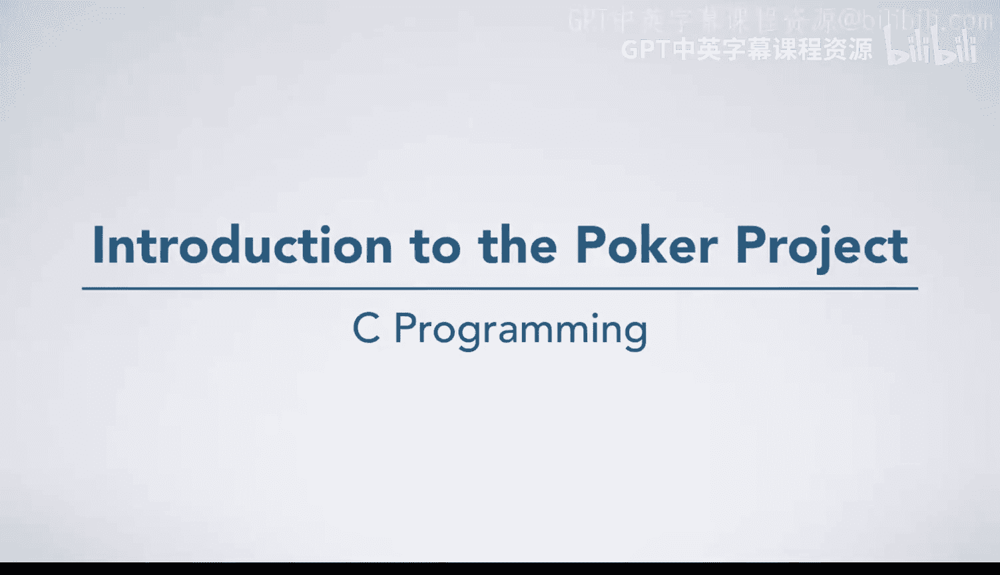
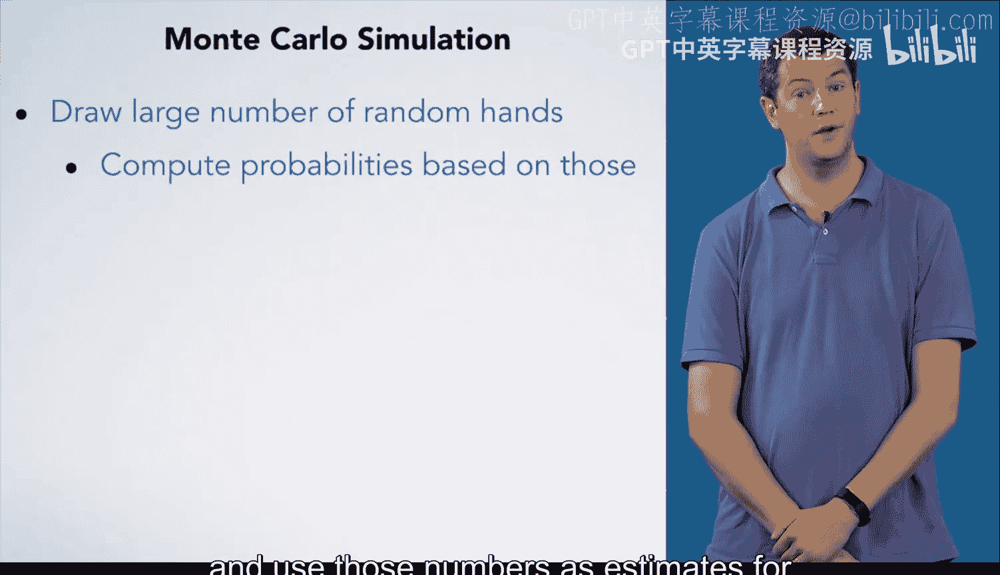
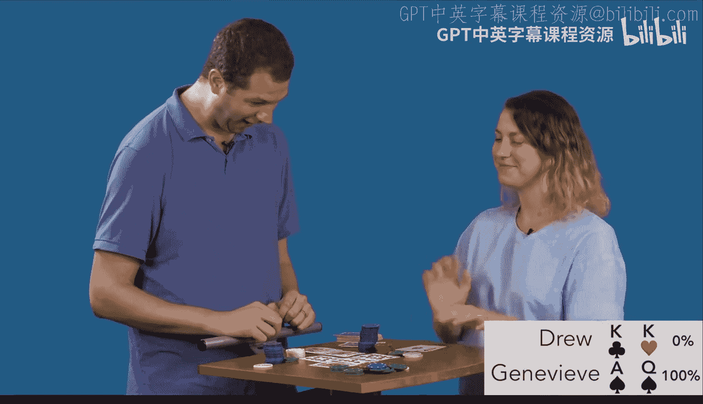

# 051：扑克项目介绍 🃏

在本节课中，我们将学习如何利用C语言编写一个程序，用于计算德州扑克中玩家获胜的概率。我们将探讨如何用计算机可读的方式描述牌局，并介绍一种名为“蒙特卡洛模拟”的强大技术来估算概率。

---

## 项目背景与目标

上一节我们介绍了C语言的基础知识，本节中我们来看看如何将这些知识应用于一个有趣的项目。在观看扑克比赛时，我们常常看到屏幕上显示每位玩家获胜的概率。这些概率是如何计算的呢？当未知牌很多时，手动计算会变得非常复杂。因此，我们的目标是编写一个程序，能够根据已知的牌面信息，自动计算出每位玩家的获胜概率。

## 如何描述一手牌

为了实现这个目标，我们首先需要找到一种让计算机易于处理的方式来描述牌局。在德州扑克中，每位玩家最终会拥有7张牌：2张底牌和5张公共牌。玩家需要从这7张牌中选出最好的5张来组成一手牌。

以下是描述单张牌的方法：
*   **牌面值**：用一个字母表示，例如 `K` 代表国王（King）。
*   **花色**：用一个字母表示，例如 `H` 代表红桃（Hearts）。

因此，一张“红桃K”可以表示为 `KH`。对于未知的牌，我们用问号加一个数字来表示，例如 `?2`。相同的 `?2` 代表同一张未知牌，它与 `?0` 和 `?1` 代表不同的牌。

让我们看一个具体的例子。从我的视角，我的牌可以这样描述：
*   我的底牌：`KH`（红桃K）， `KC`（梅花K）。
*   已知的公共牌（翻牌圈和转牌圈）：`3S`（黑桃3）， `TS`（黑桃10）， `QS`（黑桃Q）， `KS`（黑桃K）。
*   未知的河牌：`?2`。

我的对手Genevieve的牌则由她的两张未知底牌（`?0`, `?1`）和与我相同的五张公共牌组成。

这种表示方法非常灵活，足以描述许多其他扑克变种，例如没有公共牌的七张牌梭哈。

## 计算概率的挑战

现在我们知道如何描述牌局了，但如何实际计算概率呢？一种方法是让程序考虑所有可能的未知牌组合。例如，如果我们能看到两位玩家的手牌，但还有5张牌未发出，那么大约有2.05亿种可能的组合。虽然计算机能在几分钟内处理完，但我们希望程序能更快。

另一种方法是基于概率和组合数学原理为每种情况推导公式。但这工作量巨大，尤其是考虑到不同玩家手牌之间的相互影响。

## 解决方案：蒙特卡洛模拟

因此，我们将采用一种更通用、更高效的方法：**蒙特卡洛模拟**。

那么，什么是蒙特卡洛模拟呢？它的核心思想是：
1.  为未知牌进行大量（例如10万次）随机发牌。
2.  在每次模拟中，根据完整的牌面判断哪位玩家获胜。
3.  统计每位玩家获胜的次数。
4.  用（获胜次数 / 总模拟次数）来估算每位玩家的真实获胜概率。

只要随机模拟的次数足够多，得到的结果就会非常精确。蒙特卡洛模拟不仅适用于扑克或卡牌游戏，它是一种广泛适用的技术，尤其适用于精确计算极其复杂或计算量巨大的问题。

---

## 总结

本节课中我们一起学习了扑克概率计算项目的核心思想。我们首先定义了用`KH`、`?2`等形式描述牌面的方法，让计算机能够理解牌局。接着，我们认识到直接计算所有组合或推导公式的困难，从而引入了**蒙特卡洛模拟**这一强大技术。通过大量随机抽样和统计，我们可以高效且准确地估算出复杂的概率。在后续的课程中，你将学习如何用C语言实现这个模拟过程。