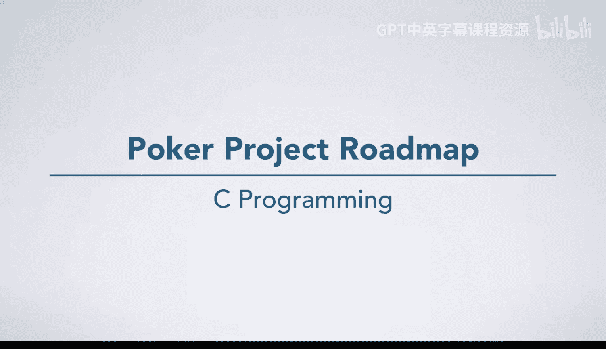
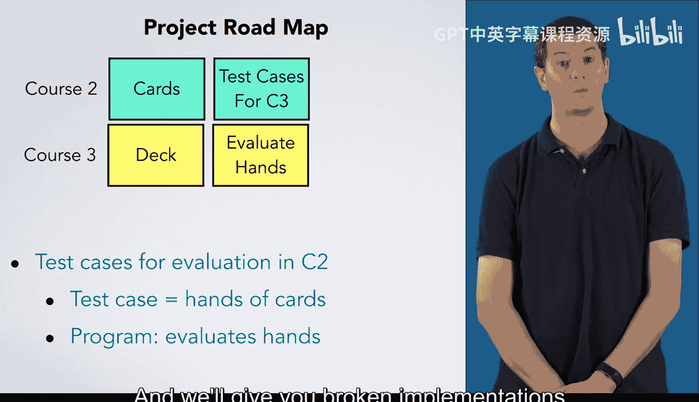

# 052：扑克项目路线图 🃏

在本节课中，我们将一起了解贯穿本系列课程的一个综合性项目——扑克牌项目。我们将看到该项目如何分阶段进行，以及每个阶段需要完成的核心任务。

## 项目概述

由于这个项目横跨多门课程，我们现在将为你展示整个项目的路线图，以便你了解在本课程中项目的进展方向。

## 课程2：处理单张牌 🃁

在课程2中，你将处理与 `card_t` 结构相关的代码，你将使用这个结构来表示一张扑克牌。

以下是你在本阶段需要完成的任务：
*   编写打印扑克牌的函数。
*   编写根据字母对（如“As”代表黑桃A）或整数创建扑克牌的函数。
*   使用 `assert` 来检查一张牌是否有效。

## 课程3：处理牌组与牌型判断 🎲

上一节我们介绍了单张牌的处理，本节中我们来看看如何处理一整副牌以及判断牌型。

在课程3中，你将编写一些处理一副扑克牌的函数。

以下是你在本阶段需要完成的任务：
*   编写一个随机洗牌的函数。这对于蒙特卡洛模拟非常有用，因为你需要抽取许多随机的牌手。
*   编写判断一组牌构成何种扑克牌型（例如：一对、顺子、满堂红）的代码。
*   在完成牌型判断后，编写比较两手牌以确定胜负的代码。

判断扑克牌型有一些棘手之处。在开始编写所有代码之前，拥有测试用例会很有帮助。由于我们在本课程中涵盖了测试内容，我们将让你现在就开始为牌型判断代码开发测试用例。

你可以在尚不知道如何实现判断代码的情况下完成此任务，并且我们会提供有缺陷的实现版本供你运行测试用例，就像你在其他作业中所做的那样。

## 课程4：整合项目与处理输入 📂

在课程3中，我们为牌组操作和牌型判断打下了基础。最后，在课程4中，你将完成整个项目。

以下是你在本阶段需要完成的任务：
*   编写读取输入文件的代码，你将在该课程中学习如何操作。
*   处理未知的牌，我们将其表示为 `?0`、`?1` 等。
*   最后，将所有功能整合起来，编写 `main` 函数来调用你编写的所有其他函数并打印出结果。

## 总结

本节课中，我们一起学习了扑克牌项目的完整路线图。这个项目将汇集整个专项课程中的大部分主要概念，并为你提供一个展示新学编程技能的机会。