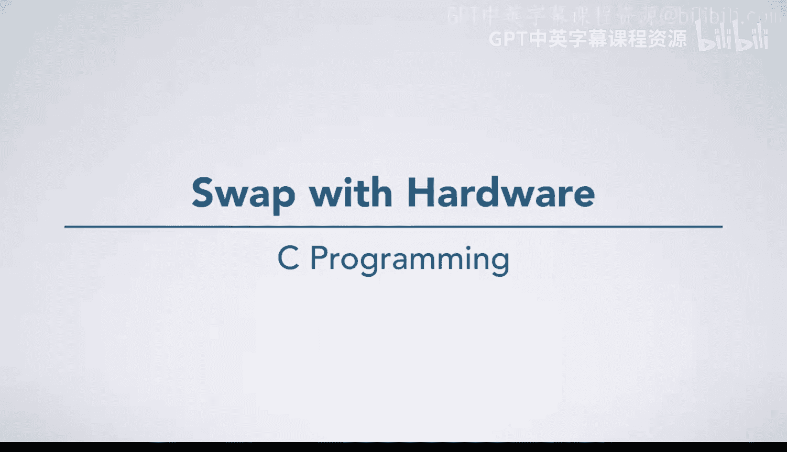
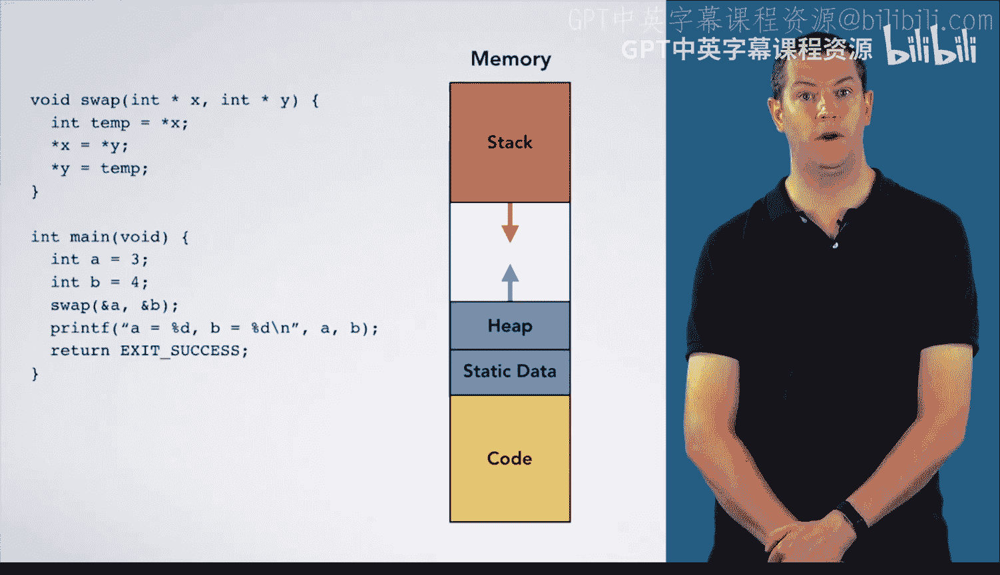

# 057：硬件级交换 🔧



在本节课中，我们将重新审视交换函数，并特别关注其在硬件层面发生的一些关键过程。我们将通过分析内存中栈和代码区的具体操作，来深入理解函数调用和指针操作背后的原理。

---



上一节我们介绍了函数调用的基本概念，本节中我们来看看在硬件内存层面，一个交换函数是如何具体执行的。

首先，我们需要了解程序在内存中的布局。内存被划分为不同区域，各有其用途。在本例中，由于我们的函数未使用堆或静态数据区，我们将重点关注**栈**和**代码区**。


我们首先想象一下代码在内存中的样子。为了简化，我们假设每条指令恰好占用4个字节。因此，你会看到每个指令块在内存中是连续存放的。虽然这取决于具体的运行机器，但此图具有代表性。

请注意，由于内存地址向上增长，`main`函数中的第一条指令（将变量`A`设为3）实际上位于内存底部。随着程序执行，你总是向更高的内存地址移动。

在内存顶部是我们的**栈**，用于存储程序所需的所有局部变量。接下来我们展示栈的可能结构。


在之前的概念图中，我们总是将栈帧画成独立的、带有函数名称标签的方框。但在这种更贴近硬件视角的内存视图中，栈将显示为一段连续的内存空间，从一个栈帧直接过渡到下一个栈帧。

我将使用两种颜色来高亮不同函数的栈帧：`main`函数的栈帧用蓝色表示，`swap`函数的栈帧用紫色表示。

本视频中栈帧的构建方式与之前概念视频中的展示略有不同。我们将把**参数**放在**调用函数**的栈帧中，而不是被调用函数的栈帧里，这更贴近硬件实际发生的情况。

现在我们可以开始执行程序了。首先执行第一条指令，将变量`A`的值设为3。

```c
A = 3;
```

下一条指令将变量`B`的值设为4。

```c
B = 4;
```

接下来我们要调用`swap`函数。为此，需要准备它的两个参数。

以下是准备参数并调用函数的步骤：

1.  **准备第一个参数**：第一个参数是变量`A`的地址。我们在内存中查找`A`的地址，假设是`0xFFFC`。我们将这个值存储在栈上，作为`swap`函数参数`x`的位置。
2.  **准备第二个参数**：第二个参数是变量`B`的地址。我们在内存中查找`B`的地址，假设是`0xFFF8`。我们将这个值存储在栈上对应的位置。

现在，我们几乎准备好调用`swap`函数了。在之前的视频中，我们常用带数字的小圆圈标记调用点。现在，随着我们对指针和代码在内存中的位置有了更深的理解，我们将更明确地展示其工作原理。

事实上，我们栈帧的最后一个位置将专门用于存储所谓的**返回地址**。返回地址告诉我们，当`swap`函数执行完毕后，接下来应该执行哪条指令。

在本例中，接下来应该执行的是调用`printf`的那行代码，它位于内存地址`0x4008`。因此，我们将地址`0x4008`存储为返回地址。这将告诉我们完成`swap`函数后下一步该做什么。

现在，我们可以进入并执行`swap`函数。请注意，`swap`函数现在拥有自己的栈帧（此处显示为紫色方框），其中只包含一个变量`temp`。

`swap`函数的第一行代码是取出`x`所指向的值，并将其存储在变量`temp`中。

```c
int temp = *x;
```

如果我们查看栈上的`x`，会发现它的值是`0xFFFC`，它指向内存中值为`3`的变量`A`。因此，我们将取出`3`，并将其存入`temp`变量。

下一条指令稍微复杂一些，我们需要同时确定这个赋值语句的**左值**和**右值**。

```c
*x = *y;
```

*   **左值**：是`x`所指向的东西。我们再次查看`x`，其地址为`0xFFFC`。它指向地址为`0xFFFC`的方框，当我们执行赋值语句时，这个方框的值将被改变。
*   **右值**：是`y`所指向的东西。`y`的值是`0xFFF8`，它指向一个值为`4`的方框。因此，我们要做的是取出值`4`，并将其存储到地址为`0xFFFC`的方框（即变量`A`）中。

现在，最后一行代码将为我们完成交换函数。

```c
*y = temp;
```

*   **左值**：是`y`所指向的东西。查看`y`，其值为`0xFFF8`，因此我们将改变地址为`0xFFF8`的方框（即变量`B`）的值。
*   **右值**：是`temp`的值，即`3`。

因此，我们将`3`存入地址为`0xFFF8`的方框。至此，我们完成了整个`swap`函数的执行。

此时，我们不再需要`swap`函数的栈帧。因此，现在我们只有一个栈帧，即位于栈底的、蓝色的`main`函数栈帧。在这个栈帧的底部，有一个指针（返回地址）告诉我们从`swap`函数返回后应该执行哪一行代码。

我们将严格按照这个指示执行：将执行箭头移动到内存地址为`0x4008`的代码处。现在，我们将执行`main`函数剩余的代码。

---

本节课中我们一起学习了交换函数在硬件内存层面的执行过程。我们追踪了代码在内存中的执行路径，观察了栈帧的构建与销毁，以及参数传递和返回地址的工作原理。通过将抽象的指针操作与具体的内存地址和值的变化对应起来，我们深化了对C语言函数调用机制的理解。