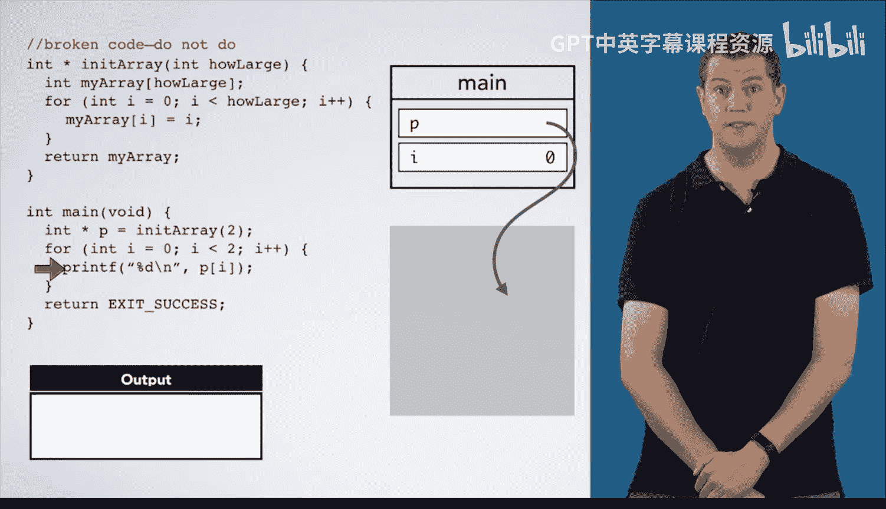

# 062：悬空指针详解 🧠


在本节课中，我们将学习悬空指针的概念。悬空指针是指向已释放内存的指针，使用它会导致未定义行为。我们将通过一段有问题的代码来演示悬空指针是如何产生的，并解释为什么这样的代码是危险的。

## 代码执行过程分析

上一节我们介绍了指针的基本概念，本节中我们来看看一段会产生悬空指针的代码是如何执行的。

主函数首先声明一个整型指针 `P`，并用函数 `init_array` 的返回值初始化它。

```c
int* P = init_array(2);
```

我们为 `P` 创建一个存储空间，并为 `init_array` 函数创建一个栈帧，传入参数 `2`，然后将执行箭头移入函数内部。

接下来，在 `init_array` 函数中声明一个大小为 2 的整型数组。

```c
int my_array[2];
```

我们在该栈帧中为两个整数分配空间。请注意，图中的方框大小不代表实际内存占用比例。参数 `how_large` 和数组 `my_array` 的每个元素占用的内存量相同，每个方框占用四个字节（假设 `int` 类型大小为 4 字节）。

然后进入 `for` 循环。

以下是循环的执行步骤：

1.  `i` 的值为 0，将数组的第一个元素初始化为 0。
2.  `i` 的值为 1，将数组的第二个元素初始化为 1。

循环结束后，数组完成初始化。接着，执行到 `return my_array;` 这一行。

如果你写了这段有问题的代码，你可能希望它将数组复制回主函数的栈帧。然而，由于多种原因，这无法实现。在主函数中，我们只申请了存储一个整型指针的空间，而不是一个任意大小的数组。如果需要在主函数栈帧中有一个数组，我们必须在那里声明一个数组并指定其大小。

在本专业课程后续内容中，我们将学习如何在栈外分配内存，使数据在函数调用后依然存在。但目前我们尚未学习这种方法。

因此，当我们返回 `my_array` 时，表达式 `my_array` 的值是一个指向数组首元素的指针。所以，返回到调用位置（位置 1）的返回值仅仅是一个指向该内存地址的指针。

## 悬空指针的产生

返回时，`P` 将被赋予这个指针值。然而，在从函数返回的过程中，`init_array` 函数的栈帧会消失。现在，这个指针指向一个已不存在的内存区域。

我们仍然将这个值赋给 `P`，`P` 指向内存中那个位置上的任意内容。但那里已经没有与之关联的变量了。如果该内存位置的内容未被改变，它可能仍然保存着值 `0`。但由于该内存位置可能被其他数据重用，其值可能意外改变。

此时，`P` 就成为了一个悬空指针。请注意图中它指向了“虚无”。解引用 `P` 因此是错误的操作。

## 解引用悬空指针的后果

如果我们进入接下来的 `for` 循环，并尝试打印 `p[0]`，它将输出 `P` 所指向内存位置的值。这个值可能仍然是 `0`，也可能不是。我们无法确定会得到什么结果。

在我的计算机上运行此代码，第一次迭代得到 `0`，第二次迭代也得到 `0`。第一次迭代很可能读取了 `my_array` 残留的 `0`。但当调用 `printf` 函数时，`printf` 的栈帧会覆盖这片内存区域。因此，它会破坏之前存储在该位置的值 `1`，而第二次迭代将读取来自前一次 `printf` 调用后残留在其栈帧中的某个值。

无论发生什么，这段代码都是错误的，我们不应该编写这样的代码。

## 总结



本节课中我们一起学习了悬空指针。我们通过分析一段代码，看到了悬空指针是如何在函数返回后指向已释放栈内存而产生的。使用悬空指针会导致程序读取到不可预测的数据，这是一种未定义行为，必须避免。记住，永远不要返回指向局部变量的指针。