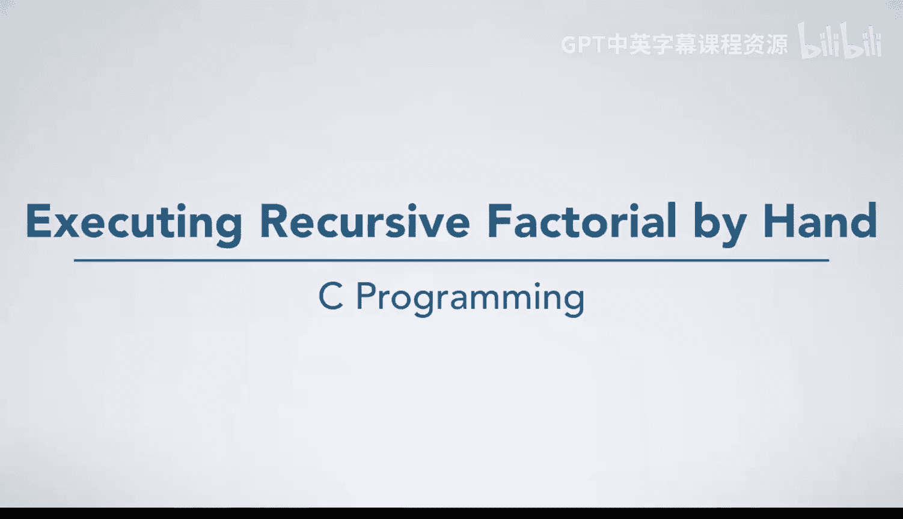
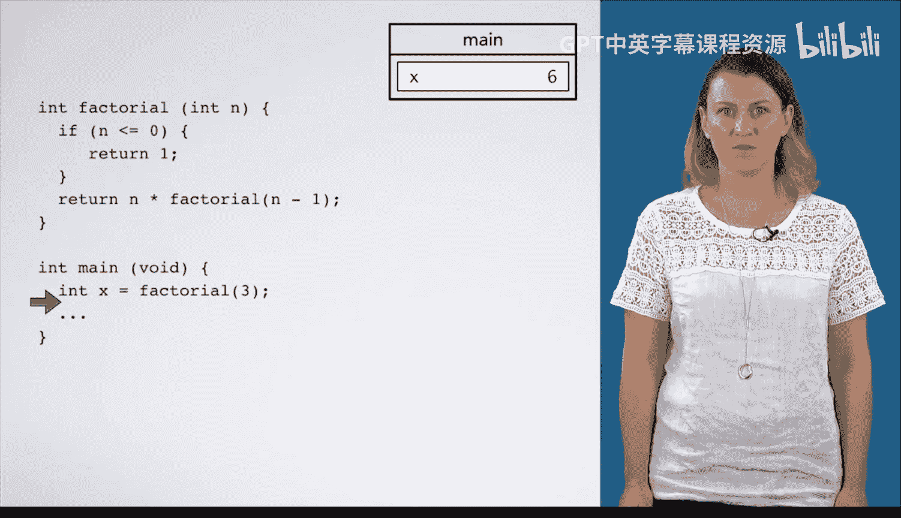
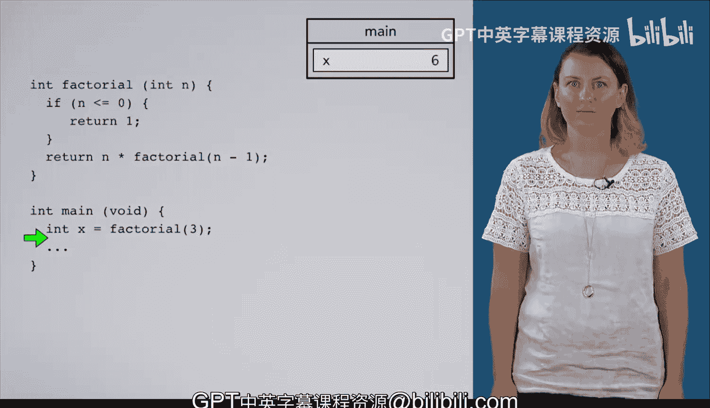

# 067：手动执行递归阶乘函数 🧮



在本节课中，我们将通过手动追踪一个递归函数——阶乘函数 `factorial` 的执行过程，来深入理解递归在C语言中是如何工作的。我们将一步步地模拟计算机执行代码的过程，观察函数调用、栈帧创建和返回值传递。

---

## 从主函数开始

程序从 `main` 函数开始执行。第一行代码声明了一个变量 `x`，并将其初始化为 `factorial(3)` 的返回值。

```c
int x = factorial(3);
```

此时，为了计算 `factorial(3)`，程序需要调用 `factorial` 函数。

---

## 第一次函数调用：`factorial(3)`

程序为 `factorial` 函数创建了一个栈帧，并将参数 `n` 的值设置为 `3`。我们将这个调用点标记为 **调用点1**，并将执行箭头移入 `factorial` 函数内部。

在 `factorial` 函数中，首先检查条件 `n <= 0`。由于 `3` 不大于 `0`，程序跳过了 `if` 语句，直接执行到 `return` 语句。

```c
return n * factorial(n - 1);
```

这条 `return` 语句包含了一个对 `factorial` 函数的递归调用，这次传入的参数是 `2`。

---

## 第二次函数调用：`factorial(2)`

程序再次进入 `factorial` 函数，此时 `n` 的值为 `2`。我们标记这个递归调用的返回位置为 **调用点2**。

同样，`2` 不小于等于 `0`，因此程序跳过 `if` 语句，到达最后的 `return` 语句。这里又产生了一个递归调用 `factorial(1)`，但返回地址仍然是 **调用点2**。

---

## 第三次函数调用：`factorial(1)`

程序进入 `factorial` 函数，`n` 为 `1`。条件 `n <= 0` 仍不成立，程序继续执行到最后一行代码，产生了递归调用 `factorial(0)`。

---

## 第四次函数调用：`factorial(0)` 与基准情形

这次调用 `factorial` 函数时，参数 `n` 为 `0`。条件 `n <= 0` 终于成立，函数执行 `if` 语句块中的代码：

```c
if (n <= 0) {
    return 1;
}
```

函数返回值 `1`。这是递归的**基准情形**，它停止了进一步的递归调用。

---

## 回溯与计算返回值

现在，递归调用开始逐层返回，并完成乘法计算。

1.  返回值 `1` 被传回给调用 `factorial(0)` 的那个函数实例，即 `factorial(1)` 中的调用点。
2.  在 `factorial(1)` 中，`return` 语句计算 `1 * 1`，得到结果 `1`。这个值被返回给调用它的 `factorial(2)`。
3.  在 `factorial(2)` 中，计算 `2 * 1`，得到结果 `2`，并返回给 `factorial(3)`。
4.  最后，在最初的 `factorial(3)` 调用中，计算 `3 * 2`，得到最终结果 `6`。

---

## 返回主函数

`factorial(3)` 的返回值 `6` 被送回到 `main` 函数中最初的调用点。赋值语句完成，变量 `x` 被赋值为 `6`。

```c
// 此时，x 的值变为 6
int x = 6;
```

---

## 总结

本节课中，我们一起手动追踪了递归阶乘函数的完整执行过程。我们看到了：



*   递归函数如何通过**基准情形**终止。
*   每次递归调用如何创建新的栈帧并暂停当前执行。
*   返回值如何沿着调用链**回溯**，并与每一层的参数相乘，最终得到结果。



这个过程清晰地展示了递归“递去”和“归来”的两个阶段，是理解递归机制的核心。