# 070：递归实现斐波那契数列 🧮

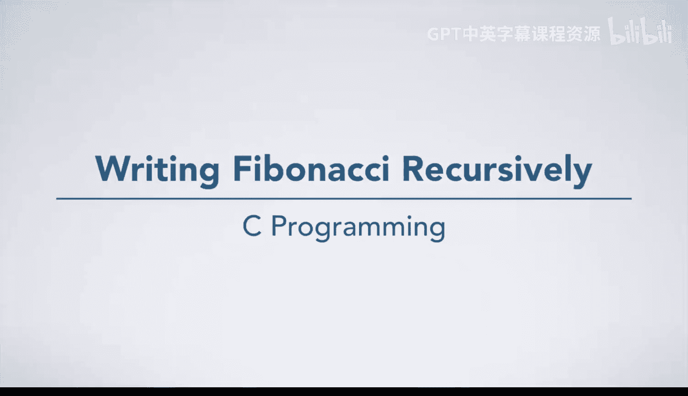

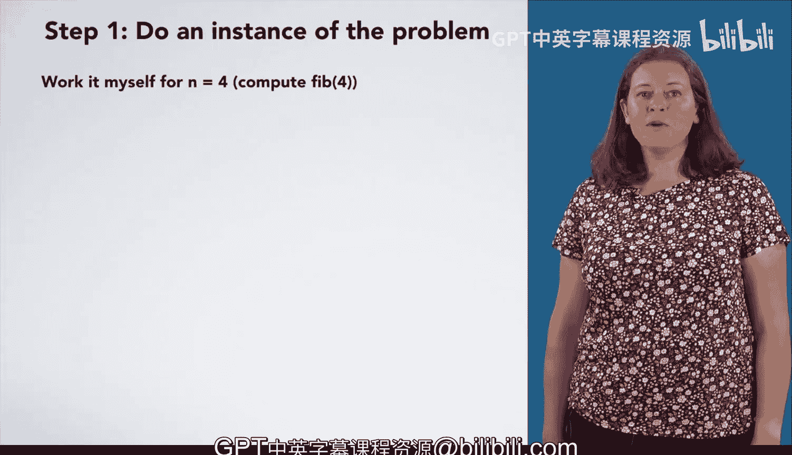

在本节课中，我们将学习如何使用递归方法实现斐波那契数列的计算。我们将遵循编程过程的四个步骤，通过一个具体的例子来理解递归的工作原理。

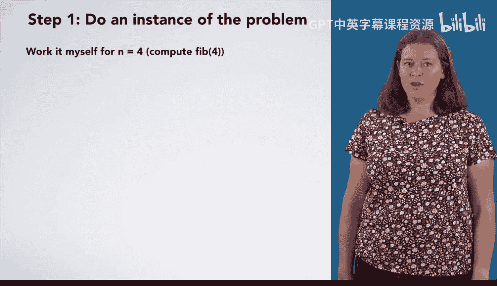

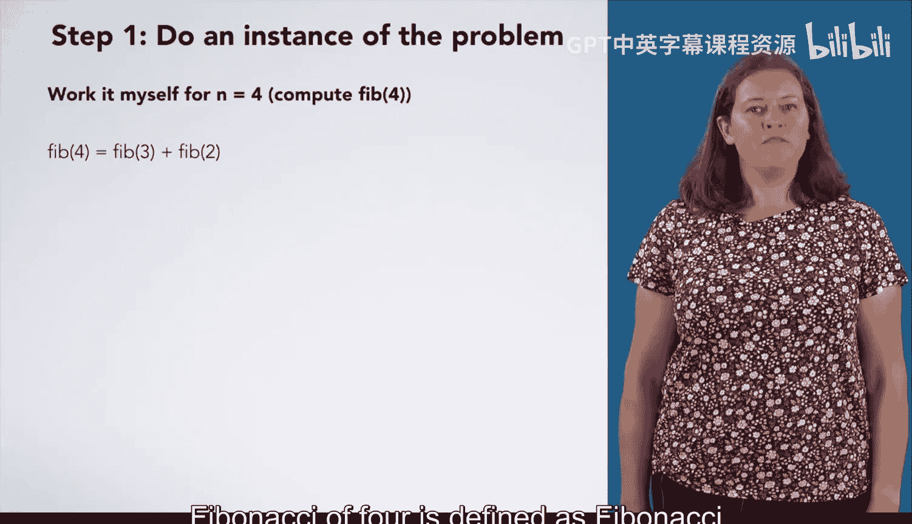

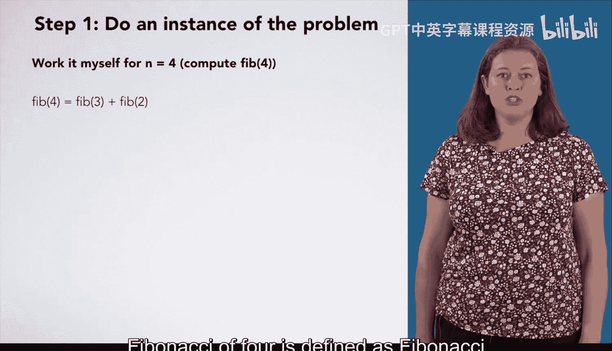

## 概述

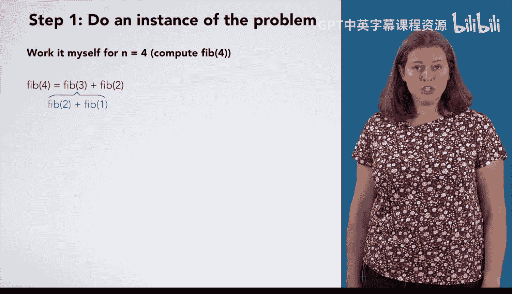

我们将以计算 `Fibonacci(4)` 为例，逐步展示递归算法的设计过程，包括理解问题、列出步骤、归纳模式以及测试算法。我们还将讨论算法在边界情况（如负数输入）下的处理。

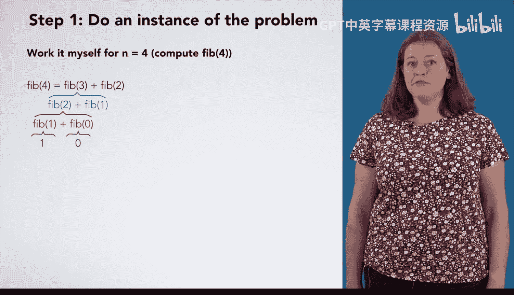

## 第一步：通过例子理解问题

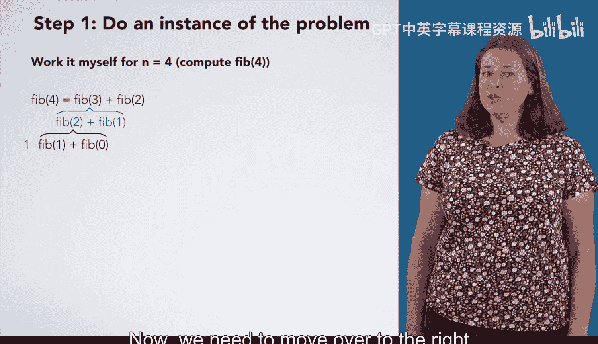

首先，我们通过计算 `Fibonacci(4)` 来理解斐波那契数列的定义。根据定义，`Fibonacci(4)` 等于 `Fibonacci(3)` 加上 `Fibonacci(2)`。

为了计算 `Fibonacci(3)`，我们需要知道 `Fibonacci(2)` 和 `Fibonacci(1)` 的值。

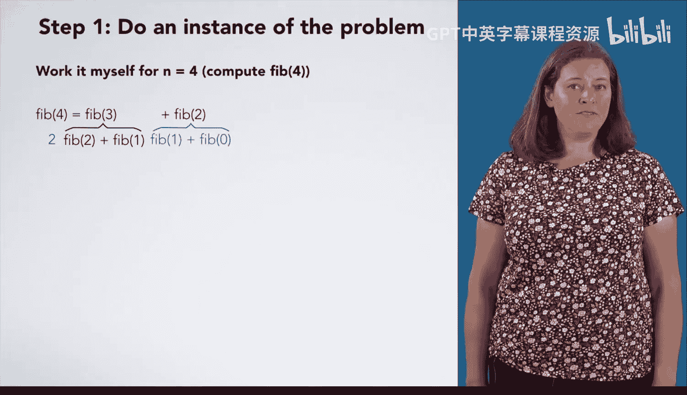

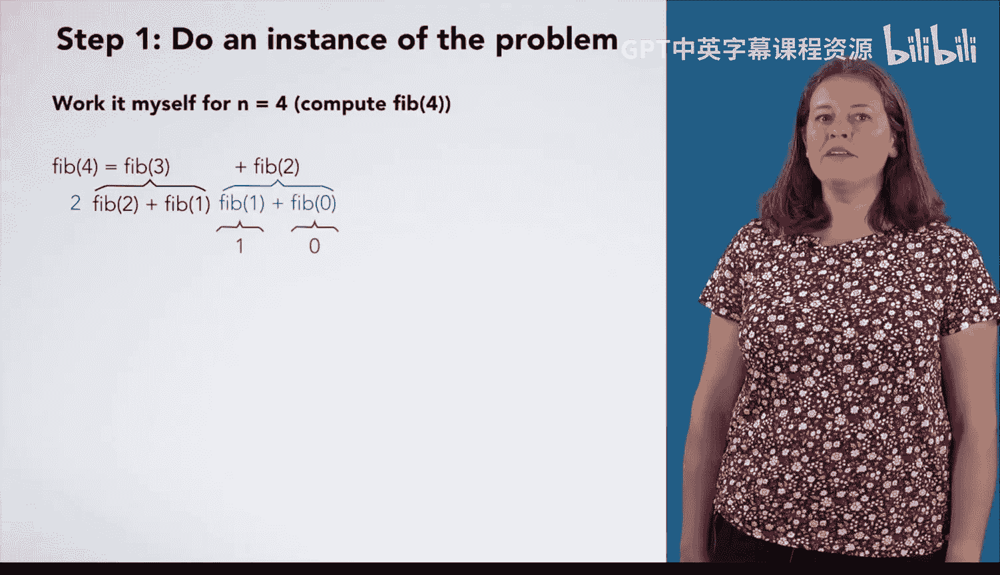

而 `Fibonacci(2)` 又等于 `Fibonacci(1)` 加上 `Fibonacci(0)`。根据定义，`Fibonacci(1)` 的值为 **1**，`Fibonacci(0)` 的值为 **0**。

因此，`Fibonacci(2)` 等于 **1 + 0 = 1**。


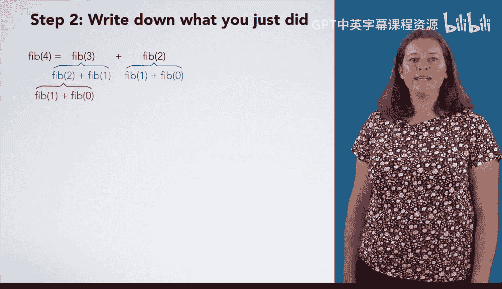

接下来，我们回到计算 `Fibonacci(3)` 的表达式。其值为 `Fibonacci(2)` 加上 `Fibonacci(1)`，即 **1 + 1 = 2**。

现在，我们回到最初的表达式计算 `Fibonacci(4)`。其值为 `Fibonacci(3)` 加上 `Fibonacci(2)`，即 **2 + 1 = 3**。

所以，`Fibonacci(4)` 的结果是 **3**。

## 第二步：列出计算步骤

在理解了计算过程后，我们需要将计算 `Fibonacci(4)` 时所执行的所有步骤系统地记录下来。

以下是计算过程中执行的所有操作：

1.  计算 `Fibonacci(3)`。
2.  为了计算 `Fibonacci(3)`，需要先计算 `Fibonacci(2)`。
3.  为了计算 `Fibonacci(2)`，需要计算 `Fibonacci(1)` 和 `Fibonacci(0)`。
4.  回到计算 `Fibonacci(3)` 的表达式，计算 `Fibonacci(1)`。
5.  回到计算 `Fibonacci(4)` 的表达式，计算 `Fibonacci(2)`。
6.  为了计算这个 `Fibonacci(2)`，再次计算 `Fibonacci(1)` 和 `Fibonacci(0)`。

观察这些步骤，我们可以总结出计算不同斐波那契数的方法：

*   计算 `Fibonacci(0)`：直接返回 **0**。
*   计算 `Fibonacci(1)`：直接返回 **1**。
*   计算 `Fibonacci(2)`：需要计算 `Fibonacci(1)` 和 `Fibonacci(0)`，然后将结果相加。
*   计算 `Fibonacci(3)`：需要计算 `Fibonacci(2)` 和 `Fibonacci(1)`，然后将结果相加。
*   计算 `Fibonacci(4)`：需要计算 `Fibonacci(3)` 和 `Fibonacci(2)`，然后将结果相加。

## 第三步：归纳通用模式

现在，我们需要从具体的步骤中寻找规律，归纳出适用于所有情况（特别是 `n > 1` 的情况）的通用算法。

首先，我们注意到计算 `Fibonacci(4)`、`Fibonacci(3)` 和 `Fibonacci(2)` 的步骤非常相似。而计算 `Fibonacci(1)` 和 `Fibonacci(0)` 则不同，它们是直接知道答案的特殊情况，我们称之为 **基准情形**。

因此，算法的第一部分是处理基准情形：
*   如果 `n == 0`，则返回 **0**。
*   如果 `n == 1`，则返回 **1**。

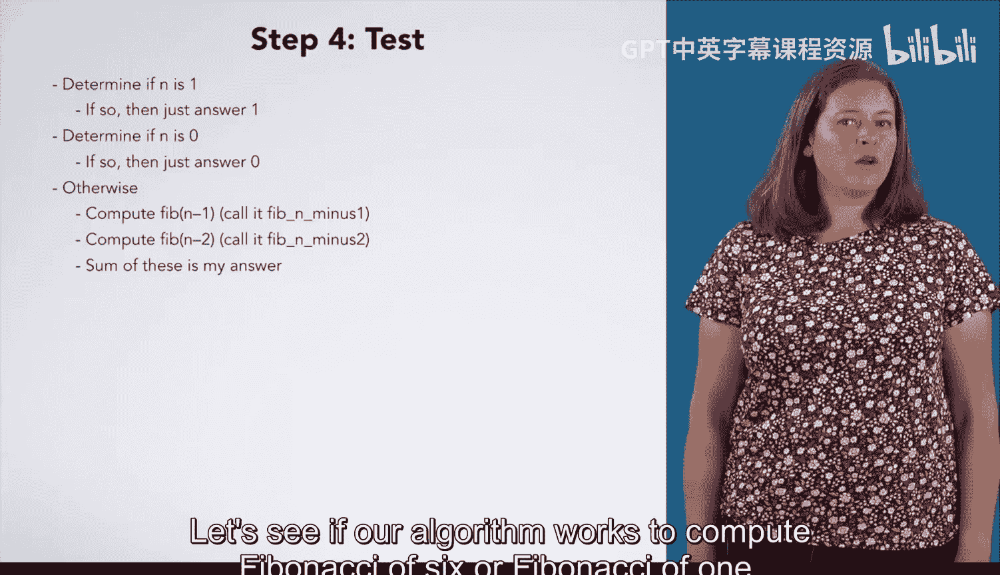

对于非基准情形（即 `n > 1` 的情况），我们观察其计算模式：
1.  计算 `Fibonacci(n-1)`。
2.  计算 `Fibonacci(n-2)`。
3.  将上述两个结果相加。

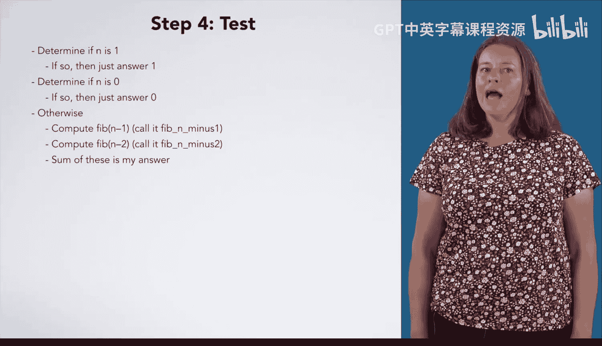

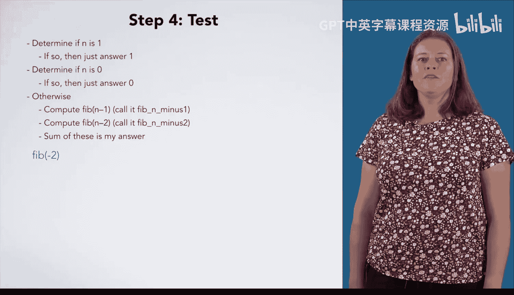

用伪代码可以表示为：
```c
if (n == 0) return 0;
if (n == 1) return 1;
// 否则 (n > 1)
fib_n_minus_1 = Fibonacci(n - 1);
fib_n_minus_2 = Fibonacci(n - 2);
return fib_n_minus_1 + fib_n_minus_2;
```

## 第四步：测试与完善算法

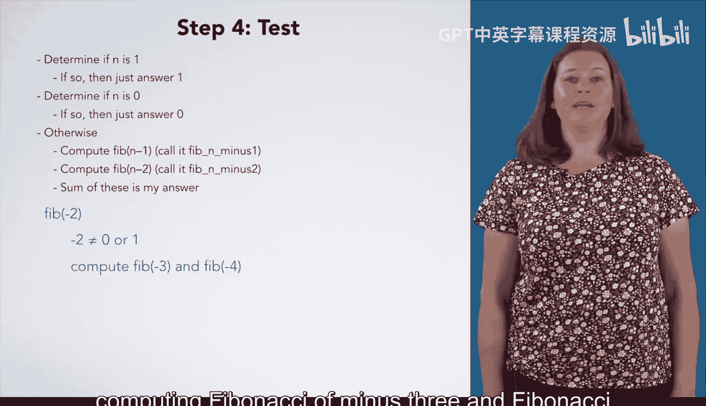

设计出初步算法后，必须进行测试。我们测试几个案例：

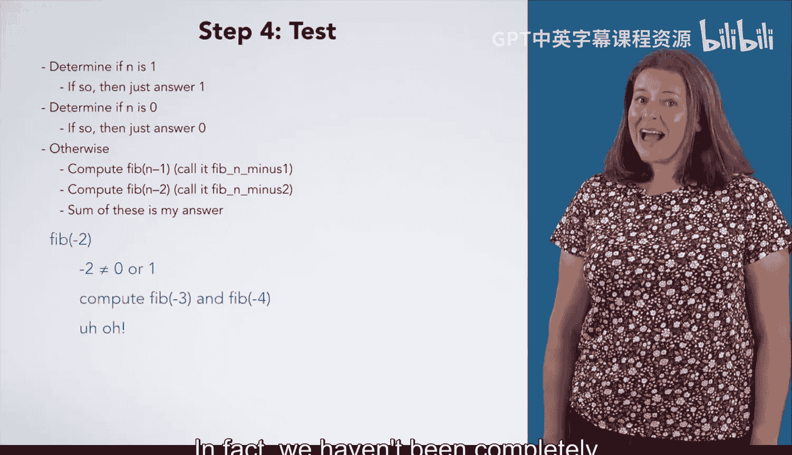

*   `Fibonacci(6)`：算法可以正常递归计算。
*   `Fibonacci(1)`：算法直接返回 **1**，正确。

然而，当我们测试 `Fibonacci(-2)` 时，会发现问题。根据我们当前的算法：
*   `-2` 既不等于 **0** 也不等于 **1**，所以会进入“否则”分支。
*   这将尝试计算 `Fibonacci(-3)` 和 `Fibonacci(-4)`。
*   而计算 `Fibonacci(-3)` 又会触发计算 `Fibonacci(-4)` 和 `Fibonacci(-5)`。
*   这个过程将无限进行下去，无法终止，导致程序出错。

这个测试案例暴露了我们算法的一个缺陷：它没有正确处理 `n < 0` 的情况。回顾斐波那契数列的完整数学定义，它实际上包含多种情况：
1.  `n == 0`
2.  `n == 1`
3.  `n > 1`
4.  `n < 0` 且 `n` 为奇数
5.  `n < 0` 且 `n` 为偶数

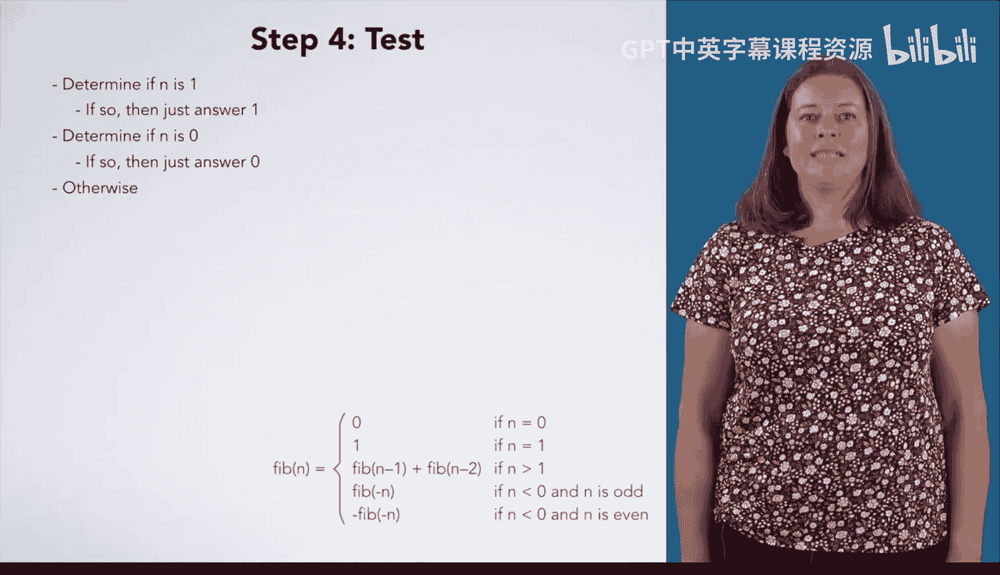

我们的算法只处理了前三种情况。我们需要明确处理 `n > 1` 的条件，并增加对负数的处理逻辑。对于负数 `n`，一种常见的处理方式是：
*   计算 `Fibonacci(-n)`，记作 `fib_neg_n`。
*   如果 `n` 是奇数，则结果就是 `fib_neg_n`。
*   如果 `n` 是偶数，则结果是 `-fib_neg_n`。

修正后的算法逻辑会更加健壮。我们需要用包含负数的测试案例来验证这个修订后的算法。

## 总结

本节课我们一起学习了如何用递归实现斐波那契数列。我们经历了从具体例子入手、列出步骤、归纳通用模式到测试完善的完整算法设计流程。关键点在于识别出 **基准情形**（`n=0` 和 `n=1`）以及 **递归情形**（`n>1` 时，问题可分解为两个更小的同类问题）。同时，我们也认识到全面考虑输入范围（包括负数）对于编写健壮程序的重要性。递归的核心思想是将复杂问题分解为相似的、更简单的子问题，这种思想是算法设计中的重要工具。