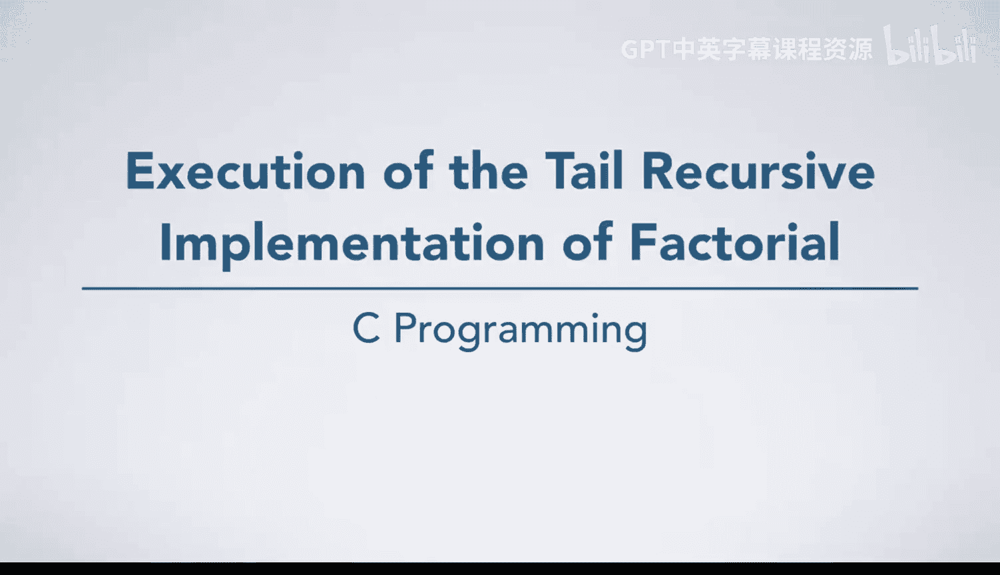
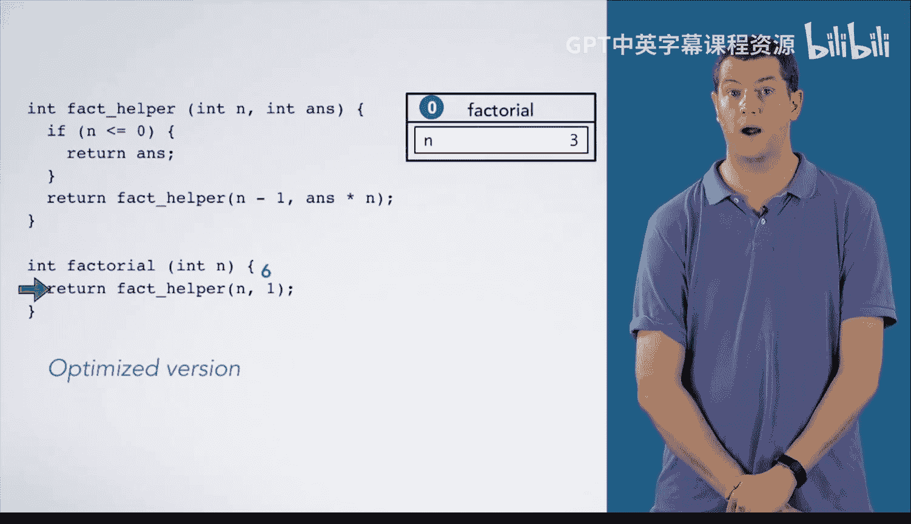

# 073：尾递归阶乘实现执行过程 🔍

在本节课中，我们将学习尾递归版本的阶乘函数，并逐步追踪其执行过程。我们将分析普通递归与经过编译器优化后的尾递归在内存使用上的关键区别。

## 概述

阶乘函数有一个参数 `n`，代表要计算阶乘的数字，它返回一个整数，即该输入的阶乘值。本课的重点是名为 `fact_helper`  的辅助函数，它有两个参数：整数 `n` 和整数 `answer`。`n` 是我们要计算阶乘的数字，而 `answer` 是一个随着每次递归调用而更新的累积乘积。当 `fact_helper` 调用自身时，这是它执行的最后一项计算，这被称为**尾递归**。

## 普通尾递归执行过程

现在，让我们逐步追踪普通尾递归版本的执行过程。

我们从 `factorial` 函数内部开始，其中 `n` 的值为 3，我们将调用 `fact_helper`。

以下是执行步骤：

1.  创建一个栈帧，传入参数 `n=3` 和 `answer=1`。我们用数字 1 标记调用点位置，以便在离开函数时知道返回何处。
2.  进入 `fact_helper` 后，由于 `n` 的值为 3，我们跳过基本情况，将再次调用 `fact_helper`。
3.  为下一次递归调用创建新的栈帧，其中 `n=2`，`answer=3`。
4.  再次进入函数，跳过基本情况，为下一次调用创建栈帧，其中 `n=1`，`answer=6`。
5.  再次进入函数，跳过基本情况，为下一次调用创建栈帧，其中 `n=0`，`answer=6`。
6.  这次进入函数时，`n` 小于等于 0，满足基本情况，我们返回答案 `6`。
7.  返回值 `6` 沿着调用链向上传递，依次返回到调用点位置 2，并销毁每个递归调用的栈帧。
8.  最后，将值 `6` 返回到调用点位置 1，并将执行箭头移回 `factorial` 函数。

这里需要注意的关键点是，一旦我们放置了每个尾递归调用，我们只需要将值 `6` 一路返回。实际上，我们不再需要那些栈帧，因为帧中没有任何值会被再次使用。

## 尾递归消除优化

一个优化的编译器会识别到这一点，并执行所谓的**尾递归消除**。这样，就不会为每次递归调用 `fact_helper` 都创建新的栈帧。

让我们逐步追踪优化后的版本。

以下是优化后的执行步骤：

1.  同样从 `factorial` 函数内部开始，`n=3`。我们为 `fact_helper` 创建一个栈帧，其中 `n=3`，`answer=1`。标记调用点位置 1，然后进入 `fact_helper`。
2.  `n` 不小于等于 0，因此我们将放置递归调用 `fact_helper`。但是，编译器会**重用当前的栈帧**。
3.  首先，我们必须分别计算新参数 `n=2` 和 `answer=3`。注意，我们在开始更改帧中任何值之前完成此操作，因为我们需要使用当前值。
4.  然后，我们将帧中 `n` 的值更新为 2，将 `answer` 的值更新为 3。
5.  现在我们跳回 `fact_helper` 内部。跳过基本情况，再次准备放置递归调用。
6.  编译器将使代码将 `n` 和 `answer` 的值更新为新的参数 `1` 和 `6`。
7.  跳过基本情况，再次重用同一个栈帧，这次 `n=0`，`answer=6`。
8.  这次我们进入基本情况，然后直接将答案 `6` 返回到 `factorial` 函数中的调用点位置 1。

请注意，优化后，不需要为每次调用 `fact_helper` 都创建栈帧。这意味着所需的空间不再与输入 `n` 的大小成正比。你只需要一个 `factorial` 的帧和一个 `fact_helper` 的帧。

## 总结

本节课中，我们一起学习了尾递归阶乘函数的执行过程。我们对比了普通尾递归与经过编译器优化（尾递归消除）后的版本。关键区别在于，优化版本通过重用栈帧，将空间复杂度从 **O(n)** 降低到了 **O(1)**，从而避免了递归深度过大可能导致的栈溢出问题，并提升了效率。理解尾递归及其优化是编写高效递归代码的重要基础。