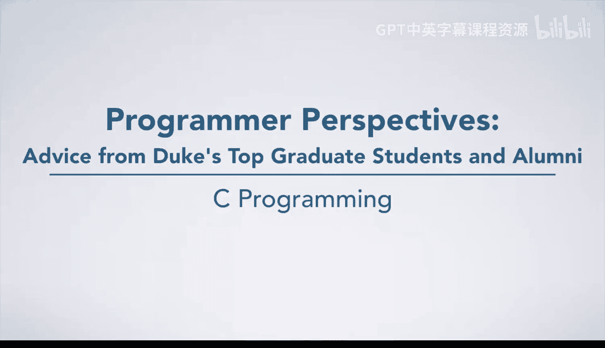
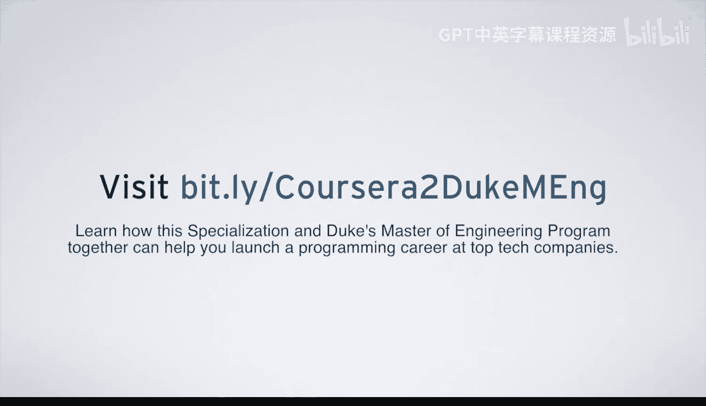

# 075：解决现实世界问题 💡

在本节课中，我们将学习杜克大学校友、现任软件工程师Marta分享的经验。她将结合自身在大型科技公司的实习与工作经历，讲述如何将在课堂上学到的编程知识应用于解决现实世界中的复杂问题，并为初学者提供宝贵的学习与职业建议。

---

## 概述

Marta在杜克大学攻读电气与计算机工程硕士学位期间，通过课程学习和暑期实习，将理论知识转化为解决实际工程问题的能力。她特别强调了耐心、热情以及明确职业方向的重要性。

---

## 从课堂到现实项目 🚀

上一节我们了解了课程概述，本节中我们来看看Marta如何将课堂所学应用于实际工作。

Marta在暑期实习期间，参与了一个具有真实影响力的项目，而不仅仅是模拟练习。她的项目与Andrew Hilton教授的“工程机器人服务软件”课程内容直接相关。在那门课程中，她学习了如何构建健壮的服务器、理解输入/输出（I/O）通信机制等知识。

这些知识在她的实习项目中发挥了关键作用。她的项目本质上是课程项目的延伸，但规模更大、难度更高。她负责重写一个被全球机器使用的服务。以下是她的主要工作内容：

*   **技术栈升级**：她利用异步通信、线程、事件驱动和Future等现代编程范式重写了该服务。
*   **性能提升**：经过重写，该服务的请求响应时间从**1.7秒**显著降低到**0.7秒**。

看到自己掌握的知识能够应用于实际项目，并取得可量化的优异成果（使服务更**可扩展**、更**健壮**、更**快速**），令她感到非常满足。这证明了将编程学习与现实问题解决相结合的巨大价值。

---

## 给编程新手的建议 📝

在了解了理论联系实际的重要性后，本节我们来看看Marta为初学者提出的具体建议。

对于编程新手，Marta认为首要的是培养正确的心态和学习方法。她在杜克大学期间观察到，对编程充满热情的学生与仅仅因为流行而选择它的学生，在表现上存在差异。

以下是她的核心建议列表：

*   **保持耐心与热情**：学习编程需要时间。热爱你所做的事情至关重要，否则过程会变得艰难。
*   **投入时间学习**：选修这门课程时，你需要花时间研读材料、完成练习。
*   **保持开放心态**：Marta提到，课程中最难的部分是“忘记”自己原有的编程方式，以接纳课程教授的新方法。这最终被证明是非常有价值的。
*   **建立扎实基础**：即使你对C语言一无所知，学完本课程后，你也能达到中级水平，并在算法、C语言和数据结构方面打下坚实基础。
*   **明确职业方向**：编程领域广阔。尽早确定你感兴趣并想解决的问题领域，这有助于你找到一份能持续激发学习动力、令人兴奋的工作。

---

## 职业发展与人际网络 🌐

上一节我们讨论了学习心态和基础，本节我们聚焦于职业规划的实际步骤。

除了技术学习，职业发展也需要策略。Marta结合自身经验，给出了以下建议：

*   **积极拓展人际网络**：如果你认识业内的人，或者有时间，主动联系他们。了解他们的公司是否在招聘。
*   **参加招聘活动**：积极参加职业招聘会或技术大会，与公司代表交流。
*   **拓宽公司选择视野**：不要只盯着苹果、谷歌、微软、Facebook等巨头。还有许多科技公司需要合格的人才。

---

## 总结

本节课中，我们一起学习了杜克大学校友Marta的宝贵经验。她通过重写全球性服务的实际案例，生动展示了如何将课堂知识（如构建**健壮服务器**、理解**I/O通信**）转化为解决现实问题的能力，并取得了将性能从 `1.7秒` 提升到 `0.7秒` 的显著成果。同时，她为初学者指明了方向：保持**耐心**与**热情**，打下扎实的**算法**与**数据结构**基础，明确职业兴趣，并积极拓展人际网络。记住，编程不仅是学习语法，更是关于解决问题和创造价值。