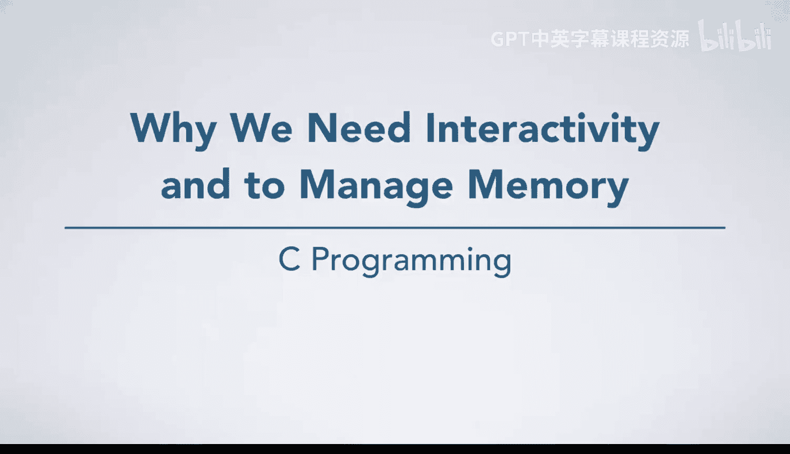
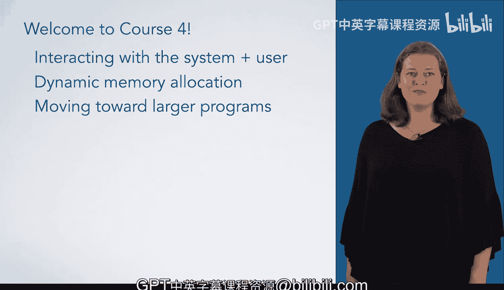

# 076：为什么我们需要交互性和内存管理 🚀



在本节课中，我们将探讨C语言编程中两个至关重要的高级主题：程序与系统/用户的交互，以及动态内存管理。理解这些概念是编写功能完整、高效且健壮的程序的关键。

## 课程概述 📋

到目前为止，你的C语言编程技能已经得到了很好的发展。现在是时候通过几个非常重要的主题来完成这门专项课程的学习了。

第一个我们将要讨论的主题是与系统和用户的交互。你已经学会了向屏幕打印输出，但如果你想要读取用户的输入呢？如果你想把数据存储到文件中，而不是打印到屏幕上，或者从文件中读取数据，又该如何操作？那些使用命令行参数的程序又是如何利用这些参数的？我们将涵盖所有这些主题，并介绍一些关于你的程序与操作系统之间关系的背景知识，这些任务都涉及到操作系统。

本课程的第二个主要主题是动态内存分配。这意味着在程序运行时分配空间来存储数据，因为你在编写程序时并不知道需要多少空间。如果你的程序需要读取一个文件，你并不知道该文件中会有多少数据，可能是50行，也可能是5000万行。即使你创建了一个能容纳5000万个元素的数组，你仍可能发现你的程序需要处理5亿个元素。

最后，我们将讨论一些在你开始编写更大规模程序时需要牢记的重要概念。你目前在本课程中编写的程序规模还比较小。有些程序拥有数千甚至数百万行代码。我们虽然不会处理那么大规模的程序，但会讨论重要的原则，并通过一个中等规模的示例进行实践。

那么，让我们开始深入学习吧。

## 核心主题详解 🔍

### 程序交互性

上一节我们概述了本课程的方向，本节中我们来看看程序交互性的具体需求。程序不仅需要输出信息，更需要接收输入并与外部环境（如用户、文件系统）进行沟通。

以下是程序交互性的几个关键方面：

*   **用户输入**：程序需要能够读取用户从键盘输入的数据。
*   **文件操作**：程序需要能够将数据持久化存储到文件中，或从文件中读取数据以供处理。
*   **命令行参数**：程序启动时，可以通过命令行接收额外的参数来改变其行为。

这些交互都依赖于程序与操作系统之间的协作。操作系统作为中间层，管理着硬件资源（如键盘、磁盘），并为程序提供统一的接口（如函数调用）来访问这些资源。

### 动态内存管理

理解了程序如何与外界交互后，我们来看看程序内部如何高效地管理数据。在许多情况下，程序所需的数据量在编写时是无法预知的。

动态内存分配解决了这个问题。它允许程序在运行时（而非编译时）请求操作系统分配特定大小的内存空间。这通过C标准库中的函数来实现，例如：

```c
// 动态分配一个能容纳n个整数的内存空间
int *dynamic_array = (int*)malloc(n * sizeof(int));
```

如果预先分配的固定大小数组（例如 `int array[1000];`）不足以容纳所有数据，程序可能会崩溃或产生错误。动态内存管理提供了灵活性，使程序能够根据实际需求调整其使用的内存量。

### 迈向更大规模的程序

最后，当我们开始构思和编写更复杂、规模更大的程序时，需要遵循一些重要的软件工程原则。

以下是编写大型程序时需注意的几个核心概念：

*   **代码组织**：将代码合理地分割成模块或函数，提高可读性和可维护性。
*   **可维护性**：编写清晰、有注释的代码，便于自己或他人日后修改和扩展。
*   **模块化设计**：构建可以独立测试和重用的代码单元。

我们将通过分析一个中等复杂度的示例程序，来具体观察这些原则是如何被应用的。

## 总结 🎯



本节课中，我们一起学习了C语言编程进阶的两个核心支柱：**交互性**与**内存管理**。我们了解到，程序需要通过输入输出、文件操作和命令行参数与外界沟通；同时，为了处理未知大小的数据，必须掌握动态内存分配的技巧。最后，我们探讨了编写大规模程序时应遵循的组织与设计原则，为开发更复杂的软件奠定了基础。掌握这些知识，将使你的程序从简单的计算工具，转变为能够解决实际问题的强大应用。