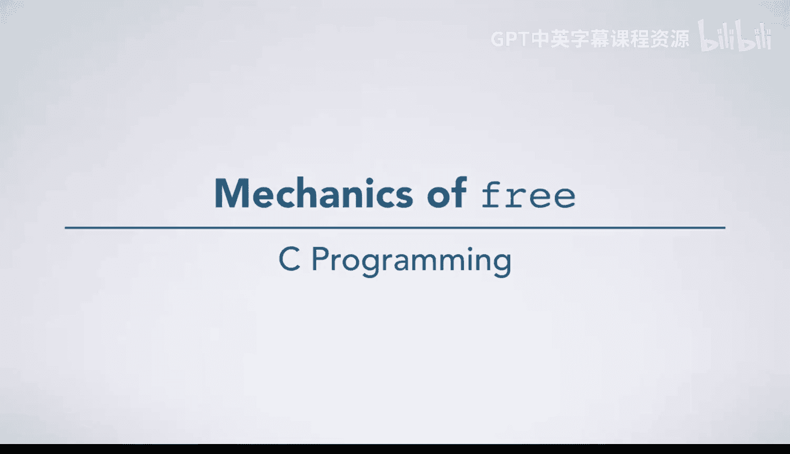
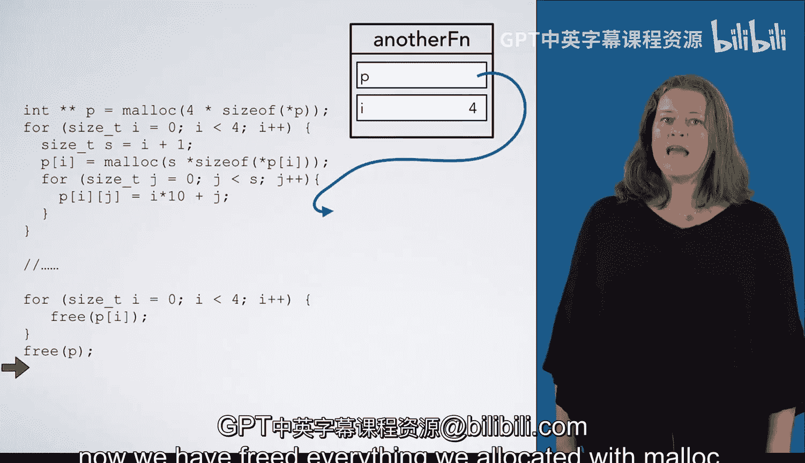

# 082：free的机制原理 🧠



在本节课中，我们将要学习C语言中`free`函数的工作原理。你已经学会了如何使用`malloc`分配内存，同样重要的是，当你使用完内存后，需要调用`free`来释放它。本节将通过示例代码，详细讲解`free`的语义和内存释放后的状态变化。

---

上一节我们介绍了动态内存分配，本节中我们来看看如何正确地释放内存。

我们从一个示例代码开始，展示`free`的语义。首先，我们声明了一个指针`P`，并使用`malloc`将其初始化为指向一个包含4个整数的数组。然后，我们向数组中填充了一些数据。为了说明另一个要点，在代码末尾，我们创建了另一个指针`Q`，并将其设置为等于`P`。

代码中有一个注释（...），表示我们省略了使用这些数据进行实际计算的代码部分。现在，我们展示在调用`free`之前程序的状态。

```c
int *P = (int *)malloc(4 * sizeof(int));
// ... 填充数据 ...
int *Q = P;
// ... 使用数据的代码 ...
// 调用 free 之前的状态
```

现在，让我们看看执行`free`时会发生什么。首先，请注意我们是将指针`P`传递给`free`函数。`free(P)`实际上并不影响指针`P`本身，而是影响`P`所指向的内存。

让我们看看`P`指向哪里。它指向`malloc`之前分配给我们的那个包含4个整数的内存块。释放这块内存会“销毁”这个内存盒子，并使`P`成为一个悬空指针。

任何对`P`所指向内存的进一步使用都是无效的，就像使用任何悬空指针一样。同时请注意，由于`Q`指向与`P`相同的位置，`Q`现在也变成了悬空指针。我们也不应该尝试解引用`Q`。

---

接下来，让我们尝试一个稍微复杂一点的例子。同样，我们从代码中准备释放内存的那个点开始。在继续之前，你应该自己推导出此时程序的状态。

以下是此时程序状态的图示（使用不同颜色的箭头帮助你理清指向关系，箭头颜色本身没有特殊含义）：

首先，我们进入`for`循环，创建变量`I`并将其初始化为0。我们将释放`P[I]`。此时`I`为0，所以指针`P[0]`是这里的这个箭头。我们将释放它所指向的内存块。

调用`free`完成后，请注意该指针现在变成了悬空指针。只要我们不试图解引用它，这就没问题。

我们进入下一个循环迭代，释放`P[1]`所指向的内存。执行`free`，然后进入下一个循环迭代。我们进入`for`循环，释放`P[2]`所指向的内存。再次回到`for`循环的开头，释放`P[3]`所指向的内存。

现在`I`变为4，我们退出`for`循环。最后，我们释放`P`，它也指向一块由`malloc`分配的内存。释放`P`会释放那块内存。至此，我们已经释放了所有通过`malloc`分配的内存。

以下是该过程的代码示意：

```c
// 假设 P 是一个指针数组，每个元素都指向一块 malloc 分配的内存
for (int i = 0; i < 4; i++) {
    free(P[i]); // 释放每块独立分配的内存
}
free(P); // 最后释放存储指针的数组本身
```

---

本节课中我们一起学习了`free`函数的核心机制。关键点在于：
1.  `free`释放的是指针所指向的内存，而非指针变量本身。
2.  内存被释放后，指向它的指针变为**悬空指针**，不应再被解引用。
3.  所有指向同一块内存的指针在释放后都会变为悬空指针。
4.  对于复杂结构（如指针数组），需要确保释放所有动态分配的内存块，避免内存泄漏。



理解并正确使用`free`是管理内存、编写健壮C程序的基础。