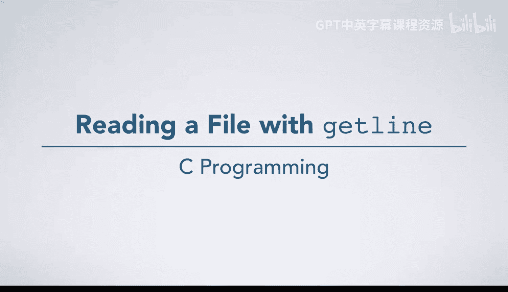

# 086：使用getline读取文件 📖



在本节课程中，我们将学习如何使用C标准库中一个非常方便的函数——`getline`——来逐行读取文件。我们将通过一个具体的例子，详细拆解其工作原理和内存管理过程。

## 概述

`getline`函数能够自动处理内存分配，简化从文件中读取文本行的过程。本节将演示如何声明变量、打开文件、循环调用`getline`，并解释其内部如何处理缓冲区、内存分配和文件结束（EOF）的情况。

---

## 变量初始化与文件打开

首先，我们需要声明并初始化几个局部变量，并打开要读取的文件。

*   `size_t size`：用于告知`getline`当前缓冲区的大小。
*   `size_t length`：用于接收`getline`返回的字符串长度。
*   `char *line`：这是一个指针，将指向`getline`分配的、包含当前读取行的缓冲区。
*   `FILE *f`：文件指针，指向以读取模式打开的文件。

以下是初始化代码：
```c
size_t size = 0;
size_t length = 0;
char *line = NULL;
FILE *f = fopen("names.txt", "r"); // 假设文件包含三行姓名
```

## 首次调用getline

现在，我们开始使用`getline`读取文件的第一行。调用`getline`时，需要传递三个参数的地址。

以下是调用方式：
```c
length = getline(&line, &size, f);
```

传递给`getline`的参数含义如下：
1.  `&line`：指向`line`指针的地址。初始时`line`为`NULL`，`getline`会据此分配内存。
2.  `&size`：指向`size`变量的地址。`getline`会更新此值以反映它分配的缓冲区大小。
3.  `f`：要读取的文件指针。

### getline的内部操作

当执行流程进入`getline`函数内部时，它会按顺序执行以下主要任务：

1.  **检查并分配内存**：由于传入的`line`指针为`NULL`，`getline`会在堆（heap）上分配一块初始内存（例如8字节）来存储读取的行。
2.  **更新size变量**：分配内存后，`getline`通过我们传入的地址，将`size`更新为新缓冲区的大小（例如8）。
3.  **读取文件内容**：`getline`从文件中读取一行文本（直到遇到换行符`\n`），将其存入缓冲区，并在末尾自动添加字符串终止符`\0`。
4.  **返回字符串长度**：函数返回读取到的字符串长度（包括换行符，但不包括`\0`）。例如，对于`"Alex\n"`，返回长度为4。

调用完成后，`length`被赋值为4，程序进入`while`循环打印该行。注意，`printf`中无需额外添加`\n`，因为换行符已包含在字符串中。

## 后续调用与内存重用

读取下一行时，我们再次调用`getline(&line, &size, f)`。

此时，`line`已指向一个有效的缓冲区，且`size`记录了其大小（8字节）。因此，`getline`内部会跳过内存分配和`size`更新的步骤，直接尝试将新的一行读入现有的缓冲区。**这会覆盖之前的内容**。如果希望保留之前读取的行，需要自行将内容复制到别处。

## 缓冲区扩容

当尝试读取的行长度超过当前缓冲区大小时，`getline`会自动进行内存重分配。

例如，当前缓冲区大小为8，但下一行需要10字节的空间（包含`\n`和`\0`）。`getline`会执行以下操作：
1.  在堆上分配一块更大的新内存。
2.  将现有缓冲区中的数据复制到新内存。
3.  释放旧的缓冲区。
4.  更新`line`指针，使其指向新的缓冲区。
5.  更新`size`变量为新缓冲区的大小。
6.  继续将完整的行读入新分配的缓冲区。

这个过程对调用者是透明的，无需手动干预。

## 处理文件结束（EOF）

当文件所有行都被读取后，再次调用`getline`会尝试读取。此时遇到文件结束（EOF），`getline`将返回`-1`（一个负值）。

由于返回值`length`不再大于等于0，`while`循环的条件`while(length >= 0)`不再满足，循环终止。

## 资源清理与程序结束

在退出程序前，必须手动释放`getline`在堆上分配的内存，并关闭已打开的文件。

以下是清理代码：
```c
free(line);   // 释放缓冲区
fclose(f);    // 关闭文件
```

---

## 总结


本节课我们一起学习了`getline`函数的使用。我们了解到：
1.  `getline`能自动处理缓冲区的分配、扩容和释放，简化文件读取。
2.  它通过指针参数来更新缓冲区地址和大小，并返回读取的字符串长度。
3.  当读取到文件末尾时，`getline`返回`-1`，这通常用作循环结束的条件。
4.  使用完毕后，**必须**记得用`free()`释放`getline`分配的内存，并用`fclose()`关闭文件，以避免内存泄漏和资源占用。