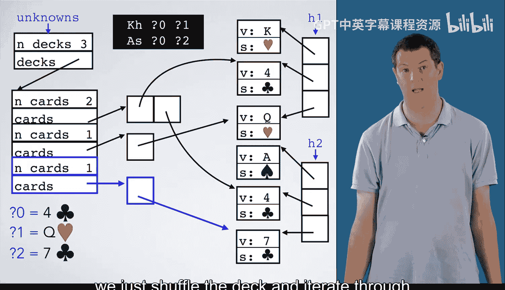
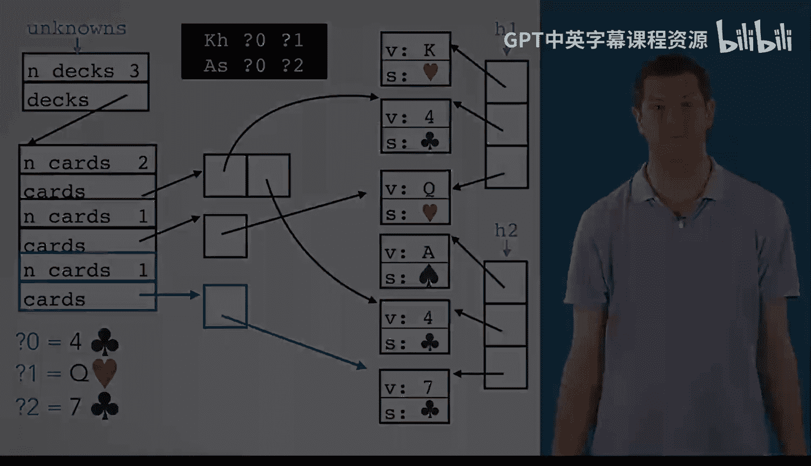

# 090：扑克项目最终部分 🃏

在本节课中，我们将完成扑克牌项目的最终部分。我们将学习如何处理输入和未知牌，并通过编写主函数将所有代码整合起来，实现蒙特卡洛模拟。

## 项目概述与目标

上一节我们介绍了扑克牌项目的核心逻辑。本节中，我们来看看如何整合所有代码，特别是处理包含未知牌的情况。

我们的目标是编写一个主函数，该函数能够读取包含未知牌的输入，并通过蒙特卡洛模拟来评估牌手的胜率。

## 处理未知牌的挑战

项目中一个看似棘手的部分是如何处理未知牌。例如，考虑以下包含两个手牌的输入示例：
*   手牌1：红桃K，未知牌`?0`，未知牌`?1`
*   手牌2：黑桃A，未知牌`?0`，未知牌`?2`

注意，两个手牌共享同一个未知标识符`?0`。这意味着在我们的实现中，必须确保两个手牌中的`?0`最终被赋予相同的随机牌值。实际手牌需要至少5张牌，但这里我们使用一个较小的例子来说明原理。

## 解决方案：使用未知牌结构

我们可以利用已学过的概念——指针、数组和结构体——来解决这个问题。我们将创建一个结构来追踪未知牌。

由于我们已经有一个`deck`类型来表示一组指向`card`的指针，我们将复用这个类型。我们的未知牌结构将包含一个`deck`数组，数组中的每个`deck`对应一个特定的未知标识符（例如，`?0`对应一个`deck`，`?1`对应另一个）。

与普通的牌堆不同，这些`deck`中的指针将指向各个手牌中的“占位符”卡片，以便后续填充。

## 构建未知牌结构：分步解析

以下是构建该结构的具体步骤：

1.  **处理手牌1的红桃K**：为手牌1和这张牌分配内存。
2.  **处理手牌1的`?0`**：创建一张占位符卡片，可以将其值初始化为无效值（如`-1`），这样如果后续忘记赋值，更容易发现错误。由于这张牌是未知的，我们需要更新未知牌结构：为`?0`分配一个`deck`，并使其单元素数组指向刚创建的这张占位符卡片。
3.  **处理手牌1的`?1`**：类似地，为`?1`创建一个`deck`，并使其指向这张新的占位符卡片。
4.  **处理手牌2的黑桃A**：为手牌2和这张牌分配内存。
5.  **处理手牌2的`?0`**：这张牌也是未知的`?0`。我们不需要创建新的`deck`，而是向`?0`对应的现有`deck`中添加一个元素，使其也指向手牌2中新建的这张占位符卡片。
6.  **处理手牌2的`?2`**：创建占位符卡片。由于是`?2`，我们需要创建一个新的`deck`，并使其指向这张占位符卡片。

## 为未知牌分配随机值

构建好未知牌结构后，我们需要用它来为占位符卡片分配随机值。

首先，我们需要知道要抽取多少张随机牌。在这个例子中，我们需要3张（对应`?0`、`?1`、`?2`）。通常，这等于未知标识符的总数。

假设我们洗牌后，顶部三张牌是：梅花4、红桃Q、梅花7。我们如何将手牌中的卡片设置为这些值？

1.  **为`?0`赋值**：所有需要被设置为梅花4的卡片，都可以通过`?0`对应的`deck`中的指针找到。我们遍历这个数组，并使用找到的指针来引用那些需要被修改的卡片，将其值设置为梅花4。
2.  **为`?1`赋值**：使用`?1`对应`deck`中的指针，找到需要修改的卡片，并将其值设置为红桃Q。
3.  **为`?2`赋值**：对`?2`和梅花7重复相同的过程。

如果我们想用另一组随机牌重复此过程（例如进行下一次蒙特卡洛模拟），只需重新洗牌，并再次遍历未知牌结构即可。

## 核心逻辑代码示意

以下是上述逻辑的简化代码示意：

```c
// 假设 unknown_cards 是一个数组，每个元素是一个 deck，对应一个未知标识符
// 假设 random_drawn_cards 是一个数组，包含从牌堆顶部抽取的随机牌

for (int i = 0; i < num_unknown_identifiers; i++) {
    // 获取当前未知标识符对应的 deck
    deck *d = &unknown_cards[i];
    // 获取对应要分配的随机牌
    card *c_to_assign = &random_drawn_cards[i];

    // 遍历该 deck 中的所有指针（指向各个手牌中的占位符卡片）
    for (int j = 0; j < d->n_cards; j++) {
        card *placeholder = d->cards[j];
        // 将占位符卡片的值设置为随机牌的值
        placeholder->value = c_to_assign->value;
        placeholder->suit = c_to_assign->suit;
    }
}
```

## 总结与下一步

本节课中，我们一起学习了如何完成扑克牌项目的最终整合。我们探讨了处理包含共享未知标识符的输入数据的挑战，并设计了一个利用指针、数组和结构体的解决方案来追踪和填充未知牌。最后，我们概述了如何使用这个结构，通过蒙特卡洛模拟为未知牌分配随机值并评估胜率。





现在，你已经掌握了所有必要的概念和策略，可以开始动手编写主函数，将之前课程中编写的代码模块（如牌堆操作、手牌评估等）与本节课的输入处理和模拟逻辑结合起来，最终完成这个项目。