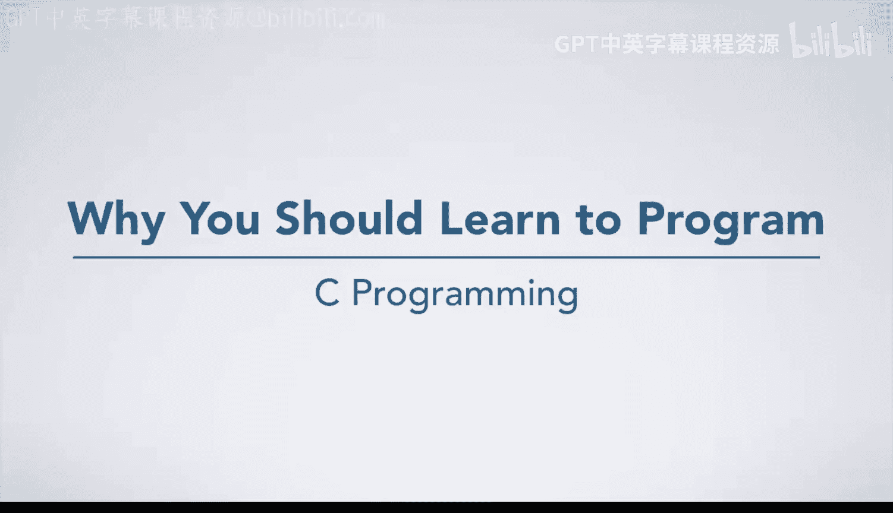
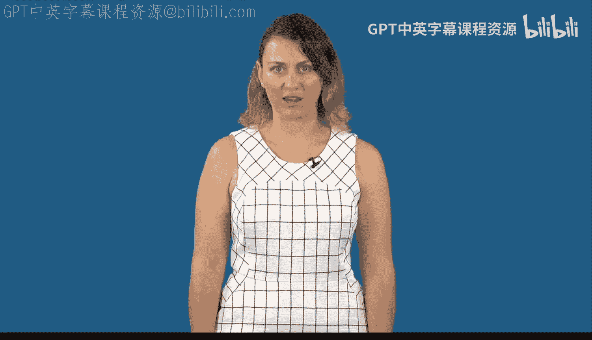
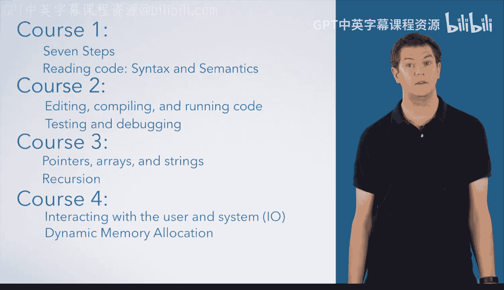
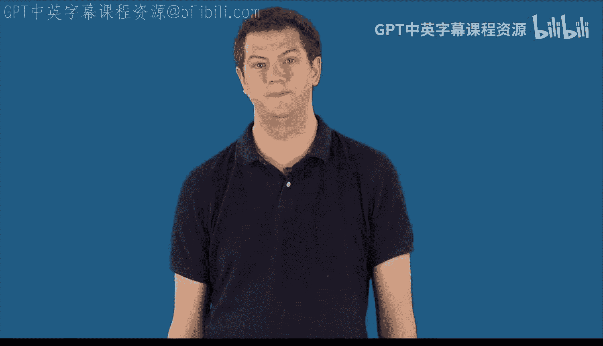

# 杜克大学《C语言入门（编程基础、C代码、指针⧸数组⧸递归、内存）｜Introductory C Programming》 p01 01_01_01_为什么你应该学习编程.zh_en -BV1Kp42117vh_p1-

Hello and welcome to programming Fundamentals， the first course in an introduction to programming in C。

 I'm Drew Hilton， and I hope you are ready to learn a lot about programming。😊，And I'm An Bracy。

 and would also like to welcome you to this course and specialization。

 I'm excited that you have the chance to come learn to program with us。😊，And I'm Genevieve Flip。

 I learned to program and see from Drew and Anne's book that this specialization is based on and can tell you firsthand that it is a great way to learn。

 You don't need any prior background in programming。

 Just an eagerness to learn and excitement about thinking through problems。😊。

As Genevieve just mentioned， this specialization is great。 If you are new to programming。

 You might be thinking about learning for a wide variety of reasons。

 Maybe you want to become a professional software developer。 If so， this is a great starting point。

 We're going to build solid fundamentals that will serve you well in both C and any other language。

 Or maybe you want programming skills to use in some other discipline。

 I know a lot of social scientists and natural scientists who have found programming necessary to analyze the data that they have to explore the problems in their field。

😊，Some of you may have already taken an intro course and be looking to expand your skills。

 This can be a great chance to both build your programming skills from solid fundamentals and to learn a new language。

 Another great reason to take this specialization is if you are taking a computer organization class。

 either on courseursera or in school and don't have the seed programming background to excel。

 This specialization is a great way to come up to speed on those topics。😊。

So what's special about the way that we are going to teach you。

 We're going to start from the very beginning。 A lot of programming courses assume you can just figure out how to write code from seeing a few examples。

 We aren't going to do that。Instead， were going to teach you a step by step approach to solve programming problems。

 This seven step approach is a great way to tackle any programming problem from smaller ones that you will use as practice in this course to large。

 complicated ones that you will use in real life situations。

 We're also going to teach you how to read code as well as how to write it。 After all。

 how can you write if you can't read， for every piece of syntax that we teach you。

 we are also going to teach you the semantics。 what exactly the code does for any code you write。

 you will be able to execute it by hand， saying exactly what every line does which goes hand in hand with the principle of no magic we're never going to tell you to write or do a thing just because Instead。

 we want you to learn that everything in programming is about well definedfined rules which you can understand and follow or even execute yourself。

 So where do we go from here， the rest of this course is all about computational thinking。

 You'll learn。😊，A lot of important concepts， how to design an algorithm to solve a problem。

 how to execute a piece of code by hand， and everything is a number principle。

 These will lay the foundation for you to start writing programs in C in course 2。Speaking。

 of course， too， that is where you will learn to use a variety of tools that are important to develop your code。

 you'll learn things like how to turn your code into an actual program that the computer can run。

 which is called compiling。 you'll also learn about testing and debugging。

 finding and fixing mistakes in your program。In course3。

 you will learn about ways to store more complex data using pointers， arrays and strings。

 If you don't know what these are now， no problem。 we'll explain them when we get there。

And in course 4， we'll learn how to interact with the user in the system。

 as well as how to dynamically allocate memory when you don't know in advance how much data you have to work with。

So let's get started。

