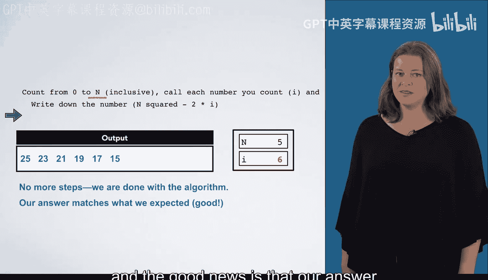
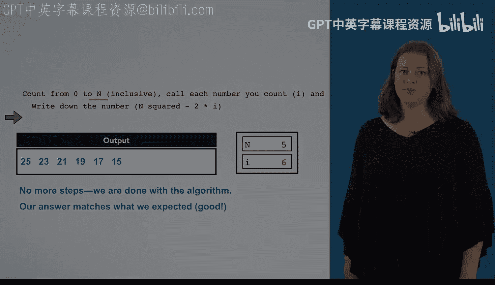

# 杜克大学《C语言入门（编程基础、C代码、指针⧸数组⧸递归、内存）｜Introductory C Programming》 p03 03_01_05_测试数值序列算法.zh_en -BV1Kp42117vh_p3-

In this video， we're going to test the algorithm that we just wrote。

 We are going to be counting from 0 to n， and n is variable。

 We're going to draw boxes for each of our variables to keep track of what value they currently have as we step through our algorithm。

As we begin， n has the value5。The other thing we're going to keep track of is the output of our program here is a box labeled output。

 and every time we write something down， we're going to write it into this output box。Finally。

 we're going to use a green arrow to keep track of where we are。 Right now。

 the arrow is right before the line that says count from 0 to n。

 which means we haven't done this yet。Now we can start。

 The first thing we want to do is count from 0 to n inclusive and call each number that we're counting I。

Since I is a variable and it's going to start with the value0。

 we create a box to hold I and its value of0。Now we enter the next step。

The next thing we're going to do is write down n squared minus2 times i。

We have a little bit of math to do here。 N is the value5 and I has the value 0。

 so this gives us 25 minus0 or 25。And again， we're supposed to write this number down。

 so we place this number into our output box。Now this process is going to repeat again and again。

Now I is going to have the value1。Once again， we're going to compute n squared -2 times I。

 This is the same as last time， except I has the value of  one。 This is 25-2 or 23。

 We write that to our output box。Now we just completed i equals 0 and i equals1。

 and we're trying to get all the way to i equals 5。So now we're working on I with a value of 2。

 once again， n squared minus2 times I， which is 25 minus4。The value is 21。

And we will write this to our output box。Now we're working on I with the value of three。

We're going to write down the number。N squared -2 times I，25-6， which is 19 into our output box。

And we're going to keep doing this for I having the value4， which is 17。For i equals 5。Which is 15。

I keeps getting larger each time we step through our algorithm。When I equals 6， however。

We're going to stop because we're only counting up to n equals 5。At this point。

 we finished the entire algorithm。 and the good news is that our answer matches what we were expecting。

 The sequence of numbers is， in fact， what we were hoping to produce。😊。

