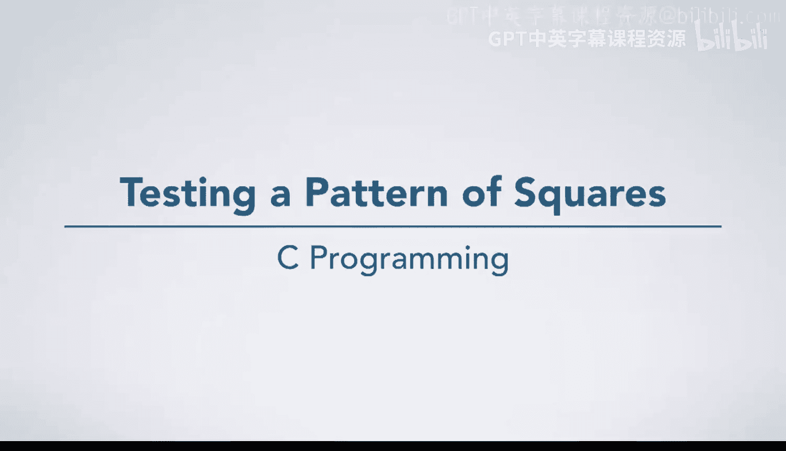
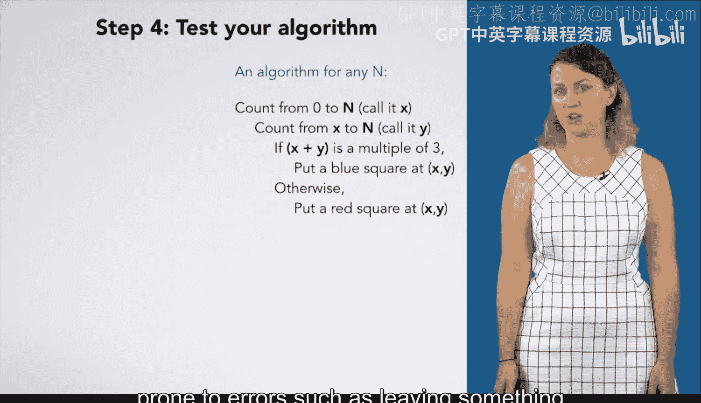

# C语言入门：p05：测试正方形模式算法 🧪

在本节课中，我们将测试一个用于在网格上绘制蓝红正方形图案的算法。测试能增强我们对算法的信心。由于泛化是编程过程中较困难且易出错的部分（例如，可能将本应作为变量的值误设为常量），因此测试尤为重要。

## 准备工作 🛠️

我们需要一个用于绘制的网格、一个箭头来跟踪算法执行位置，以及一个列出变量的方框。我们设定 `n` 的值为 **2**。

## 算法执行步骤 📝

以下是算法的逐步执行过程。

首先，我们为变量 `x` 创建一个方框，并从 **0** 开始计数。接着，为变量 `y` 创建一个方框，并从 `x` 的当前值（此处为 **0**）开始计数。

现在，我们需要判断 `x + y` 是否是 **3** 的倍数。此时 `0 + 0 = 0`，是 **3** 的倍数。

因此，我们进入 `if` 语句，在坐标 **(0, 0)** 处放置一个蓝色正方形。至此，`y` 的当前迭代步骤完成。

我们继续计数，`y` 变为 **1**。计算 `0 + 1 = 1`，不是 **3** 的倍数。

于是，我们进入 `otherwise` 子句，在坐标 **(0, 1)** 处放置一个红色正方形。`y` 的当前步骤完成。

继续计数，`y` 变为 **2**。计算 `0 + 2 = 2`，不是 **3** 的倍数。

我们在坐标 **(0, 2)** 处放置一个红色正方形。继续计数，`y` 变为 **3**。

由于我们只从 `x` 计数到 `n`（即 `y` 从 `x` 到 `n`），当 `y = 3` 时，已超出范围，因此不执行任何步骤。

## 继续外层循环 🔄

上一节我们完成了 `x = 0` 时的内层循环。本节中，我们继续为 `x` 计数，现在 `x` 变为 **1**。

我们将从 `y = 1` 计数到 `n`（即 `y` 从 `1` 到 `2`）。首先，`y = 1`。

计算 `1 + 1 = 2`，不是 **3** 的倍数。

我们在坐标 **(1, 1)** 处放置一个红色正方形。然后递增 `y`，`y` 变为 **2**。

计算 `1 + 2 = 3`，是 **3** 的倍数。

我们在坐标 **(1, 2)** 处放置一个蓝色正方形。至此，`y` 的计数完成。

接下来，我们计数下一个 `x`，`x` 变为 **2**。此时，`y` 从 `2` 计数到 `2`。

计算 `2 + 2 = 4`，不是 **3** 的倍数。

我们在坐标 **(2, 2)** 处放置一个红色正方形。`y` 的计数完成。

接着，我们计数下一个 `x`。由于我们只计数到 `n`（即 `x` 从 `0` 到 `2`），当 `x` 尝试变为 **3** 时，已超出范围。

因此，计数过程结束。

## 算法验证 ✅

算法执行完毕。我们得到了预期的结果图案。可以说，我们的算法至少在 `n = 2` 的情况下是有效的。

通过测试一个并非用于推导算法的特定 `N` 值，我们对算法的正确性增加了信心。当然，若想获得更高置信度，需要进行更全面的测试。但需谨记，测试本身无法**证明**算法绝对正确，它只能让我们对其正确性越来越有信心。

## 总结 📚

本节课中，我们一起学习了如何通过手动模拟执行来测试一个网格着色算法。我们使用 `n = 2` 作为测试用例，逐步跟踪了变量 `x` 和 `y` 的变化，并根据条件 `(x + y) % 3 == 0` 放置了相应颜色的正方形。这个过程验证了算法在特定情况下的正确性，并加深了我们对循环和条件判断执行流程的理解。记住，测试是编程中不可或缺的一环，它能帮助我们发现潜在的错误并提升代码质量。