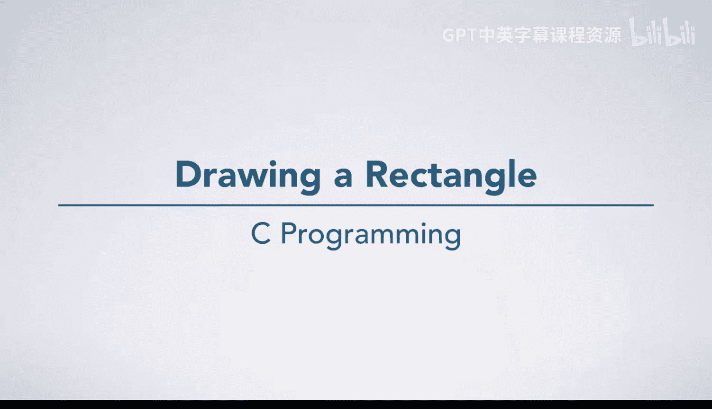
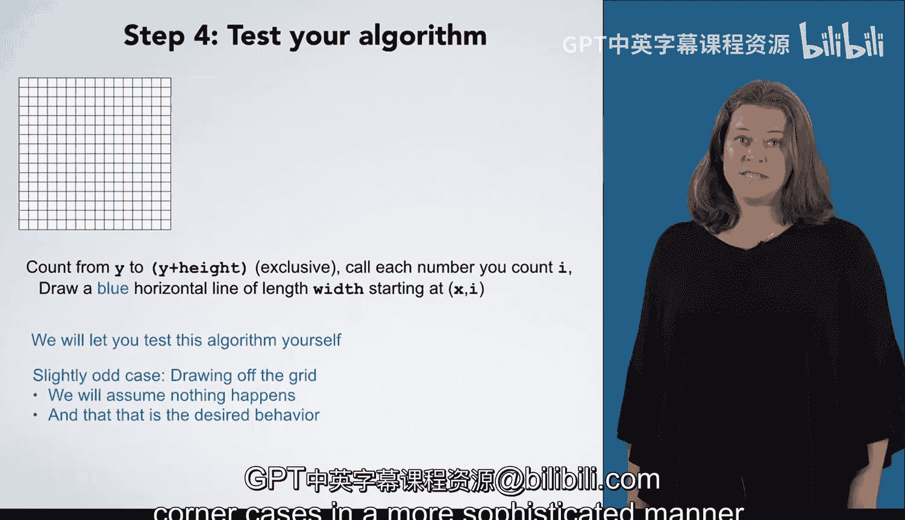

# C语言入门：p06：绘制矩形算法设计

在本节课中，我们将学习如何为一个具体问题设计算法：在16x16的网格上，根据给定的起始坐标、宽度和高度，绘制一个蓝色矩形。

## 问题概述

我们有一个16x16的网格。目标是绘制一个蓝色矩形，该矩形具有特定的高度和宽度，并位于一个特定的起始坐标（X, Y）处。

## 具体实例分析

首先，我们通过一个具体实例来理解问题。假设起始坐标为（7, 9），矩形宽度为8，高度为4。

要解决这个具体实例，我们从起始点开始，用蓝色画笔绘制这个矩形。

现在，我们退一步，写下刚才绘制矩形的步骤。

1.  从坐标（7, 9）开始，绘制一条长度为8的水平线。
2.  从坐标（7, 10）开始，绘制一条长度为8的水平线。
3.  从坐标（7, 11）开始，绘制一条长度为8的水平线。
4.  从坐标（7, 12）开始，绘制一条长度为8的水平线。

让我们暂时离开绘图，审视一下写下的这四行描述。你会发现这是一个非常重复的过程。

这四步的唯一区别是Y坐标。Y坐标从9开始，到12结束。我们从9开始，因为这是矩形起始的Y坐标。我们在12结束，因为我们要绘制一个高度为4的矩形，所以需要绘制四条水平线，停止在 `Y + 高度 - 1` 的位置。

## 归纳通用算法

检查完这四步后，让我们尝试编写一个能将其推广的算法。

回顾一下，我们是从Y开始计数，直到 `Y + 高度` 这个值。注意，这个范围是**不包含** `Y + 高度` 本身的，因为我们数了9, 10, 11, 12，并没有数到13（即 `Y + 高度`）。我们将这个循环变量称为 `i`。

对于 `i` 的每一个值，我们都要从坐标（7, `i`）开始，绘制一条长度为8的水平线。

为什么长度是8？因为这是矩形的宽度，所以我们可以将其称为 `宽度`。这样，我们的算法就能适用于不同大小的矩形。

为什么X坐标从7开始？因为这是起始的X坐标，我们可以将其称为 `X`。这样，我们的算法就能适应所有X值。

现在，这一步“从坐标（X, `i`）开始绘制一条长度为 `宽度` 的水平线”看起来有点复杂。这没关系，我们可以将其视为另一个独立的编程问题。我们假设已经知道如何完成这一步，或者可以将其作为一个新问题，从头开始用步骤1到4的方法来解决。在本练习中，我们假设我们知道如何执行这一步。

最后，我们需要增加一点精度，因为我们想要的是蓝色线条。所以算法需要明确指出：绘制一条**蓝色**的、长度为 `宽度` 的水平线，起始位置为（X, `i`）。

以下是完整的算法描述：

对于 `i` 从 `Y` 到 `Y + 高度 - 1`（包含）：
*   从坐标（X, `i`）开始，绘制一条蓝色的、长度为 `宽度` 的水平线。

你可以用自己设定的X、Y、宽度和高度值来测试这个算法，看看它是否有效。

## 边界情况说明

最后需要注意，某些X、Y、宽度和高度的组合会导致绘图超出网格边界。在本例中，我们假设发生这种情况时无需特殊处理，不做任何响应就是期望的行为。后续课程中，我们将学习更复杂的方式来处理错误和边界情况。

## 本节总结

本节课中，我们一起学习了如何为一个绘制矩形的问题设计算法。我们从分析一个具体实例入手，识别出重复的步骤模式，然后将其归纳为一个通用的循环算法。该算法使用起始坐标（X, Y）、宽度和高度作为参数，通过循环绘制一系列水平线来形成矩形。我们还简单讨论了算法边界情况的处理方式。