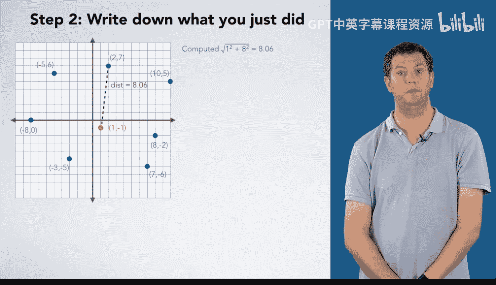

# C语言入门：07：最近点问题

## 概述
在本节课中，我们将学习如何从一组点中找到距离给定点最近的点。我们将通过一个具体的例子，逐步推导出解决此问题的通用算法。

---

## 07_01：手动求解实例 🧮

上一节我们介绍了课程目标，本节中我们通过一个具体例子来手动寻找最近点。

我们有一个笛卡尔坐标系，其中定义了一个点集 **S** 和另一个给定点 **P**。点 **P** 的坐标是 (1, -1)。我们的目标是找到 **S** 中距离 **P** 最近的点。

首先，我们需要计算两点间距离的数学定义。两点 **(x1, y1)** 和 **(x2, y2)** 之间的距离公式为：

**距离 = √[(x2 - x1)² + (y2 - y1)²]**

以下是手动计算和比较每个点与点 **P** 距离的步骤：

1.  计算 **P(1, -1)** 与点 **(2, 7)** 的距离：√[(1-2)² + (-1-7)²] = √(1 + 64) ≈ 8.06。
2.  计算 **P** 与点 **(10, 5)** 的距离：√[(1-10)² + (-1-5)²] = √(81 + 36) ≈ 10.82。比较 10.82 与 8.06，8.06 更小，因此当前最近点仍是 **(2, 7)**。
3.  计算 **P** 与点 **(8, -2)** 的距离：√[(1-8)² + (-1-(-2))²] = √(49 + 1) ≈ 7.07。比较 7.07 与 8.06，7.07 更小，因此更新当前最近点为 **(8, -2)**。
4.  计算 **P** 与点 **(6, -5)** 的距离：√[(1-6)² + (-1-(-5))²] = √(25 + 16) ≈ 7.81。比较 7.81 与 7.07，7.07 更小，因此当前最近点保持为 **(8, -2)**。
5.  计算 **P** 与点 **(-3, -5)** 的距离：√[(1-(-3))² + (-1-(-5))²] = √(16 + 16) ≈ 5.66。比较 5.66 与 7.07，5.66 更小，因此更新当前最近点为 **(-3, -5)**。
6.  计算 **P** 与点 **(-4, 3)** 的距离：√[(1-(-4))² + (-1-3)²] = √(25 + 16) ≈ 9.06。比较 9.06 与 5.66，5.66 更小，因此当前最近点保持为 **(-3, -5)**。
7.  计算 **P** 与点 **(-5, 2)** 的距离：√[(1-(-5))² + (-1-2)²] = √(36 + 9) ≈ 9.22。比较 9.22 与 5.66，5.66 更小，因此当前最近点保持为 **(-3, -5)**。

所有点测试完毕，最终答案为 **(-3, -5)**。通过视觉检查，该点看起来确实是距离 **P** 最近的点。

---

## 07_02：步骤分析与关键发现 🔍

上一节我们完成了手动计算，本节中我们来仔细分析并记录下这些步骤。

我们将上述计算过程整理为更清晰的步骤列表：

以下是记录每一步计算和比较的详细过程：
*   计算 √(1² + 8²) ≈ 8.06。
*   计算 √(9² + 6²) ≈ 10.82，比较 10.82 与 8.06，8.06 更小。
*   计算 √(7² + (-1)²) ≈ 7.07，比较 7.07 与 8.06，7.07 更小，因此这是一个更好的选择。
*   计算 √(6² + (-5)²) ≈ 7.81，比较 7.81 与 7.07，7.07 更小。
*   ... 以此类推。
*   最终给出答案 **(-3, -5)**。

这些步骤看起来合理，但我们在记录过程中忽略了一个关键点。仔细看最后一步“给出答案 **(-3, -5)**”。当我们尝试将这个过程推广为通用算法时，我们会问：为什么答案是 **(-3, -5)**？我们发现，答案 **(-3, -5)** 在之前的步骤描述中并没有明确出现。

这个现象表明我们的步骤记录有遗漏。我们在思考时下意识地做了某件事，但没有把它写下来。在推广算法之前，必须先修正这一点。

我们为什么选择 **(-3, -5)** 作为答案？回顾最后几步，长度为 5.66 的虚线是我们跟踪的“当前最近距离”。我们最初以 **(2, 7)** 作为起点，之后每次发现更短距离时就更新这个“当前最近点”。然而，在我们写下的步骤里，从未提及与这个“当前最短距离”相关联的是哪个点。

我们需要修正步骤，加入对“当前最近点”的跟踪：
1.  初始最佳选择为 **(2, 7)**。
2.  当计算到点 **(8, -2)** 并判断 7.07 更小时，我们将最近点更新为 **(8, -2)**。
3.  当计算到点 **(-3, -5)** 并判断 5.66 更小时，我们将最近点更新为 **(-3, -5)**。

现在，最终的答案就清晰了：它就是最后一次更新后保留的“最佳选择”。

---

## 总结
本节课中，我们一起学习了“最近点”问题。我们首先通过一个具体实例手动计算，然后仔细分析了计算步骤，并发现了一个关键遗漏——需要持续跟踪“当前最近点”而不仅仅是距离。修正后的完整步骤为我们下一节将算法推广到通用情况打下了坚实基础。