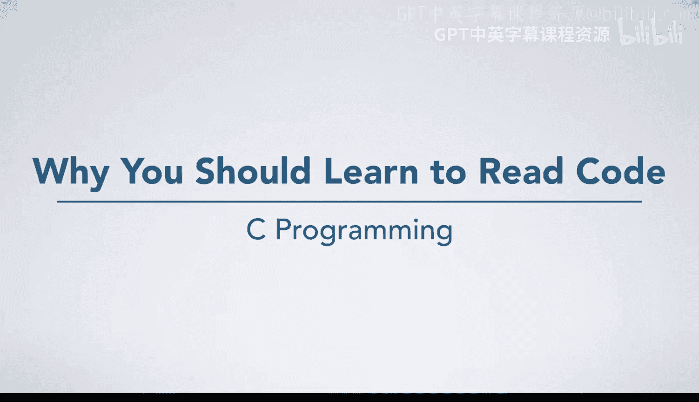
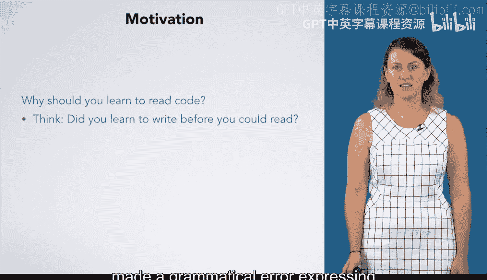
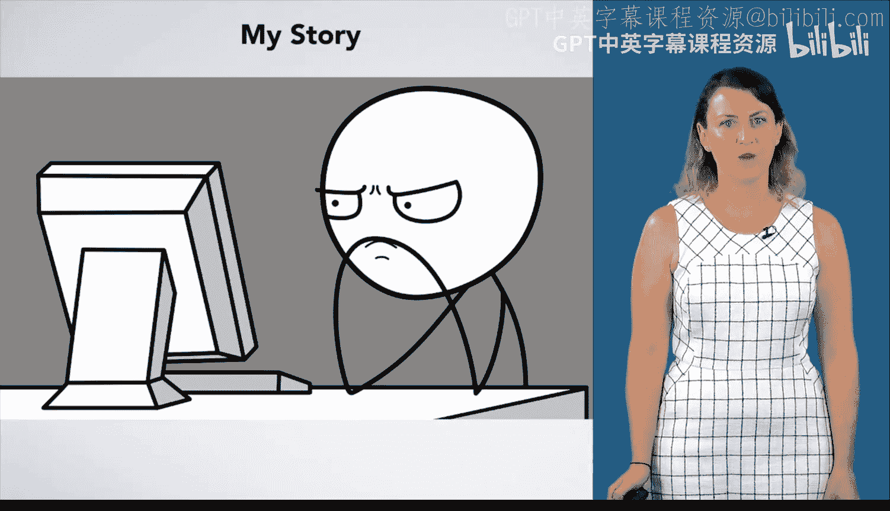
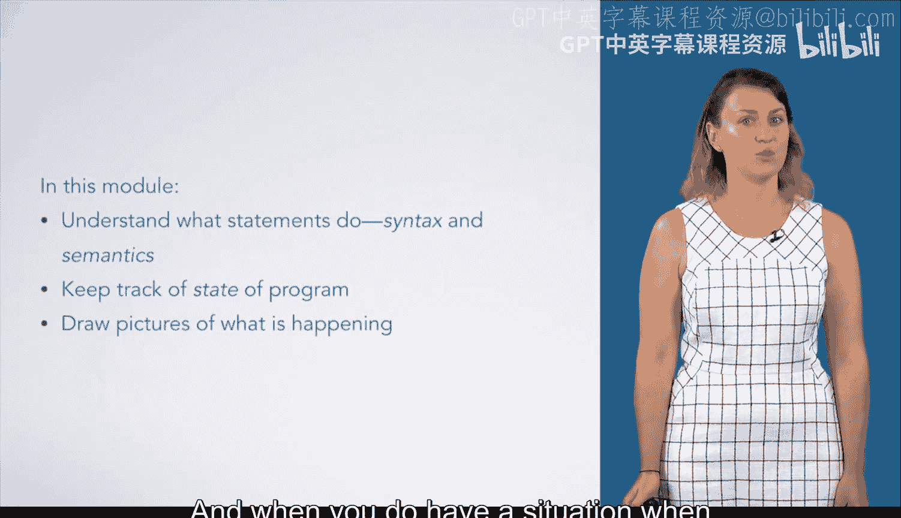

# 杜克大学《C语言入门（编程基础、C代码、指针⧸数组⧸递归、内存）｜Introductory C Programming》 p09 09_02_01_为什么你应该学习阅读代码.zh_en -BV1Kp42117vh_p9-

In this module， you will learn to read code and execute it by hand。

 Why would you want to do this when you could take a quick syntax lesson and start typing。

Think for a moment about when you were first learning about written language。

 Did you learn to write before you could read， Probably not。

 Re a word or sentence and attaching meaning is easier than formulating your own。

 You've probably misspelled a word or made a grammatical error expressing an idea that you could read just fine。

Programming is much like this。 You need to read for understanding and understand exactly how code is executed before you can write good code of your own。

 It's also easier。Reading well will help you make fewer mistakes as you go。

 but also help you troubleshoot when your code does something you did not expect。

My background is in mechanical engineering， And in my undergraduate program。

 we used Matlab for computational tasks。 Despite excellent instruction and thoughtful exercises。

 Many students， myself included would spend hours debugging code， mostly by guessing and checking。

 Never once did I draw a picture of what I thought was happening or execute even a line of code by hand。

 And I probably couldn't have because there were a few things I didn't understand fully。😊。

While teaching， I have seen students make similar mistakes。

Finding the cause of an error message is a treasure hunt。

 one that might take much longer than someone spent writing the code in the first place。

Often， we know what we want a section of code to be doing， maybe even what we think it's doing。

 but unless you can be sure you cannot be confident in your result and you'll likely spend more time debugging than you want to。

Here is an algorithm for a function we'll talk about later in the course。

You can see here that each step of the algorithm changes something about the state of the program。

Here are the same steps implemented in code。 Do not worry if you do not know how to read this yet。

 The point is that the code needs to change the program in the exact same way as your algorithm。

 If the code is doing something different， we need to change it to match the algorithm。

 This is why learning to read code is so important for writing it。In this module。

 you'll learn to understand what statements do。 Both the syntax or grammar of a language and the semantics or meaning a statement has。

 You'll also learn how to keep track of the state of a program。

 where you are and what functions can see which variables。To do this。

 you will learn how to draw pictures of exactly what is happening。 according to a set of rules。

 Once you can do these things， writing code will come easier。

 And when you do have a situation when your code does not do what you expect。

 you'll have a set of tools you can use to investigate your program to see what it is doing。

