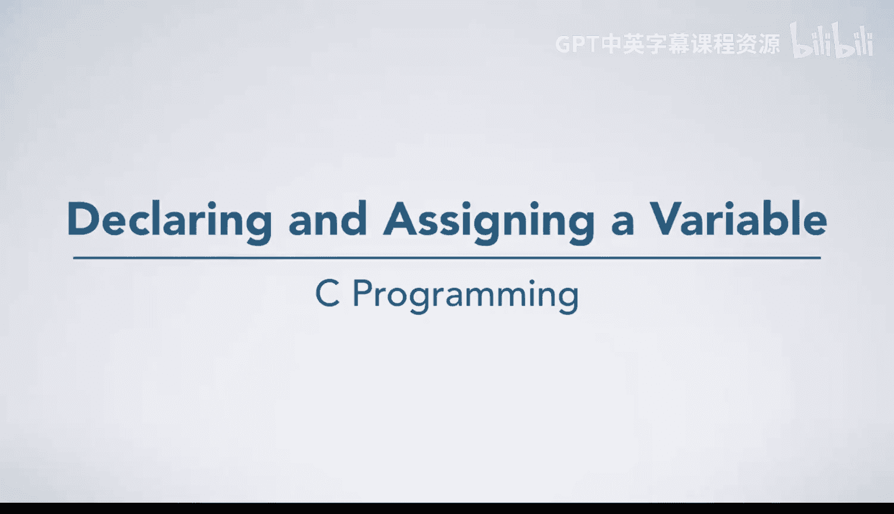
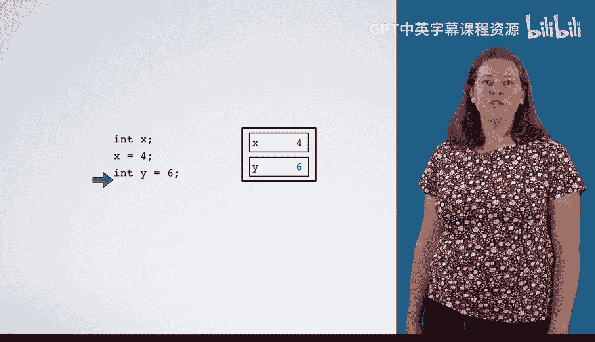
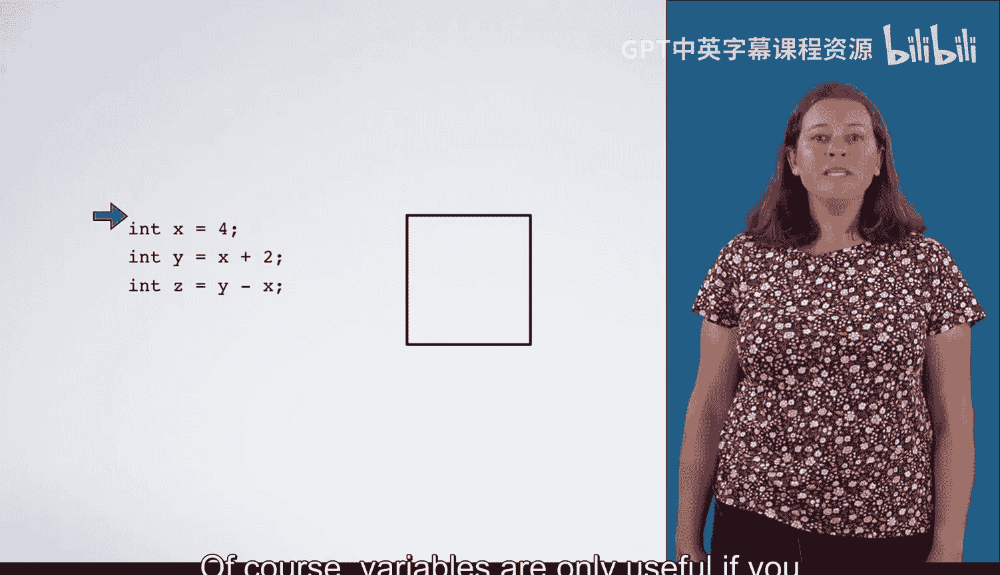
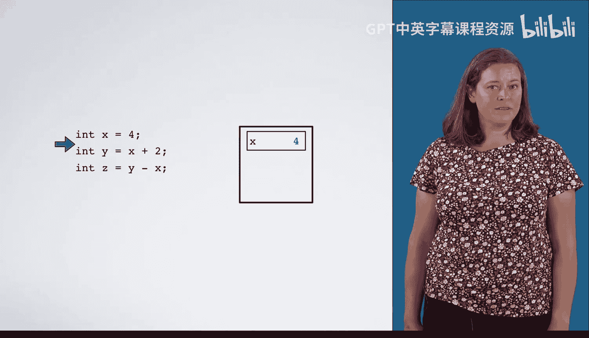
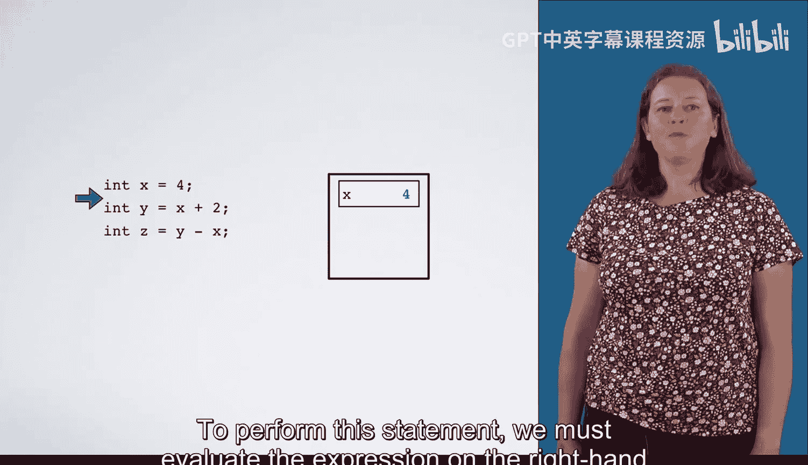
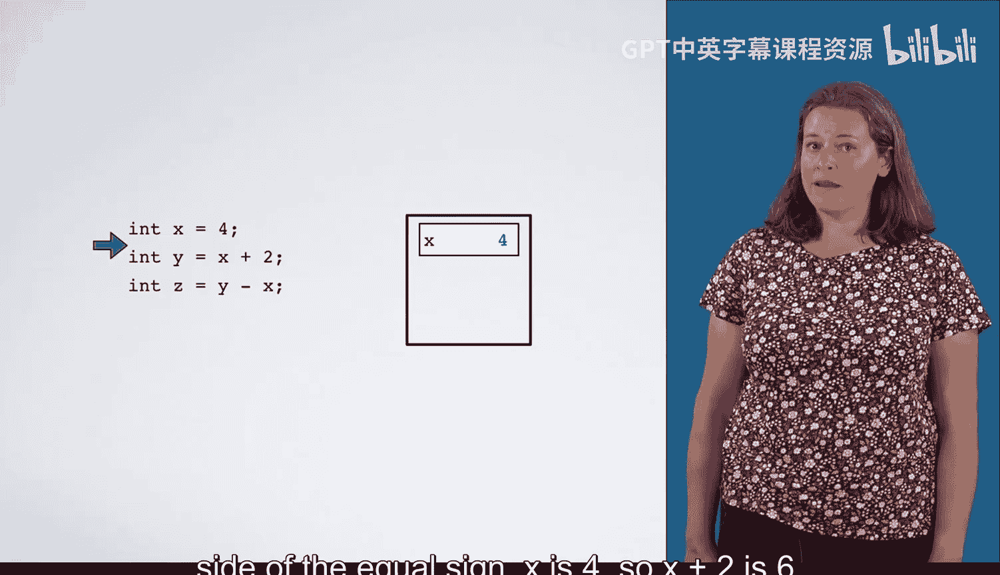
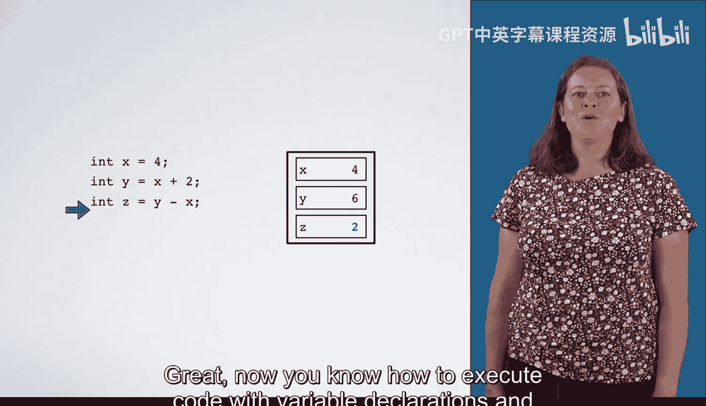

# C语言入门：P10：变量声明与赋值 📝



在本节课中，我们将学习C语言中最基础的语句——变量声明与赋值。我们将从最简单的代码执行开始，逐步构建对更复杂语句的理解。

## 概述

我们将首先了解如何声明变量，然后学习如何为变量赋值，最后探讨如何将声明与赋值结合在一行代码中完成。理解这些基础概念是编写任何C程序的第一步。

## 变量声明

在C语言中，使用变量前必须先声明它。声明语句告诉编译器变量的名称和类型。

以下是声明变量的基本语法：
```c
int x;
```
执行这条语句会在内存中创建一个标记为 `x` 的“盒子”。由于变量 `x` 未被初始化，这个盒子里的值是未知的。

我们可以声明多个变量：
```c
int x;
int y;
```
执行这两条语句会创建两个独立的“盒子”，分别标记为 `x` 和 `y`。它们都未被初始化。

**重要提示**：使用未初始化的变量是危险的，这会导致程序中出现难以发现和修复的错误（bug）。

## 变量赋值

声明变量后，我们可以使用赋值语句为其赋予一个具体的值。

赋值语句的基本语法是：
```c
变量名 = 值;
```
例如，在声明 `int x;` 之后，我们可以写：
```c
x = 4;
```
执行这条赋值语句会将数字 `4` 放入标记为 `x` 的盒子中。此时，变量 `x` 就被初始化了，其值为 `4`。

## 声明时初始化

为了代码的简洁和安全，我们经常在声明变量的同时就为其赋值。这被称为初始化。

声明时初始化的语法是：
```c
int 变量名 = 值;
```
例如：
```c
int y = 6;
```
执行这条语句会一次性完成两件事：1) 创建一个标记为 `y` 的盒子；2) 将数字 `6` 放入这个盒子中。



## 使用变量进行计算

变量的真正价值在于存储和操作数据。我们可以在赋值语句的右侧使用表达式，其中包含其他变量。



让我们通过一个例子来理解：



假设我们有以下代码：
```c
int x = 4;
int y = x + 2;
int z = y - x;
```

**执行过程分析**：

1.  执行 `int x = 4;`：创建变量 `x` 并将其初始化为 `4`。
    

2.  执行 `int y = x + 2;`：
    *   首先，计算等号右侧的表达式 `x + 2`。此时 `x` 的值是 `4`，所以 `4 + 2` 等于 `6`。
    *   然后，创建变量 `y` 并将其初始化为计算结果 `6`。
    




3.  执行 `int z = y - x;`：
    *   计算表达式 `y - x`。`y` 的值是 `6`，`x` 的值是 `4`，所以 `6 - 4` 等于 `2`。
    *   创建变量 `z` 并将其初始化为 `2`。
    

通过这个过程，变量 `x`、`y`、`z` 最终分别存储了值 `4`、`6` 和 `2`。

## 总结

本节课我们一起学习了C语言中变量声明与赋值的基础知识。

我们了解到：
*   **变量声明**（如 `int x;`）的作用是在内存中为指定类型的变量预留空间。
*   **变量赋值**（如 `x = 4;`）的作用是将一个值存储到已声明的变量中。
*   **声明时初始化**（如 `int y = 6;`）是将声明和赋值合并的高效且安全的写法。
*   可以在赋值语句中使用包含其他变量的**表达式**（如 `y = x + 2;`），程序会先计算表达式的结果，再将结果赋给变量。



掌握这些概念是理解后续更复杂的控制流、函数和数据结构的关键。现在，你已经可以开始编写简单的C语言程序来执行基础计算了。