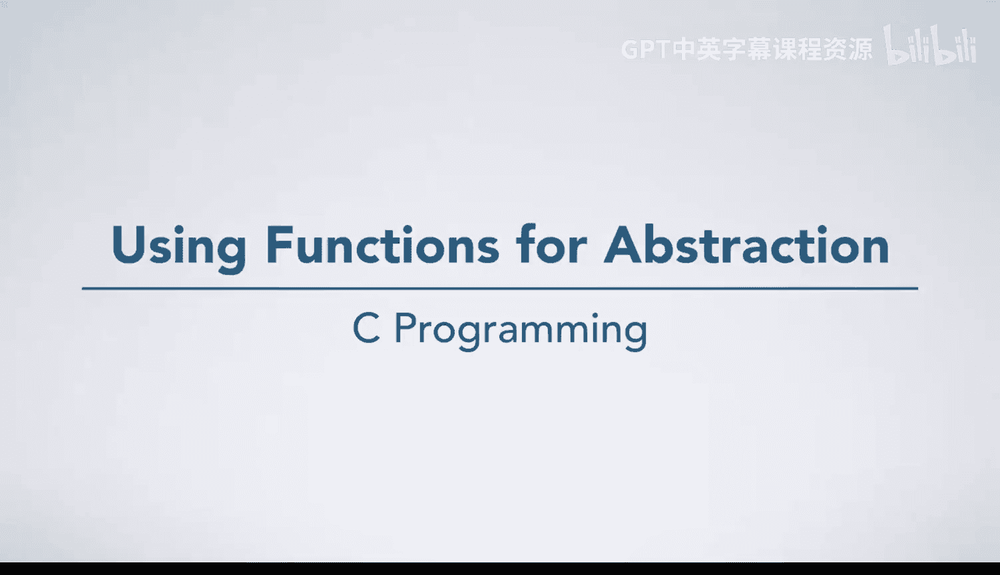
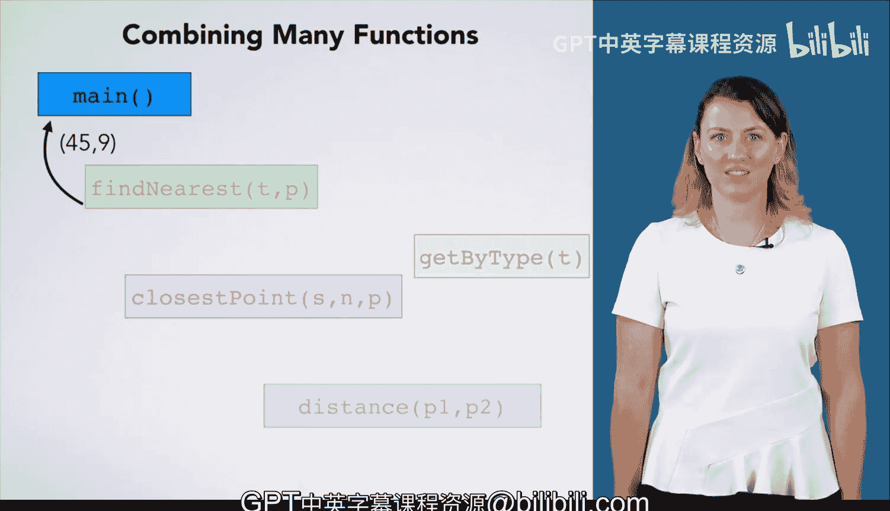

# 杜克大学《C语言入门（编程基础、C代码、指针⧸数组⧸递归、内存）｜Introductory C Programming》 p12 12_02_01_使用函数进行抽象.zh_en -BV1Kp42117vh_p12-

The next piece of C that you are going to learn about is functions to see why they are so important。

 Let us take a look back at our closest point algorithm。

 There are two places here where this algorithm computes the distance between two points。

 Why is that important， Well， we need to do the same computation twice。 Without functions。

 We would write the same code twice， and that is just in this problem。

 What if we have other problems that also need to compute the distance between two points。

 We have a few examples of other problems that would need to compute the distance between two points。

 But there are many others。We could rewrite the code each time。

 which may not seem like a big deal for something as small as computing the distance。

 but we want to avoid duplicating code whenever possible。Every time we rewrite code。

 we run the risk of making mistakes and introducing bugs into our program。Furthermore。

 it is really boring to rewrite the same code again and again。 Instead。

 we should abstract the computation for distance out into a function of its own。

Making distance its own function means we can reuse that algorithm any place we need it without rewriting it。

 How would this work？ Well， our closest point function would， in its code。

 call the distance function。 That is， it would ask the distance function to perform its computation to do this。

 Our closest point function would first pass in parameter values specifying which points the distance function should compute on。

The distance function would execute its code， doing whatever statements are in it。

 According to the rules you are learning。 It finishes when it comes up with an answer。

 which returns back to the function that called it。 When it returns。

 the distance function is done and the calling function continues its own execution。

 making use of the answer it got from the function it called。So how is this helpful， First。

 we can reuse this distance computation anytime we need， we don't have to rewrite it。

 We can just call the distance function to compute the distance between any two points。

Whether we need to compute the distance at the various places in the closest point function or in some other problem we are solving doesn't matter。

 We just call it。The other important benefit of functions is the abstracttraction。

 Abtraction is the separation of the interface， meaning what something does from its implementation。

 meaning how it does it。 Once we have written the distance function。

 we can just make use of it without thinking about its inner workings。

 as you build larger and larger programs abstraction becomes more and more important。

 you aren't limited to two functions either。 you can have many functions。

 which can call as many other functions as they need to。 For example。

 suppose our closest point function We're part of a much larger program。

 which has information about various types of locations and uses that information to give us the nearest location of a particular type。

 you might end up with something like this。 The main function， which is where all C programs start。

 might call a function to find the store nearest point 4217 passing in parameters to specify this information。

 That function might then call another function。😊，To find all locations whose type is store the get by type function could then return back a list of locations for stores。

 which find nearest can then use。 It is totally fine for find nearest to then call another function。

 such as our closest point function to find the point nearest the location we want。

 As we previously discussed closest point can call distance to compute the distance between two points and it will return back the distance it computed。

 Of course， it is totally fine for closest point to call distance as many times as it needs。

 Getting back the answer for whatever points it passed in。

 When closest point finishes its computation and figures out its answer。

 It returns that value to the function that called it。

 which then finishes its computation and returns its answer to the function that called it。 Okay。

 great。 Now you have the high levelve concepts of functions。

 Let's dive into their syntax and semantics in C。😊。

