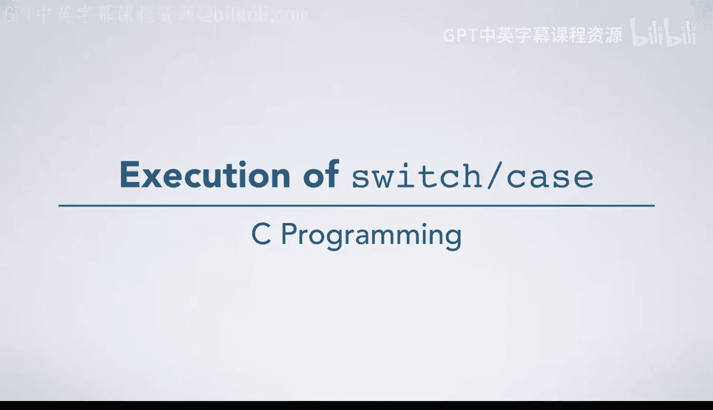
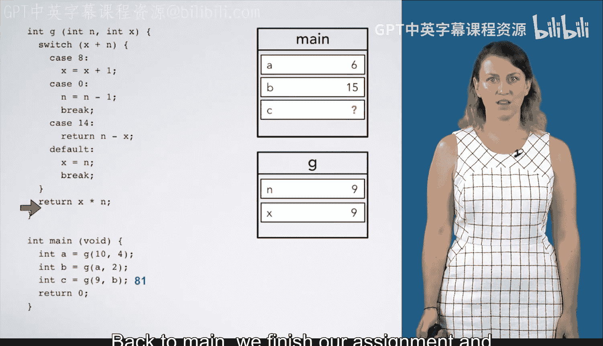
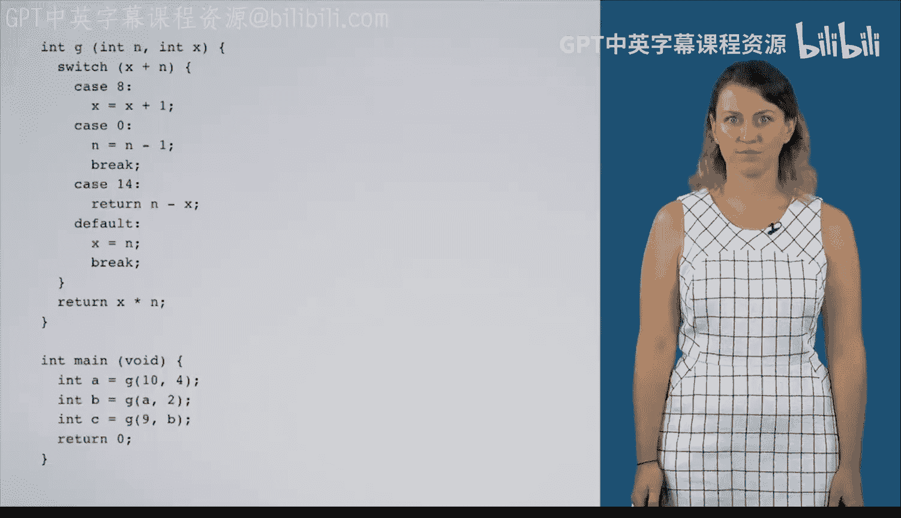

# 杜克大学《C语言入门（编程基础、C代码、指针⧸数组⧸递归、内存）｜Introductory C Programming》 p16 16_02_05_switch-case语句执行过程.zh_en -BV1Kp42117vh_p16-

In this video， we're going to execute code with a function G that contains a switch case statement。

 As always， we begin with the execution arrow at the start of main for the statement A equals G of 104。

😊，We make a box for a since we're declaring it， then we create a frame for the function G and populate it with the values 10 for n and 4 for x。

 We make a note of where we are and we' return to when the function is complete。And enter function G。

 We have a switch statement。 X plus N in this case is 4 plus 10， which is 14。

 So we find the match case label， case 14 and transition our execution arrow inside that case and begin executing statements there。

 The first statement we encounter is a return statement。 N- x 10-4 equals 6。 As always。

 when we encounter a return statement， we're going to make a note of the value to return and leave the function that were N going back to the calling function and destroying the frame。

😊，We finish the assignment statement with a equal to 6。 Now we reach in B equals G of a and 2。

 So we create a box for B。 drawaw a frame for G passing in the arguments A， which is 6 and 2。

We note our position and enter function G。Here our selection expression is 2 plus 6， which is 8。

 so we're going to go into the case for 8 and begin executing statements there。

 The first statement we encounter is x equals x plus 1。

 so we update the box for x to have three instead of 2。Now， we fall through to the next case。

 There' is no brake statement here， and we don't worry about the fact that there's another case label。

 We just keep executing statements until we reach a break。 The next statement is n equals n -1。

 So we're going to update the value of N to be 5。 And now we do reach a break statement。

 This brake statement is going to take us out of the innermost enclosing switch statement。

 The boundaries of which are here。 As we'll see later， break could take us out of other constructs。

But in this case， itll take us out of the switch statement that encloses it。

 And we begin executing executing code after the switch。

 The next statement we encounter says to return x times n， which is3 times 5， which is 15。

 So we return 15。 Re to main and destroy the frame for G。😊，And assign 15 to B。

 Now we have in to C equals G of 9 and B。 So we create a box for C。

 a frame for G with arguments 9 and B， which is 15。 and note where we are in inter function G。

 evaluating this expression gives us 24。 Looking at our case labels。 We have 8，0 and 14。

 None of those match 24。 So we use the default， which matches anything that's not named explicitly by another case label。

 We'll jump into the default case and begin executing statements there。 We do x equals N。

 assigning 9 to x， which brings us to a break， which takes us out of the inside of the switch statement。

 We now return x times N， which is 81， back to main。

 We finish our assignment and return 0 from main exiting the program。😊。

