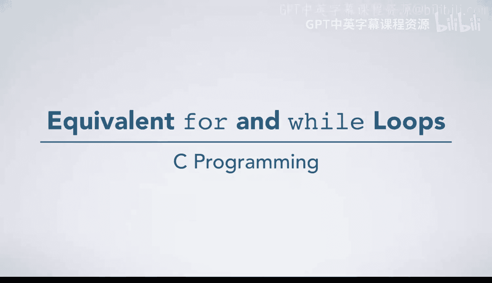
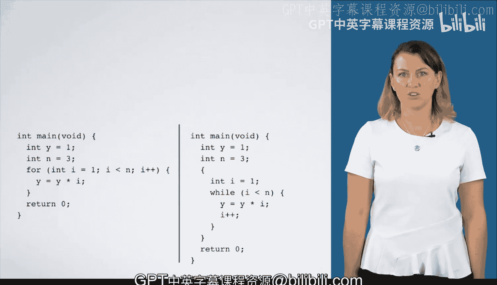

# 杜克大学《C语言入门（编程基础、C代码、指针⧸数组⧸递归、内存）｜Introductory C Programming》 p18 18_02_06_for与while循环等价性.zh_en -BV1Kp42117vh_p18-

In this video， we're going to execute equivalent for loop and while loop code。

 A for loop is sometimes called syntactic sugar because it allows you to write a more compact code for counting a common programming idiom。

 Let's look at their similar anatomy。 Both have an initialization statement in the for loop。

 it follows the four keyword。 And in the equivalent while loop。

 it is just before the beginning of the while loop。😊。

The conditional expression is the second piece following the four keyword and the piece inside parentheses after the while keyword。

The increment statement is the third piece following the four keyword。

 but an equivalent while loop would increment inside the loop body just before the closed curly brackets。

Finally， any statements that happen in the body of the for loop could also happen in a while loop before the increment statement。

Let's see these two equivalent loops in action。 As always。

 we begin with our execution arrow inside main。 We initialize y to 1 and n to 3。 Now。

 the syntax of the four loop has the int I equals one initialization just after the four keywords。

 So we'll pause the execution arrow there as the while execution arrow on the right enters the open curly brace and initializes I changing the state of our program in the same way。

 The purpose of the curly braces is subtle。 Since scope of variable I is limited to the four loop。

 the curly braces restrict the scope of variable I to this box。 Otherwise。

 its scope would be the whole main function， and it would not be equivalent to the four loop version。

 Looking at the conditional expression。 we see one less than three is true。

 So we enter the loop and begin executing statements there。😊，Y times I is one times 1， which is one。

 Next， we'll increment I to 2 and return to the top of the loop。

 Check the conditional expression 2 less than 3 is true。 So we enter the loop and evaluate y times I。

 which is one times 2， assigning 2 to Y Well increment I to 3 and return to the top of the loop 3 less than 3 is false。

 So we move the execution arrow to just after the loop， respecting the scope of I in the for loop。

 We also exit the curly brace after the while loop。

 destroying the box for I since it is now out of scope。Finally， we return zero and exit main。

