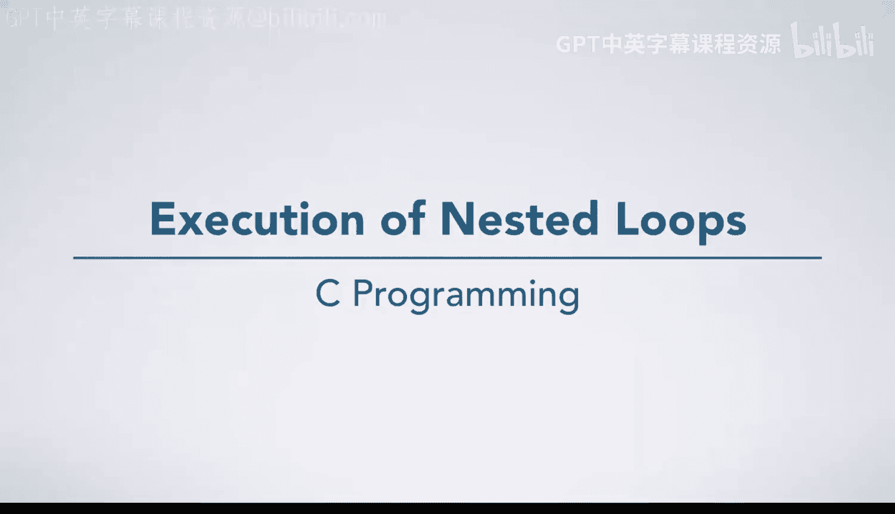
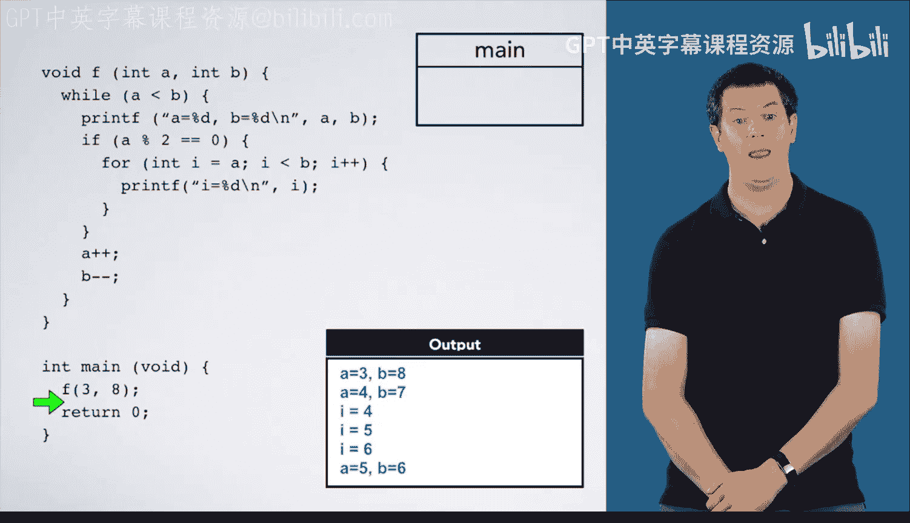
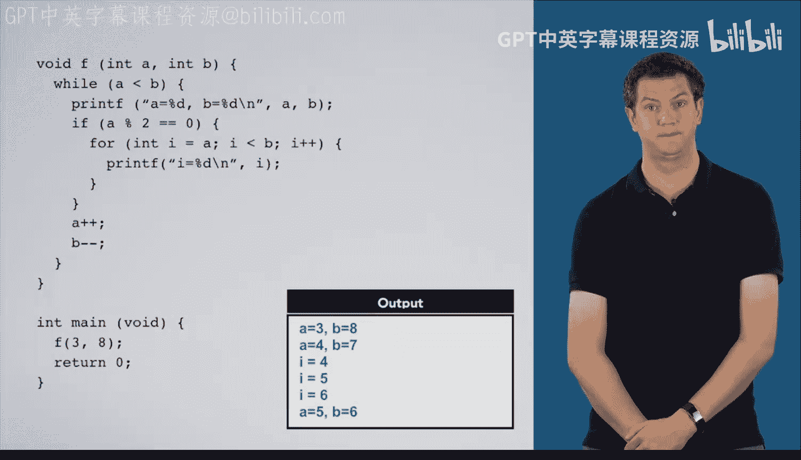

# C语言入门：19：嵌套循环执行过程详解 🌀

在本节课中，我们将通过一个具体的代码示例，详细学习C语言中**嵌套循环**的执行过程。我们将分析一个包含`while`循环、`if`条件语句和`for`循环的复杂结构，并一步步跟踪程序的执行流程。

---

## 概述

我们首先来看一个函数`F`，其内部包含一个`while`循环。在这个`while`循环中，又嵌套了一个`if`条件语句。而在这个`if`语句内部，则包含了一个`for`循环。理解嵌套结构的关键在于，它并没有引入新的规则，我们只需遵循之前学过的、从外到内逐层执行的顺序即可。

## 代码执行流程分析

程序从`main`函数开始执行。首先，我们调用函数`F`，并传入参数`a=3`和`b=8`。

调用函数`F`时，会创建一个新的栈帧。程序会记录返回地址，然后开始执行`F`函数内部的代码。

### 进入while循环

由于条件`a < b`（即`3 < 8`）为真，程序进入`while`循环体。
首先，执行`printf`语句，打印出`a=3, b=8`。
接着，遇到一个`if`语句，其条件是判断`a % 2 == 0`。这里，`%`是取模运算符，用于计算除法后的余数。
计算`3 % 2`，得到余数`1`。因此，条件为假，程序跳过整个`if`语句块。
然后，执行`a++`，将`a`的值增加为`4`；执行`b--`，将`b`的值减少为`7`。
至此，`while`循环体第一次执行完毕。

### 循环的继续与进入if语句

程序跳回`while`循环的起始处，再次检查条件`a < b`（`4 < 7`）。条件为真，因此再次进入循环体。
打印`a=4, b=7`。
再次检查`if`条件`a % 2 == 0`。计算`4 % 2`，得到余数`0`，条件为真。因此，程序这次进入了`if`语句块。

### 执行嵌套的for循环

在`if`语句块内部，是一个`for`循环。
1.  **初始化**：声明整型变量`i`，并将其初始化为`a`的当前值，即`i = 4`。
2.  **条件检查**：检查循环条件`i < b`（`4 < 7`）。条件为真，进入`for`循环体。
3.  **循环体执行**：打印`i=4`。
4.  **更新**：执行`i++`，将`i`的值更新为`5`。
5.  返回步骤2（条件检查）。

以下是`for`循环的完整迭代过程：
*   **第一次迭代**：`i=4`，条件`4<7`为真，打印`i=4`，`i`自增为`5`。
*   **第二次迭代**：`i=5`，条件`5<7`为真，打印`i=5`，`i`自增为`6`。
*   **第三次迭代**：`i=6`，条件`6<7`为真，打印`i=6`，`i`自增为`7`。
*   **第四次条件检查**：`i=7`，条件`7<7`为假。循环终止，程序跳出`for`循环。

### 完成if与while循环

跳出`for`循环后，我们位于`if`语句块的末尾。程序继续执行`if`语句之后的代码。
执行`a++`，`a`变为`5`；执行`b--`，`b`变为`6`。
到达`while`循环体的末尾，再次跳回循环开始处。

### 循环的最后一次迭代

检查条件`a < b`（`5 < 6`），为真，进入循环体。
打印`a=5, b=6`。
检查`if`条件`a % 2 == 0`（`5 % 2 = 1`），为假，跳过`if`语句块。
执行`a++`，`a`变为`6`；执行`b--`，`b`变为`5`。
再次回到`while`循环开始。

### 循环结束与函数返回

检查条件`a < b`（`6 < 5`），此时为假。因此，跳过整个`while`循环体，直接执行到函数`F`的末尾。
函数`F`执行完毕，返回`main`函数。
`main`函数中只剩下`return 0;`语句，执行后程序正常退出。

---

## 总结

本节课中，我们一起学习了嵌套循环的执行过程。通过跟踪一个具体的例子，我们明确了以下几点：
1.  嵌套结构遵循**从外到内、逐层执行**的基本规则。
2.  外层循环（如`while`）的每次迭代，都可能完整地执行其内部嵌套的整个结构（如`if`和内部的`for`循环）。
3.  理解执行流程的关键是**严格跟踪变量的值变化**和**条件表达式的真假判断**。
掌握这些步骤，你就能清晰地分析任何复杂的嵌套控制流结构。