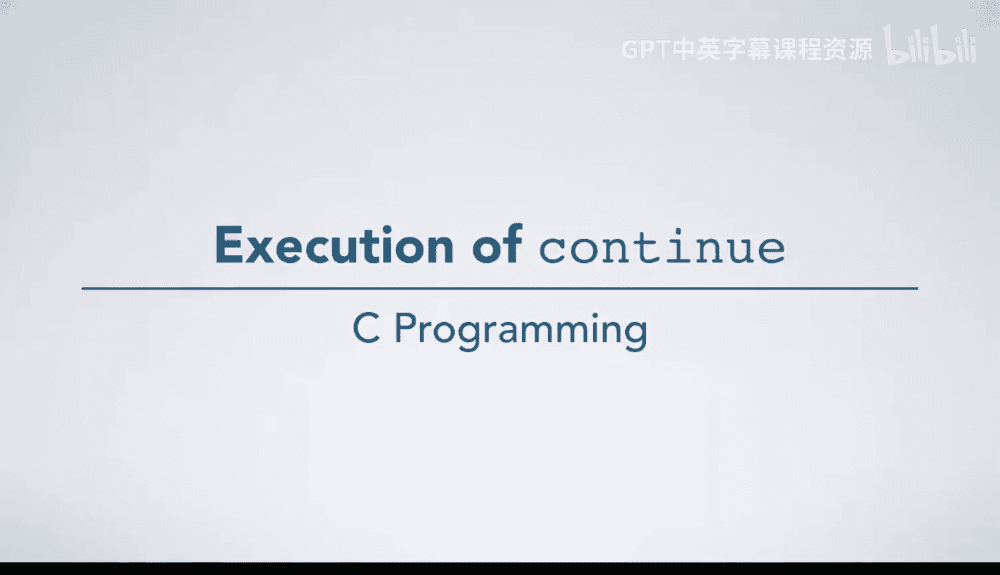
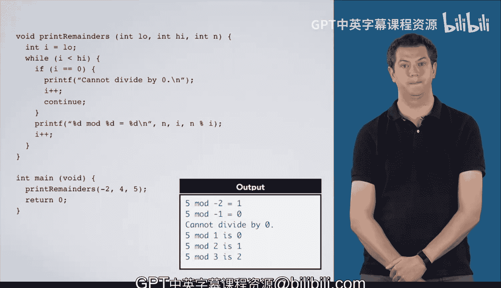

# C语言入门：20：`continue`语句执行过程详解 🚀



在本节课中，我们将学习`continue`语句在循环中的执行过程。我们将通过一个具体的代码示例，逐步分析当程序遇到`continue`时，控制流是如何跳转的，以及循环变量是如何更新的。

---

## 从`for`循环到`while`循环的转换 🔄

为了更清晰地理解`continue`的行为，我们首先将示例中的`for`循环转换为功能等效的`while`循环。

原始`for`循环结构如下：
```c
for (int i = low; i < high; i++) {
    // 循环体
}
```

转换的第一步，是将循环变量的声明移到循环外部：
```c
int i = low;
for (; i < high; i++) {
    // 循环体
}
```

接着，为了更接近`while`循环的形式，我们将增量操作`i++`移到循环体的末尾。但需要注意的是，在`continue`语句之前，我们也放置了一个`i++`。
```c
int i = low;
while (i < high) {
    // 循环体
    i++;
}
```

现在，我们已经成功地将`for`循环转换成了等价的`while`循环。由于变量`i`在函数结束时都会超出作用域，我们可以移除之前为了转换而添加的多余花括号，这不会改变代码的行为。

---

## 逐步执行过程 🧭

现在，我们开始逐步执行代码。我们首先调用`print_remainder`函数，传入参数`-2`， `4`和`5`。

1.  **初始化**：声明变量`i`并将其初始化为`low`（即-2），然后进入`while`循环。
2.  **第一次迭代**：
    *   检查条件`i < high`（-2 < 4）为真，进入循环体。
    *   检查`i == 0`为假，跳过`if`语句。
    *   执行`printf`，打印“5 mod -2 is 1”。
    *   执行`i++`，`i`变为-1。
    *   到达循环体末尾，跳转回循环条件检查处。
3.  **第二次迭代**：
    *   条件`i < high`（-1 < 4）为真，进入循环体。
    *   `i`（-1）不为0，跳过`if`语句。
    *   打印“5 mod -1 is 0”。
    *   `i++`，`i`变为0。
    *   返回循环顶部。
4.  **第三次迭代（遇到`continue`）**：
    *   条件`i < high`（0 < 4）为真，进入循环体。
    *   此时`i`等于0，条件`i == 0`为真，因此进入`if`语句块。
    *   打印“Cannot divide by zero.”。
    *   执行`i++`，`i`变为1。
    *   **遇到`continue`语句**：`continue`语句会**立即终止本次循环的剩余部分**，并直接跳转到循环条件检查处（即`while(i < high)`），开始下一次迭代。它不会执行循环体中`continue`之后的任何代码。
5.  **第四次迭代**：
    *   从循环条件检查开始：`i`为1，条件`i < high`为真。
    *   `i`不为0，跳过`if`，打印“5 mod 1 is 0”。
    *   `i++`，`i`变为2。
6.  **第五次迭代**：
    *   `i`为2，条件为真，进入循环。
    *   打印“5 mod 2 is 1”。
    *   `i++`，`i`变为3。
7.  **第六次迭代**：
    *   `i`为3，条件为真，进入循环。
    *   打印“5 mod 3 is 2”。
    *   `i++`，`i`变为4。
8.  **循环结束**：
    *   再次检查条件`i < high`（4 < 4）为**假**。
    *   跳过循环体，退出`while`循环。
    *   从`print_remainder`函数返回。
9.  最后，从`main`函数返回，程序结束。

---

## 核心要点总结 📝

本节课中，我们一起深入分析了`continue`语句的执行过程：

1.  **作用**：`continue`语句用于**跳过当前循环迭代中剩余的代码**，直接进入下一次循环的条件判断。
2.  **在`for`循环中的行为**：在`for (初始化; 条件; 增量)`循环中，执行`continue`后，程序会**先执行“增量”表达式**（例如`i++`），然后再进行“条件”判断。这是我们通过转换为`while`循环来揭示的关键细节。
3.  **与`break`的区别**：`break`是立即终止整个循环，而`continue`只是终止当前这一次迭代，循环本身还会继续（只要条件满足）。



理解`continue`的精确跳转逻辑，对于编写正确的循环和控制程序流程至关重要。