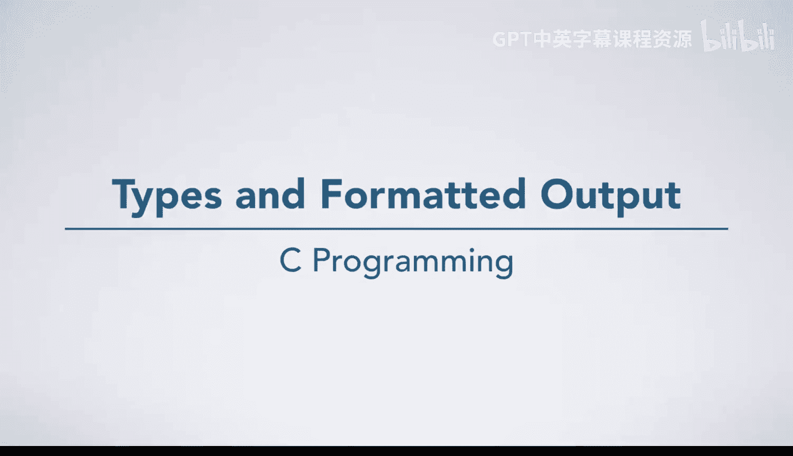
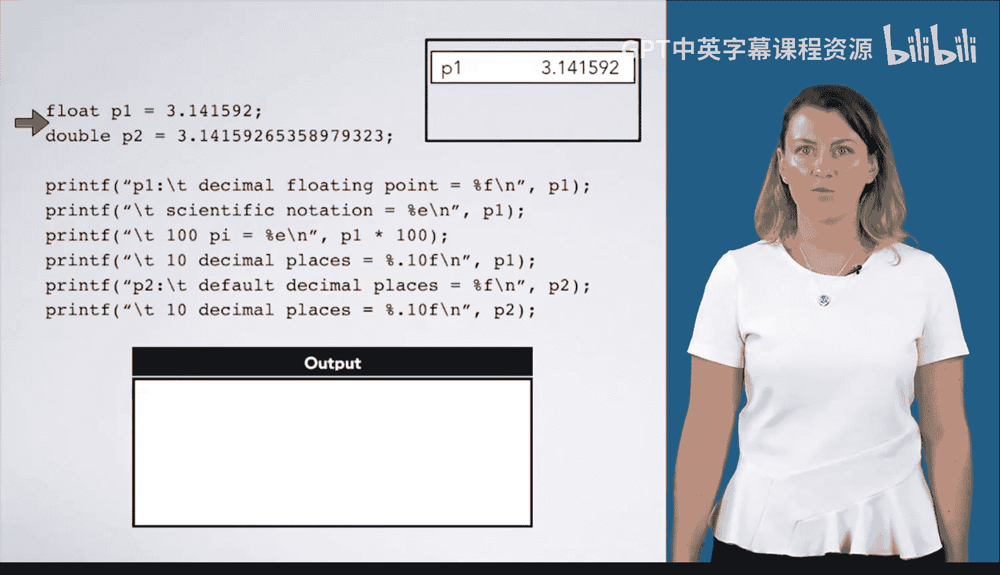

# 杜克大学《C语言入门（编程基础、C代码、指针⧸数组⧸递归、内存）｜Introductory C Programming》 p22 22_03_06_类型与格式化输出.zh_en -BV1Kp42117vh_p22-

In this video， we're going to execute some calls to print F using a variety of format specifiers so you can see how to print types other than int。

 First， we initialize a cha letter to be G。😊，An int Ne number to be negative1 and an unsigned int age to be 33。

 Next， we come to a print statement。 Pri F will look for any format specifiers。 and in this case。

 it has a percent C telling print F to look at the next argument and format it as a character。

 It prints。 My name begins with G。The next statement has the familiar percent D。

 and we have seen before that it will print neck number as a decimal integer。

 The next statement prints the value of age as a decimal integer。

 but the next statement uses the percent O format specifier。

 telling print F to print the value of age in octal or base 8。 The final statement has a percent X。

 telling print F to print the value of age as a hexadecial or base 16 integer。

What if we change things around a bit and use format specifiers that seem strange for the types of data we are passing it？

We start the same way。But now， our print statement uses percent D to format letter。 What will happen。

 Well， remember that everything is a number。 Let actually has a numerical value， which is 71。

 This numerical value is what actually gets passed to print F。

 Print F has no idea that the 71 value it receives is originally from a char。 So it just prints 71。

Next， we print Neg number， which is negative1 as a hexosmal number。

 If you work out how negative 1 is represented with a 32 B signed integer。

 you will find the hex value is F F F F， F F F F。Our next statement uses Pre U。

 which formats an integer as an unsigned decimal number， but we are passing in Neg number。

 So what will happen。 Remember that everything is just a bunch of bits to the computer。

 If you take the binary representation of negative 1。

 which is 321s and interpret it as an unsigned 32 B integer。

 you get the largest possible 32 B unsigned integer， which is about 4。2 billion。

 Our last print statement uses percent C to format the integer H。 What happens here。 will， again。

 everything is just a number。 So print F will print out the character whose numeric representation is 33。

 which is the exclamation mark character。What if we work with floating point numbers instead。

 here are some more print F calls that use floats and doubles。P1 is a float，3。141592。

 and P2 is a double that contains more digits of pi。

 The first call to print F uses the percent F format specifier to print P1 as a floating point number。

The next call has a percent E， which means print P1 in scientific notation。 Note the E plus 0，0。

 which means times 10 to the 0th power or times 1。 If we were to print 100 pi using scientific notation。

 we would get E plus 02 for times 10 to the second power。 Next， we have the format specifier。

 percent dot 10 F。 The dot 10 between the percent in the F means to print 10 decimal places。

 when we do this， we get a slightly odd answer。 Where did this 0，2，5，8 come from。

 This comes from the fact the floating point numbers can't represent every possible number precisely。

 C rounded 3。14，1，5，9，2 to the nearest representable floating point number when it performed the initialization of P1。

When we print P1， it converts that number， which is actually stored in P1 to a decimal representation。

 if that is confusing， it is okay for now since we will not do much with floatinglo Point。

 but if you find yourself writing real programs with floating point。

 you need to understand how all of this works to avoid subtle and dangerous problems。Next。

 we print P2 with the default formatting for a double。

Which prints six digits after the decimal rounding the last one。

Our next print F prints P2 with 10 digits after the decimal。 here they are all what we expect。

 Why is this different， Doubs can represent more numbers more precisely than floats can。

 So the inaccuracies of representing this number do not appear in these 10 digits。

