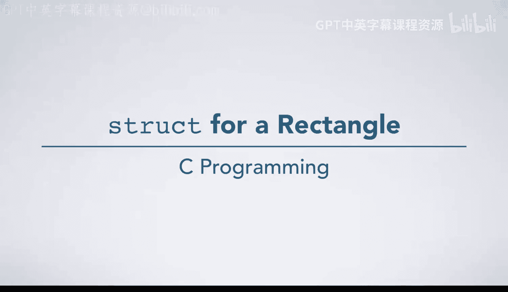
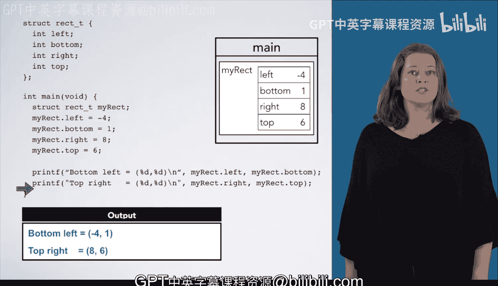

# 杜克大学《C语言入门（编程基础、C代码、指针⧸数组⧸递归、内存）｜Introductory C Programming》 p25 25_03_02_矩形结构体定义.zh_en -BV1Kp42117vh_p25-

In this example， we will see the semantics of a small piece of code。

 which works with this struct rect T。 This struct represents a rectangle with 4"， left， bottom。

 right and top。And here are some code which declares and uses astruct wrecked T。As always。

 we start execution at the beginning of main。 The first statement declares a variable of type reced T called myre。

 We will draw a box for this variable inside of main's frame and label it My rec。 However。

 unlike other boxes we have drawn， This box has four other boxes inside of it。

 One for each field of the struct。 Left， bottom， right and top。

As we have not assigned any values to these fields， these boxes are uninitialized。

 so we have placed question marks in them。The next line says my rec dot left equals negative4。

This is an assignment statement， so we must find the box named by the left hand side。

 The first part of this line names myre， which is the entire large box。 However， it says dot left。

 which names the box labeled left inside of myre's box。Remember that dot means inside of。

 So now we will put -4 into this box。 The next line behaves similarly。

 except that we are putting one into the bottom box inside of the myre box。 and likewise。

 for assigning 8 to the myre dot right and assigning 6 to my rec dot top。

Now we are going to print some information about this rectangle again。

 myre dot left names the left box inside of the Myre box。

 so we will pass4 to print F for the first percent D。

 and we will pass1 to print F for the second percent D。

So we will print that bottom left equals minus41。 we will then do a similar thing for the top right。

Now， you have seen the semantics of declaring and usingstructs。

