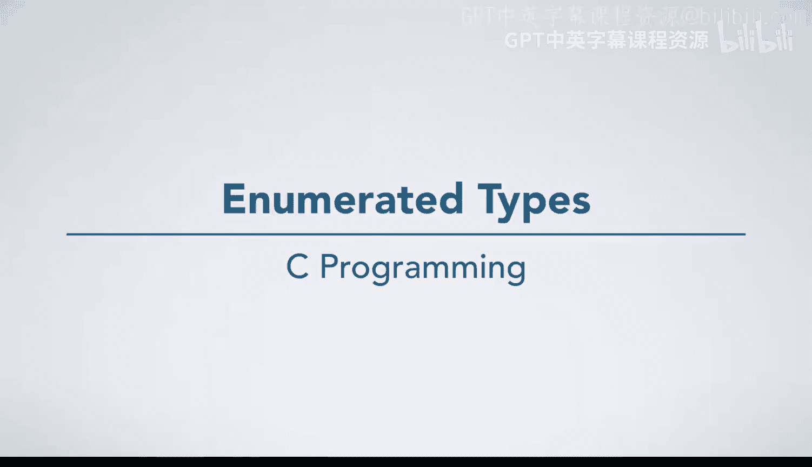
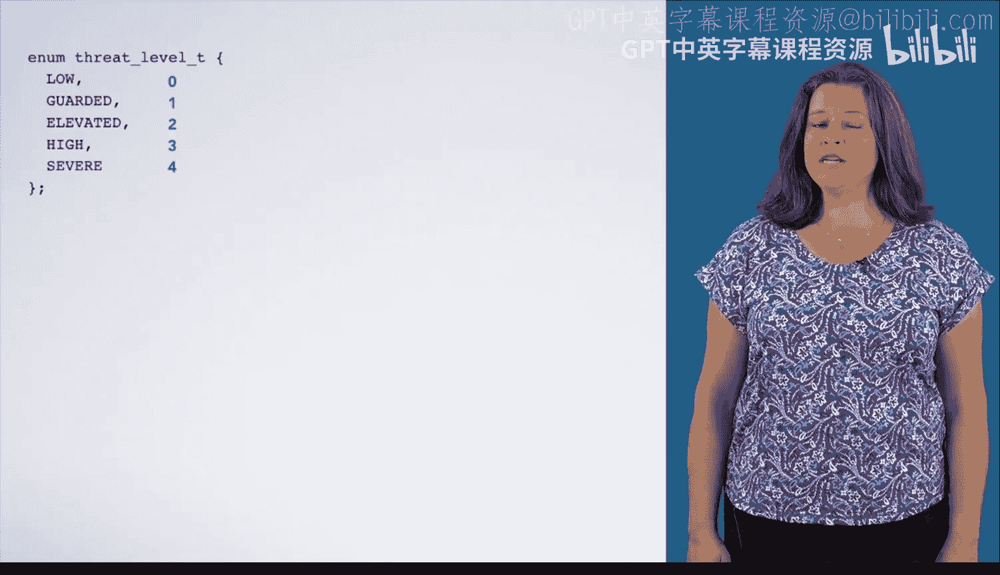

# C语言入门：27：枚举类型详解 🧩



在本节课中，我们将学习如何在C语言中定义和使用枚举类型。枚举类型是一种用户自定义的数据类型，它允许我们为整数值分配有意义的名称，从而使代码更易读、更易维护。

## 概述

我们将通过一个模拟安全系统威胁等级的例子来讲解枚举类型。系统有五个威胁等级：低、警戒、升高、高和严重。我们将这些等级编码为一个枚举类型，并展示如何在代码中使用它们。

## 定义枚举类型

首先，我们来看如何定义一个枚举类型。在代码顶部，我们使用 `enum` 关键字来创建。

```c
enum threat_level_t {
    LOW,
    GUARDED,
    ELEVATED,
    HIGH,
    SEVERE
};
```

C语言会自动为枚举列表中的每个名称分配一个整数值，从0开始递增。因此，`LOW` 对应值0，`GUARDED` 对应值1，依此类推，`SEVERE` 对应值4。

## 使用枚举类型

定义好枚举类型后，我们就可以像使用其他数据类型（如 `int`）一样使用它。我们可以声明枚举类型的变量，并将其初始化为某个枚举常量。



```c
enum threat_level_t my_threat = HIGH; // my_threat 的值为 3
```

## 辅助函数示例

为了展示枚举类型的实用性，我们定义了两个辅助函数。第一个函数 `print_threat` 用于打印与特定威胁等级对应的字符串。

以下是 `print_threat` 函数的实现，它使用 `switch` 语句来根据枚举值执行不同的操作：

```c
void print_threat(enum threat_level_t threat) {
    switch(threat) {
        case LOW: printf("Green/Low\n"); break;
        case GUARDED: printf("Blue/Guarded\n"); break;
        case ELEVATED: printf("Yellow/Elevated\n"); break;
        case HIGH: printf("Orange/High\n"); break;
        case SEVERE: printf("Red/Severe\n"); break;
    }
}
```

第二个函数 `print_shoes` 根据当前威胁等级判断是否需要脱鞋。

以下是 `print_shoes` 函数的实现，它使用 `if-else` 语句进行逻辑判断：

```c
void print_shoes(enum threat_level_t cur_threat) {
    if (cur_threat >= ELEVATED) { // ELEVATED 的值为 2
        printf("Please take off your shoes.\n");
    } else {
        printf("Shoes may be worn.\n");
    }
}
```

## 主函数流程

现在，让我们看看 `main` 函数如何将这些部分组合起来。

1.  首先，声明并初始化一个枚举变量 `my_threat`。
2.  然后，调用 `print_threat` 函数打印当前威胁等级。
3.  接着，调用 `print_shoes` 函数给出相应指示。

```c
int main() {
    enum threat_level_t my_threat = HIGH;
    print_threat(my_threat);
    print_shoes(my_threat);
    return 0;
}
```

当程序运行时，`my_threat` 的值（`HIGH`，即3）作为参数传递给 `print_threat` 函数。函数内部，`switch` 语句跳转到 `case HIGH:` 分支，打印出“Orange/High”。函数返回后，其栈帧被销毁。

随后，程序调用 `print_shoes` 函数。函数内部判断 `cur_threat`（值为3）是否大于等于 `ELEVATED`（值为2）。条件为真，因此执行 `then` 子句，打印“Please take off your shoes.”。函数返回后，其栈帧也被销毁。

最后，`main` 函数执行完毕，程序结束。

## 枚举类型的优势

通过这个例子，我们可以清楚地看到使用枚举类型的优势。如果仅使用整数0到4来表示威胁等级，代码中会充斥大量“魔法数字”，其含义对阅读者来说不明确。

例如，`if (threat_level >= 2)` 就不如 `if (cur_threat >= ELEVATED)` 直观。枚举类型使代码的意图更加清晰，从而更容易阅读、编写和修改。

## 总结

本节课我们一起学习了C语言中枚举类型的核心知识。我们了解了如何定义枚举类型，它本质上是为一系列整数常量提供了有意义的名称。我们通过安全威胁等级的例子，实践了如何声明枚举变量、如何使用枚举值，并看到了在函数（如 `switch` 和 `if` 语句中）使用枚举如何极大地提升代码的可读性和可维护性。记住，用 `ELEVATED` 这样的名字代替数字2，是编写清晰、专业代码的重要一步。