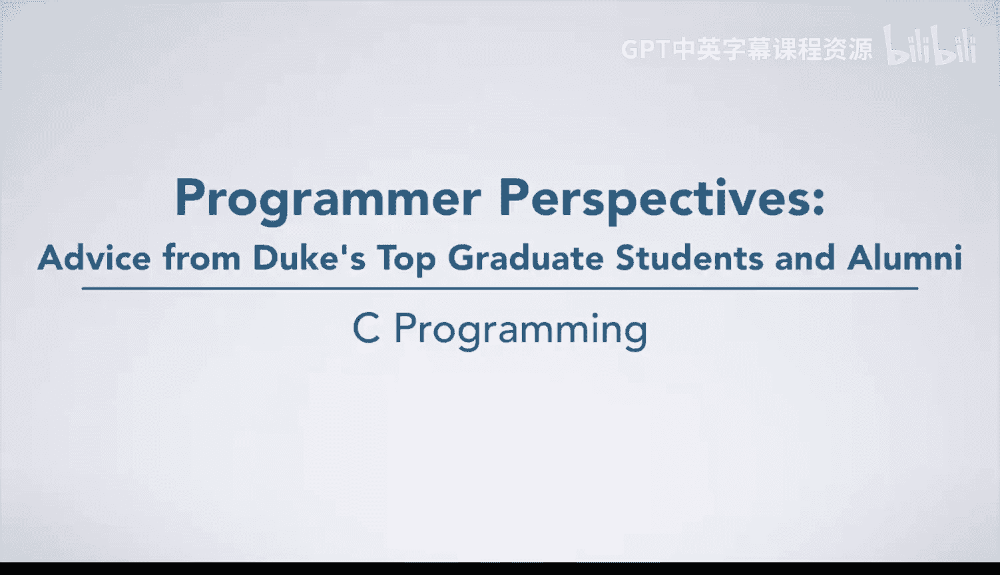
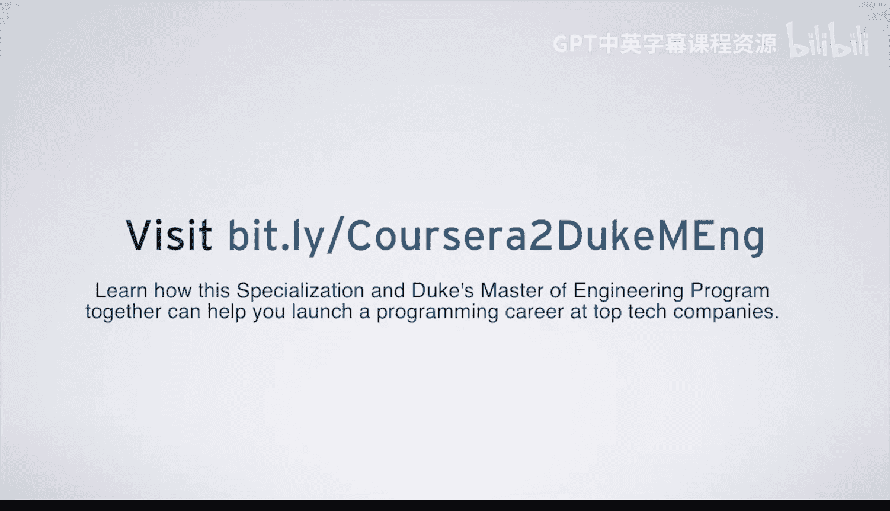
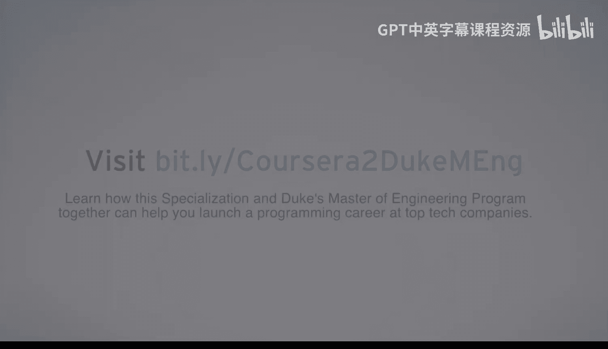

# C语言入门：28：规划与协作的重要性 🎯

在本节课中，我们将跟随杜克大学软件工程硕士生Evie的分享，探讨编程学习中规划与团队协作的重要性，并了解如何为未来的职业生涯做好准备。

---

我叫Evie，在杜克大学攻读工程硕士项目，专业是电气与计算机工程。作为这所大学和这个项目的一名学生，这是一段非常棒的经历，我在这里学到了很多。

对于编程新手来说，可能会认为编程完全是魔法。但实际上并非如此，在编程世界里，一切都遵循逻辑，必须言之成理。因此，你首先需要**信任逻辑**，而不是随意空想。此外，**规划**是编程中必须认真考虑的事情。与其只是胡乱地坐在屏幕前假装工作、敲击键盘，你实际上需要先制定计划、绘制图表，并认真思考你需要做什么，然后再将想法在编程世界中实现出来。

在杜克大学，尤其是教授们和所有课程都经过了精心的规划和设计。因此，请信任所有你必须完成的课程项目，并一步一步地执行。最终，你将成为一名出色的程序员。

---

上一节我们讨论了规划的重要性，本节中我们来看看一个具体的项目案例，它展示了团队协作的核心价值。

在整个硕士项目中，我完成了许多项目。我特别想谈谈在服务器软件课程中完成的UPS和亚马逊项目。这个项目的基本情况是：一个团队负责UPS系统，另一个团队负责亚马逊系统，我们需要共同设计通信协议，以使整个系统正常运行。

这个项目对我来说非常特别，因为它实际上模拟了工业界的真实工作场景。因为在工业界，你不可能独自一人甚至一个团队就完成整个系统。因此，**学会如何与其他团队沟通并共同设计协议**至关重要。在整个开发过程中，我们实际上需要逐步修改我们的协议，最终才能达到完美的状态。这个过程有些痛苦，但最终，当我们把所有部分整合在一起，发现整个系统完美运行时，那种成就感和内心的平静与快乐是无与伦比的。

---

从项目经验过渡到职业准备，对于正在努力找工作或准备面试的学生，我完全理解你们现在的感受。我知道这很难，但请相信我，一切都会好起来的。

我认为找工作最重要的事情不是“我如何通过这场面试”，而是“我如何成为一名优秀的软件工程师”。为了实现这个目标，你需要做的就是**练习、练习、再练习**。遵循所有课程项目的指引和教授们的建议，因为他们拥有丰富的经验，并且了解行业需要什么。一旦你越来越能胜任软件工程师的工作，工作机会自然会找到你。

---

**本节课总结**

本节课中，我们一起学习了：
1.  **编程基于逻辑**：编程并非魔法，一切都需要遵循清晰的逻辑。
2.  **规划先行**：动手编码前，充分的规划和设计至关重要。
3.  **团队协作的价值**：通过真实的项目案例，我们看到了沟通与协议设计在大型项目中的核心作用。
4.  **职业发展的核心**：专注于提升自身能力，成为一名优秀的工程师，是获得理想工作的根本途径。

记住，成为一名出色的程序员是一个循序渐进、持续学习和实践的过程。