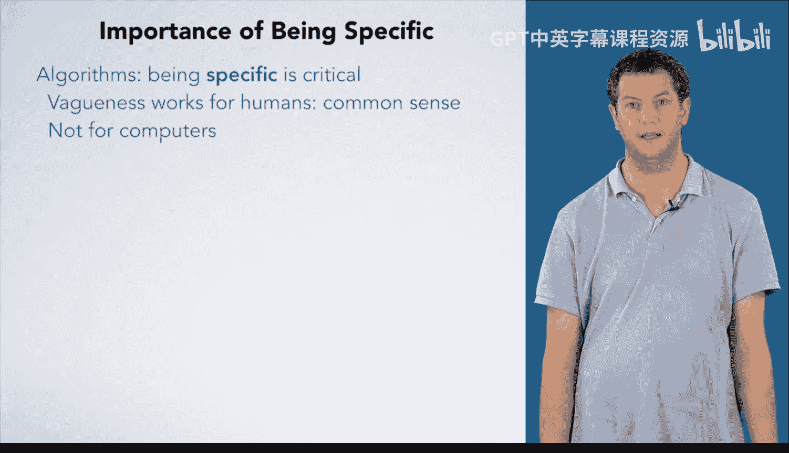

# 杜克大学《C语言入门（编程基础、C代码、指针⧸数组⧸递归、内存）｜Introductory C Programming》 p29 29_04_01_编写具体算法的重要性.zh_en -BV1Kp42117vh_p29-

You've learned a lot about thinking through algorithms with the seven steps。

 The syntax and semantics of C。 and the everything is a number principle and how it relates to types。

 We're going to take a moment to underscore the importance of being specific when you write an algorithm。

 Humans can usually figure out vague instructions because they have common sense。 However。

 computers do not have common sense and only do exactly what you tell them to。

 When you write an algorithm， you have to carefully think through exactly what to do and be very specific as you write it down。

In the next course， we'll delve into turning your algorithm into code as well as compiling and running the code and testing the code to be more confident that it's correct。

Then debugging it when something goes wrong。However， before we get there。

 we're going to wrap up this course with you writing an algorithm in English and having one of your fellow courseurra learners execute the algorithm。

 Of course， you will also execute someone else's algorithm and peer review their work。

 You want to be specific and clear when you do this so that whoever executes your algorithm knows exactly what to do。

To underscore the importance of being precise， we're going to have a fun little demonstration of a vague algorithm。

 Genevieve wrote me an algorithm to make a peanut butter and jelly sandwich。

 and I've forgotten all of my common sense。 So I'm only going to do exactly what she said。All right。

 Geneveve， this is pretty basic。 I can't imagine what could go wrong。1， get out one piece of bread。

 Okay， that seems hard to screw up。 So far， so good。2， Use a knife to put the peanut butter on it。

 okay。This is trickier than you think。You never knew that making a peanut butter sandwich was so difficult。

 all right。Three， get out another piece of bread？4。Use the knife to put the jelly on。 Okay， well。

 she didn't really tell me what to put the jelly on。

 But I guess someone told me to like put my clothes on。 they mean to wear them。

 So maybe she wants me to like。Where the jelly。Yeah， that okay。5。

 put the two pieces of bread together。

All right， do you want to bite of this sandwich？