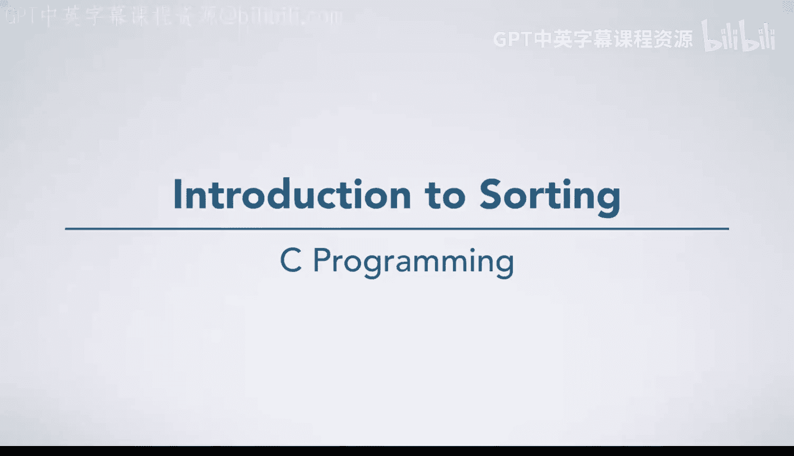
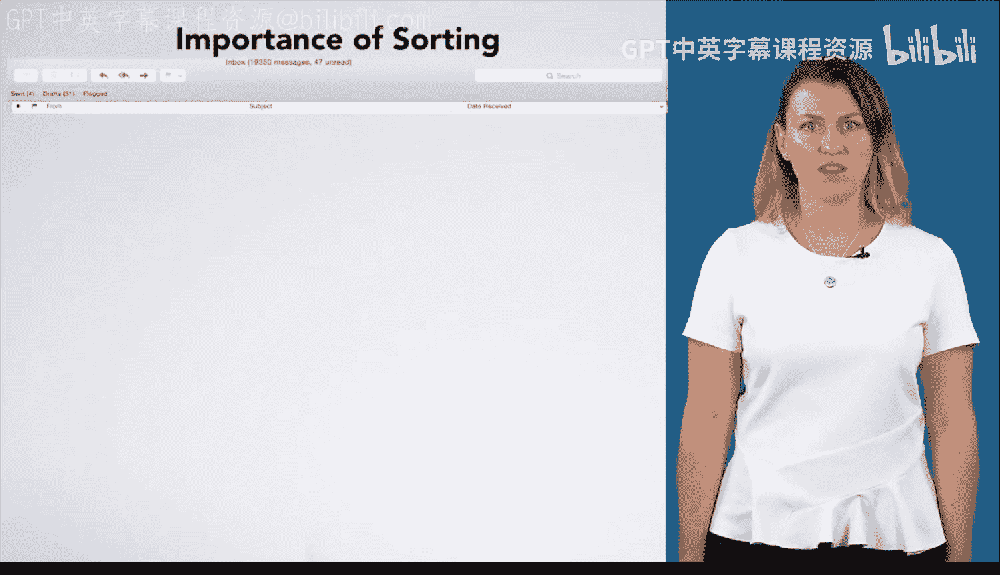

# 杜克大学《C语言入门（编程基础、C代码、指针⧸数组⧸递归、内存）｜Introductory C Programming》 p30 30_04_01_排序算法简介.zh_en -BV1Kp42117vh_p30-

Your final project in this course is going to be to write a sorting algorithm。

 That is an algorithm that takes a sequence of numbers as input and puts them in ascending order from largest to smallest。

 For example， if you had the following input data， you would want your algorithm to rearrange them so that you have this sequence。

 the same numbers but ordered from smallest to largest。 Of course， what we did here。

 just reshuffled them all at once in a way that is very hard to generalize you will want to think of a more step by step way to sort your data for any sequence of numbers。

Okay， so why think about sorting Well， for one thing。

 sorting is an important and ubiquitous algorithm in computer science。For example。

 my email client lets me sort my messages by subject， date or a variety of other criteria。

 sorting data makes it easier to find what you need。

When I'm on Facebook， there is a list of trending stories。

 How would you get the most popular stories from a list of all stories you would sort by popularity。

 then take the top items from the list。Likewise， if I search Google for something。

 it is many search results that might match my query， but sorts them based on its ranking of them。

 putting the results that are most likely to be the best at the top of the results it displays。And。

 of course， there are many other examples。Another reason why we picked sorting for you to work on is that there are many different correct ways to do it。

It is good to learn that many problems have a lot of different solutions。

 as you peer review other people's solutions， you will hopefully see approaches that are different from what you thought of。

And lastly， it is easy to verify that the answer is correct。

 When you peer review someone else's algorithm， you can easily check if they got the right answer for some input data by looking to see if they put the data in the right order。

So now let's put the seven steps to use and write a sorting algorithm。

