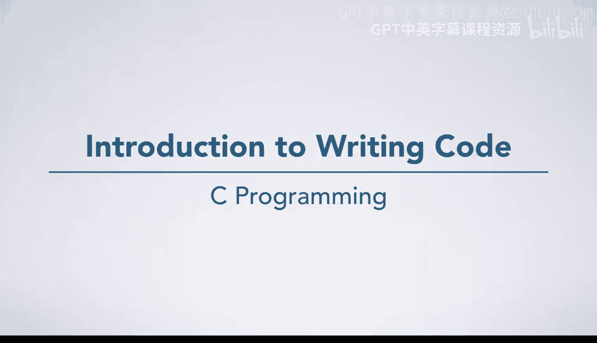
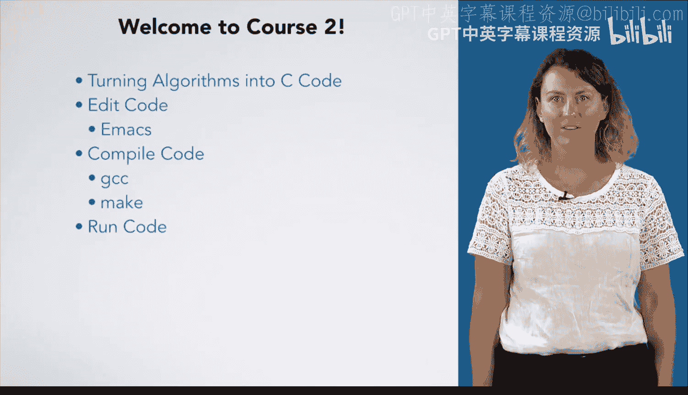

# 杜克大学《C语言入门（编程基础、C代码、指针⧸数组⧸递归、内存）｜Introductory C Programming》 p31 01_01_01_编程入门.zh_en -BV1Kp42117vh_p31-

Hello and welcome to Co 2， Wt， running and fixing code in C。 Hopefully。

 you took our programming fundamentals course and are familiar with the seven steps。

 as well as the basics of the syntax and semantics of C。 In this course。

 we are going to focus on going from an algorithm to a working program。

 We'll start by talking about turning an algorithm into C code。

 Then we're going to talk about editing the code， writing the code into the computer。

 We are going to teach you to use Eax， which is an editor for professional programmers。😊，Next。

 we'll talk about compiling the code using GCC GCC， which stands for G&U compiler collection。

 will turn your code into a format that the computer can directly execute。Once you have compiled。

 it's time to run your code。

But it may not work the first time。 We'll talk about testing your code to find problems in it and debugging your code to fix those problems will also introduce you to some very useful tools like Valgrind and GDPB。

Many of these tools are designed to be expert friendly。

 They are used by professionals and require a bit of time investment to become proficient in them。

 So why are we using these professional grade tools rather than starting you on something easier。

If you work with a novice friendly tool， it is easy to use at the start。

 but you quickly plateau what you can do with it。On the other hand。

 expert tools may be a bit difficult at the start， but as you gain experience with them。

 you far exceed what you could do with a novice tool。If you start with a novice tool。

 you end up stuck in your comfort zone。 It is hard to switch to an expert tool because of the upfront cost to learn it。

However， if you start with an expert tool， you can learn to use it from the start and enjoy the power it brings you in the long run。

As an example of novice versus expert tools， let's talk about recording video。

If I want to record video， I just pull out my cell phone and hit record。

The cell phone is a great example of a novice friendly tool。 It's super easy to use， but has few。

 if any advanced features。 On the other hand， a professional video setup is an expert friendly tool。

 It has a variety of features that my cell phone doesn't。

 I don't need to do things like connect wireless mics to my cell phone。

 but such features are needed in a professional setup。😊。

Another subtle point about tool selection is that your tool choice sends a signal about your professionalism。

 Would you hire a professional videographer who just used a cell phone。I'd be a little bit skeptical。

 The same thing happens with programming。 I've had students who have told me that they were so glad they learned these tools because interviewers noticeably took them more seriously when they found out the students used professional tools。

😊，We're going to wrap this course up with the start of a project that spans the third and fourth courses。

 You'll be writing a program that takes a description of a poker hand and computes the odds of each hand winning。

 So let's get started。