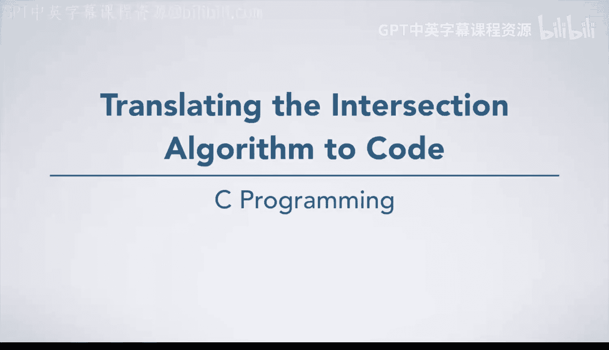
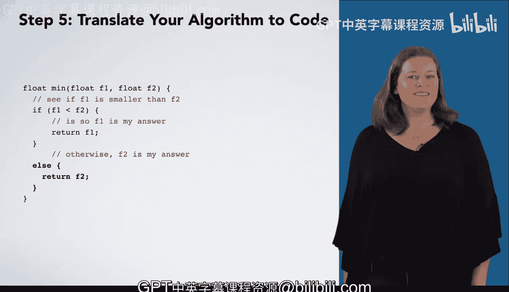

# 杜克大学《C语言入门（编程基础、C代码、指针⧸数组⧸递归、内存）｜Introductory C Programming》 p33 03_01_03_将交集算法转化为代码.zh_en -BV1Kp42117vh_p33-

Now that you have an algorithm developed， it's time to turn that into code。

 you can do this with pencil and paper or typing the code into an editor on the computer。

 you'll learn shortly how to edit your code on the computer as well as how to actually run the resulting program。

 But first， it is informative to see the translation of an algorithm to code。

The first thing you will want to do is write the function declaration。

 You learned the syntax of a function declaration previously， the return type。

 followed by the function name， and then the parameter list。 curly braces enclo the body。

Once you have written that， it's a good idea to write your algorithm steps as comments in the code。

Remember that comments are ignored by the computer and are just there for humans to read。

For the algorithm that we are developing， we first need a struct for the rectangle type。

 You have seen structs before， so there should not be anything new or surprising here。

 One question in writing this is whether the coordinates should be ints or floats。Here。

 we've decided to use floats so that we can have rectangles with fractional coordinates。Next。

 we have written the function declaration with the algorithm steps written as comments。

 This function， which is called intersection， takes two recs as parameters， R 1 and R 2。

 It returns erect as its answer。The first step tells us to make a rectangle called ants。

 Since we want to make a new piece of data， we are going to declare a variable to do this。

 we need its type and its name。Next， we want the answers left to be the maximum of R1's left and R2's left。

We want to set the value of ans left， so we need an assignment statement。

Where the left hand side is ant's do left equals。But what goes on the right hand side。

It seems like it might take more than just one simple expression to figure out the maximum of R one's left and R two's left。

 So we should abstract the computation of max out into a function。

 We should call that function here and think precisely about what it does。

 What should this function be called。What should it take and return， What should it do？

Then we can go write it later。This function should be called max。

 and it should take two floats and return a float， which is the larger of the two floats passed in。

 itss declaration would look like this。So now we can just write a call to the max function and assume it will work after we write it。

The last thing we need to figure out for this line of code is what parameters we pass to the max function。

 We want the max of R ones left and R twos left。 So we just need to write those down in code。Great。

 now we are computing the max of R1's left and R2's left and assigning that result to Ans's left。

The next step is to set ants's bottom equal to the max of R1's bottom and R2's bottom。

 We can make use of the max function that we are already going to write to do this step。

 So you end up with ant's dot bottom equals max of R 1 dot bottom and R 2 dot bottom。

The next step is to make the top be the minimum of R1s and R2s top。As before。

 we should think of a function that we want to abstract out this minimum computation into。

We'll use that function now and write it later， giving us this line of code。

Then we need to do to the right， which is pretty similar to the top。That leaves us with one step。

 We say that rectangle ants is our answer。How do we have a function Give back an answer。

 We use a return statement。 return ants。 Great， now we're done， right。Almost。

 we have a few things left unfinished。 First， we have to write Max and min。

 which we promised ourselves we would do earlier。 Second。

 we have to test this code before we conclude that it is finished。

We'll learn about testing codes soon。 However， we'll do Mac and min now。

Here's the declaration for Max with an algorithm already written as comments inside of it。

 We did not show steps 1 through 4 to come up with these steps。

 but you are certainly welcome to work through those yourself。😊。

The first thing that this algorithm does is check whether F1 is bigger than F2。

 doing one thing if so， another， if not。This translates into an if else。

 as you can see here in the then clause of the if else， we say that F1 is our answer。

 As you learned earlier， you give back an answer with a return statement， as you see here。

In the else clause， we say that F2 is our answer， which also translates into a return statement。

For men， we would have a very similar algorithm。 The only difference is that we see if F1 is smaller than F2。

 The fact that the algorithm is almost the same means that the code will also be almost the same。

We have an if statement with a then clause that has return F1 and an else clause that has return F2。

Great， now we have translated our algorithm into code。

