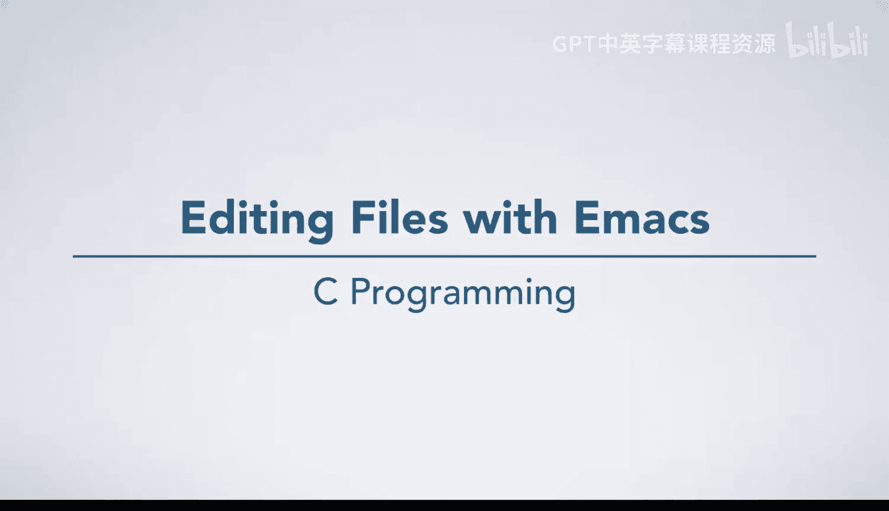
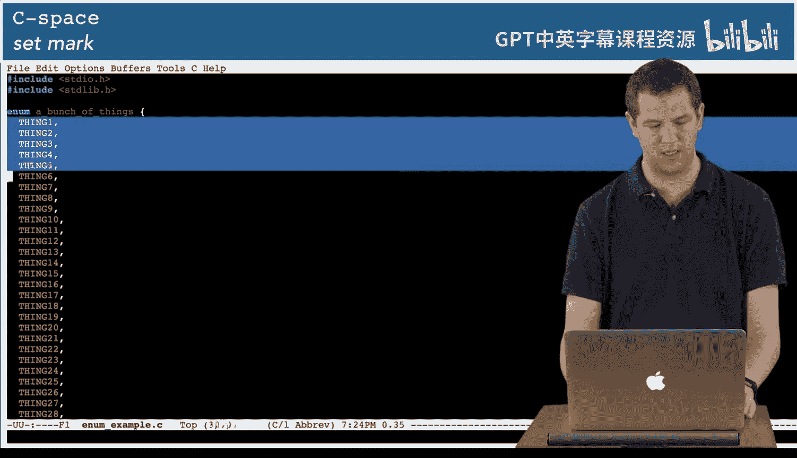
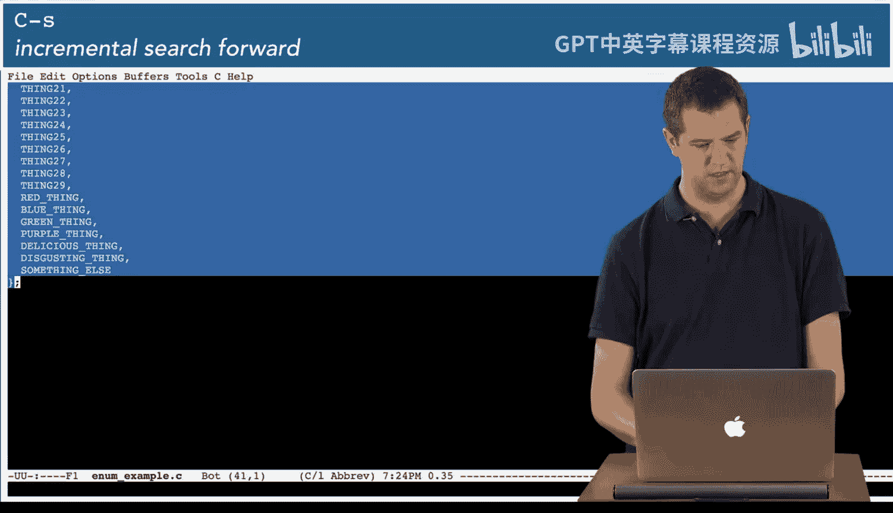
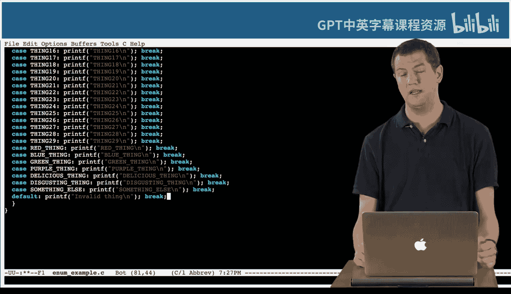

# C语言入门：05_01_07：使用Emacs编辑文件 📝

在本节课中，我们将学习如何使用Emacs编辑器的一些核心功能，包括搜索、撤销、区域操作以及键盘宏。这些技巧将帮助你更高效地编写和编辑代码。

你已经看过一个视频，演示了如何使用Emacs编写一个简单的文件，保存它，将其添加到Git并提交到评分系统。Emacs是一个非常强大的编辑器，拥有众多功能。我们将向你展示一些简单的功能，如搜索、撤销，以及Emacs撤销功能的一些很酷的特性，还有像键盘宏这样稍微高级一点的功能。显然，我们无法在这个视频中涵盖Emacs的所有内容，但我们会展示一些更有用的功能，然后你可以随着使用学习更多。

如果我看一下这个目录，我有一个文本文件和一个C文件可以操作。我将打开这个文本文件并开始操作。它只是《C语言程序设计》第二章的一些文本，你可能在课程一的阅读材料中已经读过大部分。

## 搜索功能 🔍

上一节我们提到了Emacs的基本使用，本节中我们来看看如何进行文本搜索。

我可能想做的一件事是搜索。如果我按下 `Ctrl+S`，你会看到我的Xterm底部显示“I-search”。Emacs具有增量搜索功能，这意味着当我输入搜索词时，它会开始搜索我目前输入的任何内容。例如，如果我输入“I”，它会跳转到第一个“I”的实例，并高亮显示所有其他“I”。如果我之后输入“M”，它会细化搜索，开始显示像“important”和“sometimes”和“simple”这样的词。如果我输入“E”，它会跳到这里找到“sometimes”。这在编程时非常有用，因为你想搜索一个函数名或其他东西，按下 `Ctrl+S`，然后开始输入一点，你就能快速找到你想要的东西，通常不需要输入完整的单词。

如果我按退格键，它会回到“I am”。我可能想要“important”但不是这个，所以如果我再次按 `Ctrl+S`，它会向前搜索下一个“I am”的实例，我可以继续这样做。此时它需要向下滚动。在普通的Xterm中，这不会发生。Xterm JS有一个小bug，它并不总是正确重绘屏幕。如果发生这种情况，只需按 `Ctrl+L`，这会让Emacs完全重绘屏幕。然后我就可以通过再次按 `Ctrl+S` 来继续搜索更多内容。这个bug有点烦人，但Xterm JS不是我的东西。

好的，这就是搜索。你也可以向后搜索。如果我按 `Ctrl+R`，它会说“I-search backward”，我可以向后搜索，它会向后移动。我可以通过 `Ctrl+S` 和 `Ctrl+R` 在这些搜索之间切换，向前和向后移动。

## 撤销与区域操作 ↩️

好的，这就是搜索。在我们的编辑器中，我们可能还想做其他事情。我们可能想撤销一些操作。例如，如果我输入一些东西，然后意识到我不想要它，我可以按 `Ctrl+X U`，它会撤销那个更改。

现在，这很正常。让我们假设一下，我做了很多更改。我在这里做了一些更改。“Blah, blah, blah, some other stuff.” 然后我去做一些非常重要的事情。“really important, complicated stuff I want to keep.” 现在我意识到我刚才做的所有其他事情，我想撤销它。这在编程中可能会发生，我可能在一个函数中做了一些更改，然后去处理另一段代码，然后以某种方式意识到我把那个函数搞乱了。

如果我按 `Ctrl+空格键`，它会说“Mark set”并开始高亮显示一个区域。一旦我高亮显示并选择了一个区域，我可以在该区域内撤销。所以如果我撤销 `Ctrl+X U`，它将在区域内撤销，并且只撤销该文件区域内的更改，而不是我稍后在其他地方所做的更改。这在编程或甚至编辑其他内容时非常有用。

我将来到这里，所以有时我想移动到行首，`Ctrl+A` 会做到这一点。`Ctrl+E` 会移动到行尾。我将删除这行文本。所以 `Ctrl+K` 剪切整行。如果我想把它粘贴到其他地方，`Ctrl+Y` 粘贴我上次剪切或复制的东西。如果我想复制或剪切一个区域，我可以选择它。`Ctrl+空格键` 开始选择，然后 `Ctrl+W` 将剪切。`Ctrl+Y` 将粘贴。如果我想复制而不是剪切，我可以按 `Esc+W`，然后粘贴。

现在，Emacs另一个非常酷的功能是，粘贴后，你可以更改回之前粘贴过的内容。所以粘贴后立即按 `Esc+Y`，它会取消粘贴我刚刚粘贴的内容，并粘贴前一个东西，我可以再次这样做，回到我之前复制和粘贴的更早的内容。所以有时你复制和粘贴东西，你想粘贴的不是最近的东西。这真的很酷。

好的，我直接恢复吧，我只是要保存它，这没关系。

## 键盘宏 🎹

本视频中我要展示的另一个功能，我认为非常酷。我将打开这个枚举示例，我在里面写了很多枚举项。它包含了所有这些内容。😊，我想做的是编写一个函数，接收这个枚举并打印出它是什么。

现在。我刚刚告诉过你如何复制和粘贴。所以我要复制。在复制时，我实际上可以搜索花括号，然后直接跳到这里，而不需要滚动整个内容。所以我要复制所有这些。我要写一个函数 `print_thing`。它接收枚举。

那个名字真的很长。我有点懒，所以我直接按 `Esc+/`，它会为我自动补全那个名字。哎呀，我需要给它一个名字。T，`switch (t)`。现在，刚刚粘贴了所有那些东西。Emacs告诉我我的花括号匹配了什么，即使它在屏幕外，并且没有对齐，因为我在那里没有任何分号，所以Emacs知道这个语法有问题。这告诉我我匹配了什么。另外，如果我将鼠标悬停在某个东西上，如果它们在屏幕上，它会匹配。

我只是要向后搜索这个。现在，我想做的是，我想把我刚刚粘贴在这里的每个枚举案例的名称，改成类似 `case` 那个东西：`printf` 那个东西 `break` 的样子。

现在，在大多数编辑器中，你可能需要枯燥地花15分钟复制、粘贴和修改，这真的很无聊。但Emacs有一个非常酷的功能叫做键盘宏。基本上，我想对每一行做同样的事情。所以我要这样做。

我按 `Ctrl+X (`，它说“Defining keyboard macro”。现在Emacs将记住我执行的一系列命令，并让我重放那系列命令。所以我想做的是：向前移动两个单词。我想写单词“case”。我想开始高亮显示一个区域来复制，所以我按 `Ctrl+空格键`。我想向前搜索一个逗号。然后我想向后移动。所以我按左箭头。然后我想复制。所以我要按 `Esc+W`。现在，我想过来这里，用冒号替换它。输入 `printf`。我要粘贴那个东西，所以我按 `Ctrl+Y`。假设我想要一个新行。和 `break`。然后我想向下移动一行，并用 `Ctrl+A` 移动到行首。然后我按 `Ctrl+X )`，它说“Keyboard macro defined”。

所以我对那一行执行的那一系列命令，我可以按 `Ctrl+X E`，它会对这一行再次执行。在我这样做之后，它说“Type E to repeat macro”。我可以按住 `E`。嗯，在这个上面，它让我重复它。但在大多数编辑器、大多数终端上，你可以直接按住它。然后这一个不会完全工作，因为它没有逗号，但如果我只是在那里放一个逗号，让它看起来像其他的，砰！

现在这在语法上是合法的，我可能会放像 `default: printf("Invalid thing"); break;`。

但我让Emacs通过键盘宏为我完成了所有这些工作。所以这是一些很酷的功能。你会在阅读材料中读到更多关于它们的内容，并且通过练习你会学到很多。😊

---

本节课中我们一起学习了Emacs编辑器的几个高效功能：使用 `Ctrl+S` 和 `Ctrl+R` 进行增量搜索；使用 `Ctrl+X U` 进行撤销，并学习了如何通过设置标记（`Ctrl+空格键`）在特定区域内进行选择性撤销；掌握了基本的文本操作快捷键，如 `Ctrl+A`（行首）、`Ctrl+E`（行尾）、`Ctrl+K`（剪切行）、`Ctrl+Y`（粘贴）以及 `Esc+W`（复制区域）。最后，我们探索了强大的键盘宏功能，通过 `Ctrl+X (` 开始录制，执行一系列操作，`Ctrl+X )` 结束录制，然后使用 `Ctrl+X E` 重复执行，这能极大地自动化重复性编辑任务。