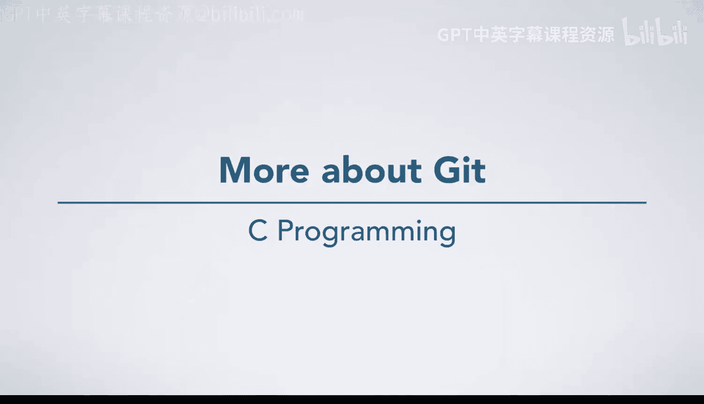
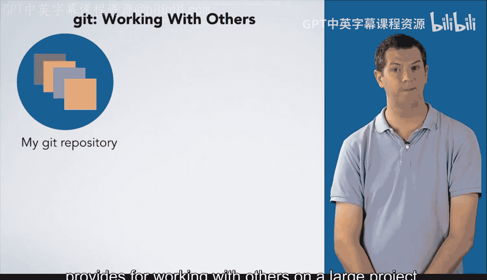
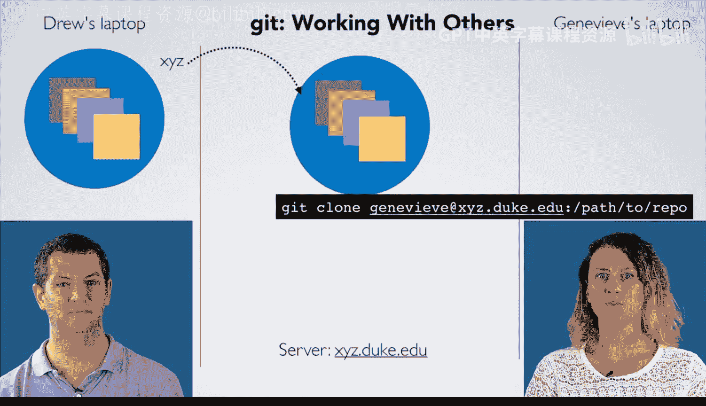
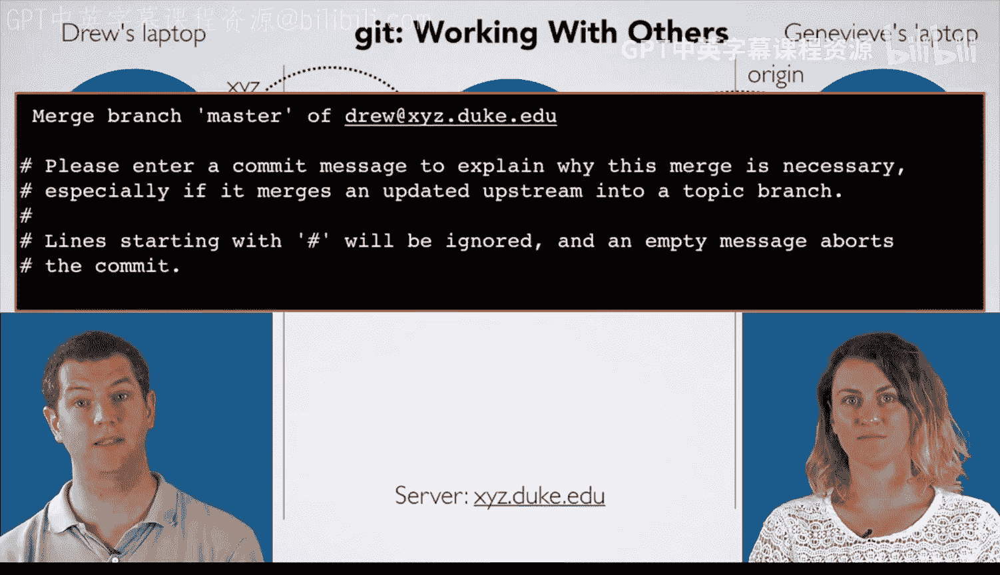
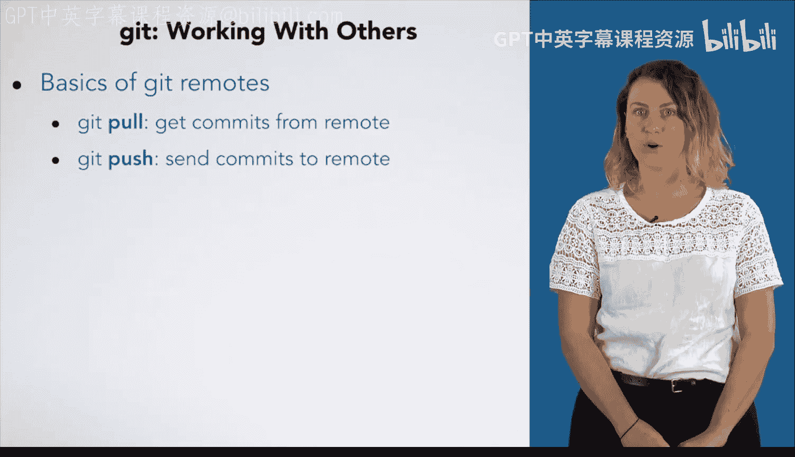

# Git入门：06_01_10：更多关于Git的内容



## 概述

在本节课中，我们将学习Git版本控制系统如何支持多人协作开发。我们将了解远程仓库的概念，以及如何使用`git push`和`git pull`命令与远程仓库同步代码。



Git在专业软件开发人员中广受欢迎，一个重要原因是它为大型项目的多人协作提供了强大的功能。

## 远程仓库与协作

假设我有一个本地的Git仓库，并希望与另一位开发者Genevieve协作。


我不仅需要获取Genevieve的代码副本，我们双方还需要能够轻松地修改代码并将这些更改合并到一起。

她的代码在她的笔记本电脑上，而我想在我的电脑上工作。由于我们的笔记本电脑并非总是可用，我们会在一个双方都能访问的服务器上创建另一个仓库。

其中一人在服务器上运行Git命令来建立一个空仓库。

## 配置远程仓库

接下来，我需要告诉本地电脑上的Git，我希望它与一个远程仓库协作。

你可以为远程仓库起任何名字。这里我将其命名为`Xyz`，因为我们的假设服务器是`xyz.duke.edu`。你需要提供远程仓库的位置。

以下命令仅用于建立与远程位置的关联：
```bash
git remote add Xyz <远程仓库地址>
```

## 推送代码到远程仓库

现在，我运行`git push`命令，指定远程仓库的名称（本例中是`Xyz`）以及我想要推送的分支（默认称为`master`分支）。Git仓库的主分支通常叫做`master`。

```bash
git push -u Xyz master
```
`-u`或`--set-upstream`选项将此远程分支设置为默认的推送和拉取位置。

我们不会深入讲解分支，但它是Git一个极其有用的功能。



现在，Git不仅会复制我所有的文件，还会将我整个修订历史（包括我所有的提交记录和附带的日志信息）推送到远程仓库。

## 克隆远程仓库

现在，Genevieve想要获取远程仓库的副本。她将使用`git clone`命令。

她指定克隆的来源位置（与Drew配置远程时使用的位置相同，但使用她自己的用户名进行身份验证）。

```bash
git clone <远程仓库地址>
```
这将在她的笔记本电脑上创建一个新的本地仓库，并自动创建一个名为`origin`的远程关联，`origin`被自动设置为默认的推送和拉取位置。


然后，Git会从远程仓库复制所有的提交记录到她的本地。

## 并行开发与同步冲突

现在，Genevieve编写了一些新代码，进行了测试，并使用`git add`和`git commit`命令创建了新的提交。此时，她的本地仓库包含了这些更改，但其他人都没有，包括Drew的仓库。

与此同时，Drew也在同一个项目上编写了自己的代码，并在自己的本地仓库中创建了提交。

Drew希望将自己的更改分享给Genevieve，于是他运行`git push`。然而，他遇到了问题。

当他执行`git push`时，收到了错误信息。错误信息指出，远程仓库包含本地尚未拥有的工作（即Genevieve的提交）。Git建议他先使用`git pull`获取Genevieve的工作。

## 拉取与合并更改

如果Drew运行`git pull`，Git会将Genevieve的提交复制到他的电脑，然后尝试合并他的工作和她的工作。

*   如果他们修改了不同的文件，或者同一文件的不同部分，Git会自动处理合并过程。
*   如果他们在同一区域做了不同的修改，Git会告知他需要手动解决冲突。



接着，Git会将Genevieve的提交以及一个代表合并结果的新提交放入Drew的本地仓库。由于这是一个新提交，Git会要求他输入提交信息，默认信息是“合并了我们的工作”，这通常是合适的。


现在，Drew可以再次尝试运行`git push`。这次，操作成功，他的新提交被复制到了服务器。

然后，Genevieve可以通过运行`git pull`来获取Drew的最新代码，这些新的提交将被复制到她的本地仓库。

## 与课程评分系统的交互

我们详细讨论这个过程，不仅因为它在软件开发中极其有用，还因为这是你与本课程评分系统交互的方式。



1.  你将代码推送到一个远程仓库。
2.  评分系统拉取你的代码。
3.  它对你的提交进行评分。
4.  然后将你的成绩提交到一个`grade.txt`文件并推送回来。
5.  你随后通过`git pull`获取这个成绩文件。


## 总结

本节课中，我们一起学习了Git远程协作的基本流程。我们了解了如何设置远程仓库，使用`git push`命令将本地提交推送到远程仓库，以及使用`git pull`命令从远程仓库获取他人的提交并合并到本地。掌握`push`和`pull`是进行团队协作和与自动化系统（如课程评分系统）交互的核心。