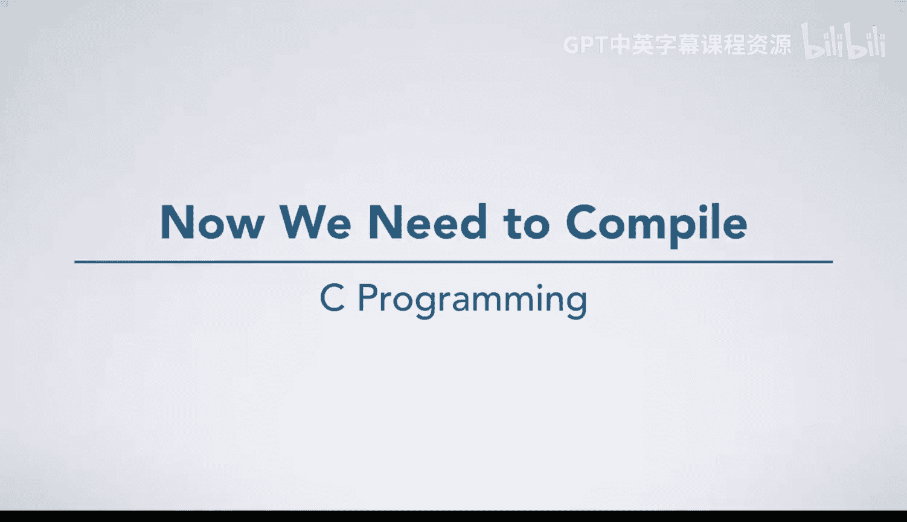
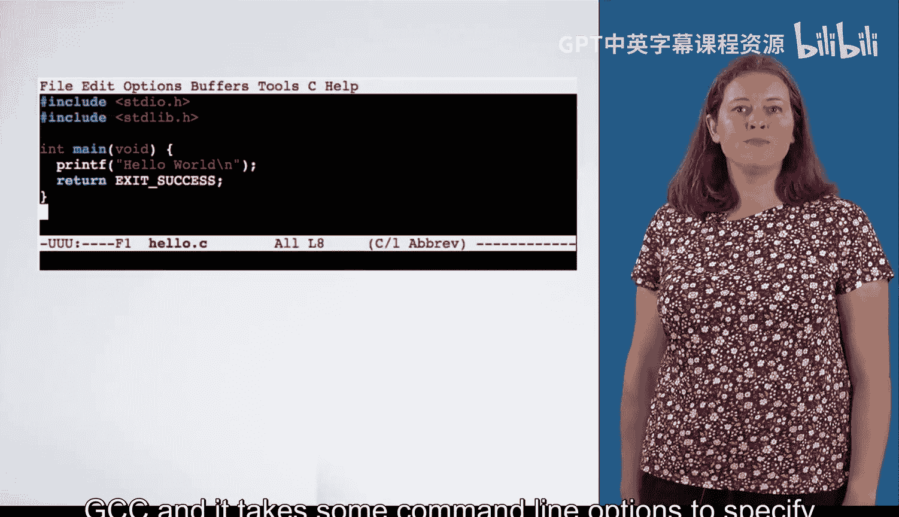
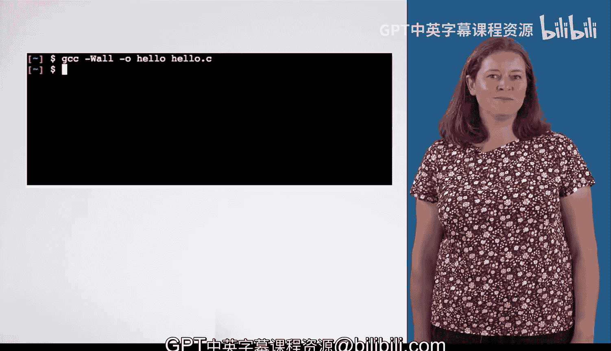

# C语言入门：07_02_01：编译与运行程序 🚀

在本节课中，我们将要学习如何将你编写的C语言代码转换为计算机可以执行的程序。这个过程被称为“编译”。我们将介绍编译的基本概念、如何使用GCC编译器，以及如何运行编译后的程序。

## 编译代码：从文本到机器指令

上一节我们介绍了如何编写和保存C语言代码。本节中我们来看看如何处理这些代码。首先，你需要编译它。

这意味着你需要运行一个名为“编译器”的程序。编译器将你编写的代码翻译成实际的机器指令。随后，编译器会生成一个文件，你可以在命令行提示符下输入其名称来执行它，就像执行任何其他程序一样。

然而，在编译代码之前，你需要添加一些 `#include` 预处理指令。你将在本课后面学到更多关于这些指令和编译过程的知识。

## 使用GCC编译器

一旦你添加了所有必要的 `#include` 指令，你就可以像运行其他命令一样运行编译器。你将使用的编译器叫做GCC。它接受一些命令行选项，用于指定诸如生成的程序名称、以及它应该对看似有问题的代码发出多少警告等事项。

你将在接下来的课程中了解更多关于这些选项的知识。你还将学习一个名为 `make` 的工具，它将简化构建包含多个文件和/或需要向编译器传递大量选项的大型程序的过程。

## 运行编译后的程序

代码编译完成后，你就可以运行生成的可执行程序了。在这个例子中，我们指示GCC生成一个名为 `hello` 的程序。我们可以使用 `./hello` 来运行它。

点号和斜杠（`./`）指定应在当前目录中查找名为 `hello` 的程序，我们稍后也会更多地讨论目录的概念。

你可以看到程序运行并打印了它的输出：“Hello world”。

## 总结

本节课中我们一起学习了C语言程序从源代码到可执行文件的完整流程。你现在知道了编译是将人类可读的代码转换为机器指令的关键步骤，了解了使用GCC编译器的基本方法，并掌握了如何运行编译后的程序。在接下来的课程中，我们将深入探讨编译器的选项和更复杂的项目管理工具。