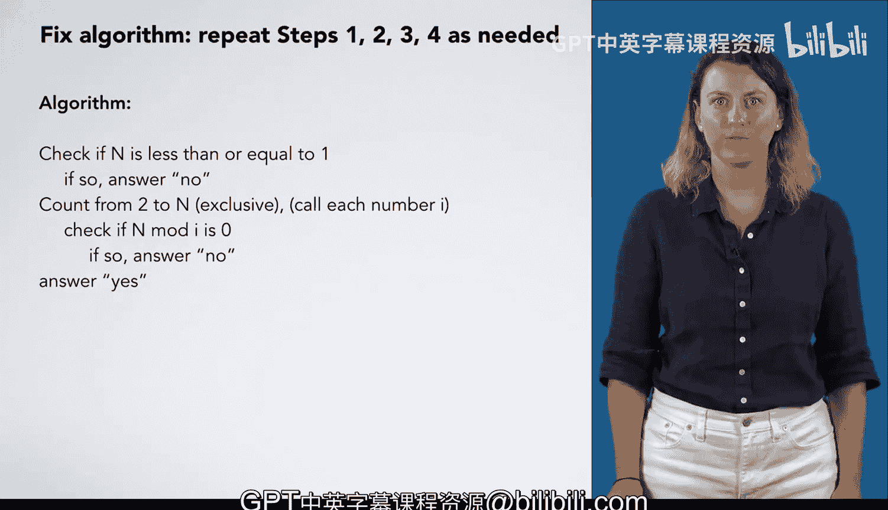

# 杜克大学《C语言入门（编程基础、C代码、指针⧸数组⧸递归、内存）｜Introductory C Programming》 p40 10_02_03_泛化isprime函数.zh_en -BV1Kp42117vh_p40-

Now we're ready to generalize our steps。 I've written down the result of step 2 for both n equals 29393 and n equals 7 so that we can look for patterns across both of them。

Sometimes it helps us generalize to see multiple instances of the problem solved。

The first thing we might notice is that the numbers in these two columns are always n。

 We check if 29393 is divisible by 2 through 7， and we check if 7 is divisible by 2 through 6。 Loly。

 it makes sense to always test N for divisibility so that we can update our steps to reflect this generalization and replace these numbers with n。

Next， you might notice that these steps are now repetitive， except for these numbers。

 which count from2 to something。And except for our answer， which is sometimes no and sometimes yes。

 If we get yes， as in n mod 7 is 0， then we immediately answer no， And if we get no。

 as in all the rest of these checks， we do nothing special。

 So we can make these steps slightly more general。 Check if n mod 2 is 0。 If so， answer no。

 Check if n mod 3 is 0。 If so， answer no and so forth。

 each time we check if n is divisible by a number。 If it is， we immediately answer no。

 In the case of n equals 7， after we tried all of these， we answered yes。😊，Here you see counting。

 The steps are completely repetitive， except for these numbers that count。On this side， we count 2，3。

4，5，6， which appears to be from 2 to n-1。 Typ in computer programming。

 we count the lower bound as inclusive and the upper bound as exclusive。

 So we'd call this counting from 2 to n exclusive。On the other side。

 we seem to be counting from 2 to 8， not including 8， which seems odd。

 What does 8 have to do with 29393， If we think about it a little more。

 we see that we would count beyond this。 We just stopped here because we came across something that told us the answer was no。

That is， we would otherwise be counting from2 to n as long as we kept getting n。

 not divisible by the number we're counting。Now， we can express this as a repetition of the same step。

 count from 2 to N and call each number that you count I。 So I is 2，3，4， et cetera。

 Then we take the step we're repeating and express it in terms of I。 Check if n mod I is 0， If so。

 answer no， on the n equals 7 side， we have the same counting repetition。 except for one difference。

 After we did all this counting， we answered。 yes。 So we're almost done。 And we have。

 but these have to look the same to be a general algorithm。 If they're different in some way。

 we need to add conditions。 So what about this last step。

It turns out it's in there in general after we finish counting and we haven't answered no。

So we can add it to the left side in the case of 29393， the step was still there。

 but we never got to it because we stopped counting when we answered no。

Now we're ready for step four， we have a general algorithm we think。

 but we may have generalized incorrectly， it may be that there was something special about the two numbers we picked and we didn't come across something that made it have other behavior。

So we want to test with values we haven't used yet， such as other yes answers like 5 and 13。

 and other no answers like 4 and9 to work through this and see if we're getting the right answer。

The more values we test， the more confident we will be that this algorithm is correct。

 We may also have missed some corner cases， numbers for which our algorithm behaves strangely。

We might want to try some unusual values， such as 0，1，2， or negative 1。2 is a good special case。

 because we start counting at 2，0， and 1 might be special because they're less than two。

 So we wouldn't count any numbers。 Neative one might also be good。

 since we would count no numbers and immediately answer， yes。We do not， however。

 need to worry about things like 2。75 or the string Hello world。Because these are the wrong types。

We specified that N must be an integer， and the type system in our programming language like C is going to enforce this。

 We won't be able to call this function with any argument that isn't an int。

Now that you've tested these out， you've seen that the algorithm gives the correct answer for 5，13，9。

 and 2。 However， it gives the incorrect answer for 0，1 and negative 1。 It won't count any numbers。

 so it will answer yes， even though these are not prime numbers。To fix our algorithm。

 we repeat steps 1，2，3， and 4 as needed。 In this case。

 there are no primes that are less than or equal to 1。 So we add to our algorithm。

 Check if n is less than or equal to 1， If so， answer no。Otherwise。

 we do all the other parts of the algorithm。In the next video。

 we'll show you how to translate this algorithm to code。

