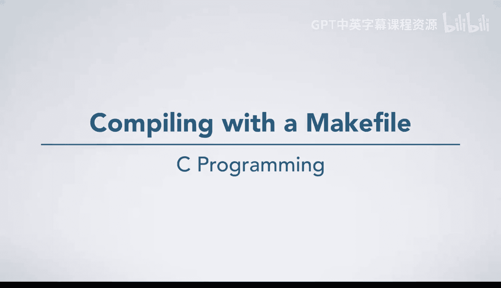
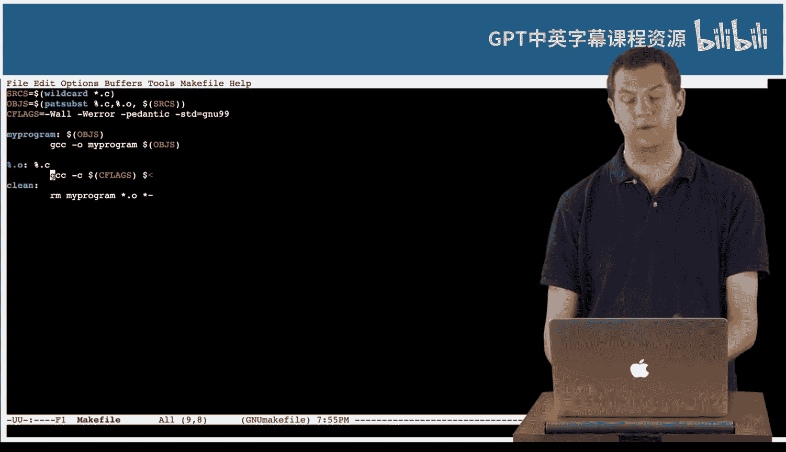

# C语言入门：14：使用Makefile编译



在本节课中，我们将学习如何使用Makefile来编译C语言程序。Makefile是一个强大的工具，它能帮助我们管理大型项目的编译过程，只重新编译那些发生变化的文件，从而节省时间。

## 概述

之前我们已经手动编译过程序，并讨论了`make`工具对于构建大型程序、跟踪文件依赖和变更的用处。本节将通过一个具体示例，演示如何创建和使用Makefile来编译一个包含多个源文件和头文件的项目。

## 使用Makefile编译

现在，我们有一个包含若干文件的项目：几个C源文件（`.c`）、几个头文件（`.h`）以及一个Makefile。虽然这不是一个庞大的项目，但足以作为一个小型示例。

如果我在终端输入`make`命令，它会根据Makefile中的规则编译所有文件，并生成最终的可执行程序。这个程序本身功能很简单，只是进行一些数学计算。

以下是编译过程的示例代码：
```bash
make
```

## Makefile的智能编译

Makefile的一个关键优势在于其智能性。例如，如果我打开`file1.c`并修改其内容（比如将某个计算改为加一），然后再次运行`make`命令，你会发现这次它只重新编译了`file1.c`这一个文件，并将其链接到最终程序中。

这个过程避免了重新编译所有文件。对于小项目来说，速度差异不明显，但对于包含大量文件的实际大型项目，这能显著节省编译时间。

## 在编辑器内集成编译

实际上，我们甚至不需要离开代码编辑器（如Emacs）去命令行执行编译。在Emacs中，我们可以使用快捷键（例如 `C-c C-v`）来触发编译。编辑器底部会显示编译命令，通常是`make -k`。

`-k`参数的意思是“keep going”，即遇到错误时继续尝试编译其他部分，以便一次性看到尽可能多的错误信息。这不是必须的，但通常是默认设置。

如果编译成功，会显示“finished with no problems”。如果代码中存在语法错误，例如漏掉了分号，编译器会在Emacs中显示错误信息。

为了演示，我们可以在代码中故意制造几个错误。此时，Emacs会将这些错误信息关联到具体的代码行。你可以直接点击错误信息，编辑器会自动跳转到产生该错误的代码行，这极大地方便了调试。

## 创建Makefile

在你的阅读材料中，会详细学习如何编写Makefile。通常从一个非常简单的Makefile开始，逐步构建成一个功能完善、灵活性强、能够轻松添加更多文件的Makefile。

基本方法是：创建一个名为`Makefile`（或`makefile`）的文件，在其中定义编译规则和依赖关系。之后，你就可以通过`make`命令来使用它了。

## 总结



本节课我们一起学习了Makefile的基本用法。我们了解到，Makefile能自动检测源文件的变化，并只编译必要的部分，从而提升效率。我们还看到了如何在代码编辑器（以Emacs为例）中集成编译过程，实现快速编译和错误定位。掌握Makefile是管理复杂C语言项目的重要一步。