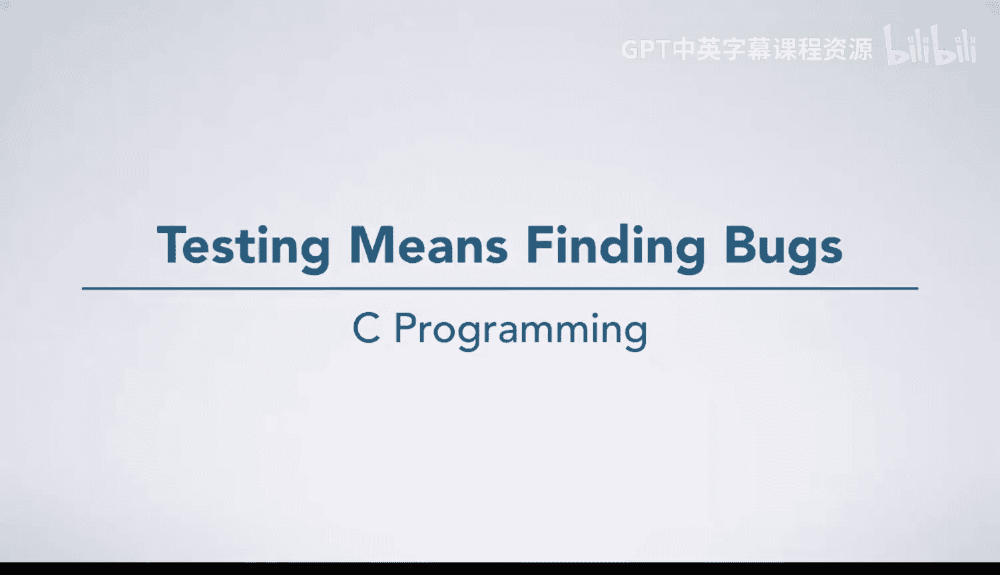
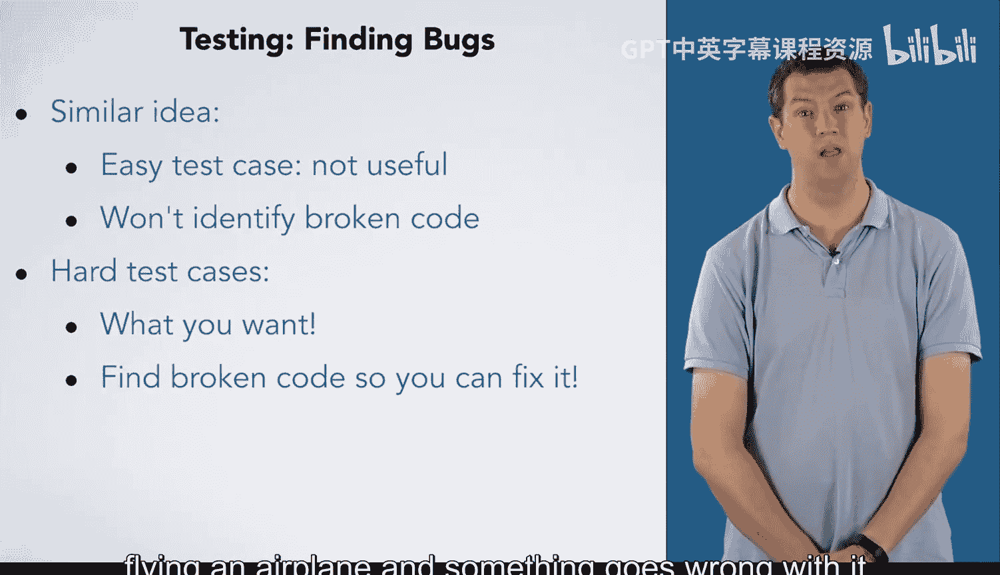

# 杜克大学《C语言入门（编程基础、C代码、指针⧸数组⧸递归、内存）｜Introductory C Programming》 p45 15_03_01_测试即发现缺陷.zh_en -BV1Kp42117vh_p45-

Next， you are going to learn about testing and debugging while these two ideas often go together they are distinct tasks。

 Testing is the process of finding bugs in your code。

 your goal is to discover inputs to the program for which it does not behave correctly。

Once a program has failed one or more test cases you want to debug it debugging is the process of fixing bugs in the program。

So what makes a good test case， Many people find this counterintuitive。

 but a good test case is one that the program fails。 Does that seem surprising。

 Why would we say that a test case is good if a program fails it。 Well。

 remember that the goal of testing is to find the bugs in the program？

 If your program fails a test case， you found a bug。

Another way to think about why hard test cases are good test cases is to think about exams where you test students instead of test cases for programs。

Suppose I had a group of students and I wanted to test their programming skills。

 maybe to determine who to hire to work on a project with me or to say if they are ready to go write real software to run important systems。

Would this be a good test question？Everyone would get it right， so the students would be happy。

 but did it really tell me anything about their programming skills。

 This question gives me no information about whether students actually can program or not。 Likewise。

 if your test case is so easy that it won't identify problems in code that can't do what it is supposed to。

 it isn't terribly useful in figuring out if your program is right。 So when you are testing。

 you want to come up with difficult test cases， this is often psychologically difficult because you want your code to work。

 you don't want to show that your program is broken。

 but you would rather find that your code is broken now。

 rather than after it is controlling a self-driving car or flying an airplane and something goes wrong with it。

So the upcoming lesson， you're going to learn a lot about testing and debugging。

 you're going to do assignments which are focused on developing test cases for programs where we have made many broken implementations will' also note that testing and debugging are often given too little coverage in programming classes and one thing I keep hearing from people I know in industry is teach more testing。

