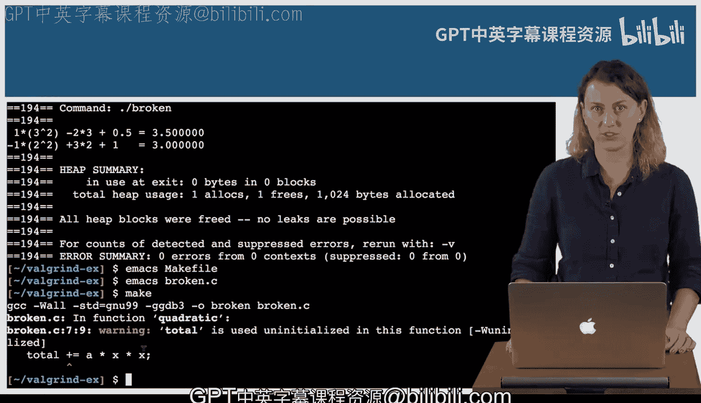

# 杜克大学《C语言入门（编程基础、C代码、指针⧸数组⧸递归、内存）｜Introductory C Programming》 p48 18_03_01_使用Valgrind发现问题.zh_en -BV1Kp42117vh_p48-

In this video， I'm going to do an example of finding bugs with Valel grind。

 Drew has given me the program broken。Compiled from brokenken dot C。

 And he'd like some help debugging it。Let's go see what we have。Let's see in this program。

 we have a function quadratic that the comment tells me computes a times x squared plus B times x plus C。

Takes four parameters， AB，C and X。Then it computes a total later in Maine。

We compute quadratic on two different sets of inputs， and then we print the output。

Let's see what that does。Here we have one times 3 squared。 So 9-2 times 3。 That's 6。 So 3。Plus。

05 equals 3。5。 That checks out。Next line， negative1 times 2 squared， negative 4 plus3 times 2。

 that's 6， so2 plus1， Oh， that should be three。We can use vel grindnd to get some more information about this problem。

Run bellgri。And then run the program the way you normally would。Error summary。

156 errors from 52 contexts。 The program wasn't even 156 lines long。Luckily。

Sometimes by treating the first error， you can fix errors down the line。

So let's find the first error。Here。Conditional jump or move depends on uninitialized values。

 The key word here is uninitialized values， and it tells us that this happens when we are calling print F。

And if we go down the line。There's an error somewhere in our program， somewhere where we call Maine。

 we can get a little bit more information about exactly where this happens。

By running vel grindnd with this option， track origins equals yes。

And now let's return to our first error。Alright， here。It still says uninitialized values。

 but then we have more information。 uninitialized value was created by a stack allocation at and address。

Which is the address of quadratic on line 5。 So let's go to line 5。In the program。

And see what we can find it out。Line5 is where we declare the function。

But that's the address Valgrind knows， because that's when the compiler created the boxes。

And then on line 6， we declare a variable。Total。Then on line 7， we do total plus equals。There it is。

 We are adding to。A value that we haven't initialized yet。So let's try initializing total to0。

And see if that fixes it。First line still equals 3。5。 Good。

 The next line should equal negative 4 plus 6。 So 2 plus 1， which is 3， And it does。 So that's good。

 Let's run Valgri again， to make sure。This time， we see error summary。

 zero errors from zero contexts， and that's what we want to see at this point in the specialization。

In later courses， you will also be interested in this information。 All heap blocks were freed。

 No leaks are possible。No note for this particular problem。If we had compiled with warnings。

Such as W all。And now let's go re break our program。So go back and leave total uninitialized again。

This time when we compile。We get a warning。 Total is used uninitialized in this function。

 and then it gives you the line number of the place where you use total uninitialized。

 and that would be helpful information。 In this case， the compiler can check our mistake。

 but in some cases， the compiler will miss things that Valgrind will catch。

