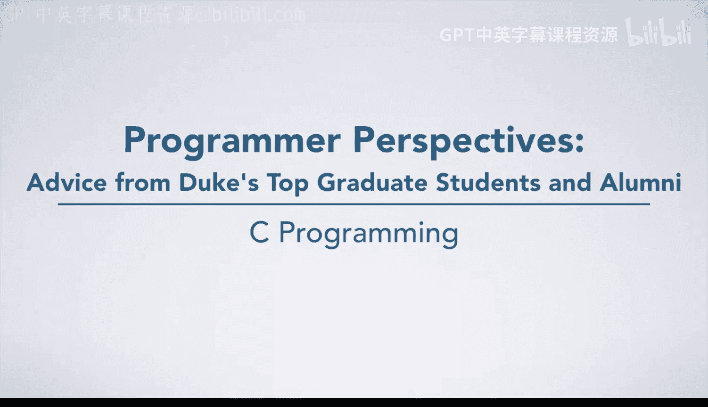
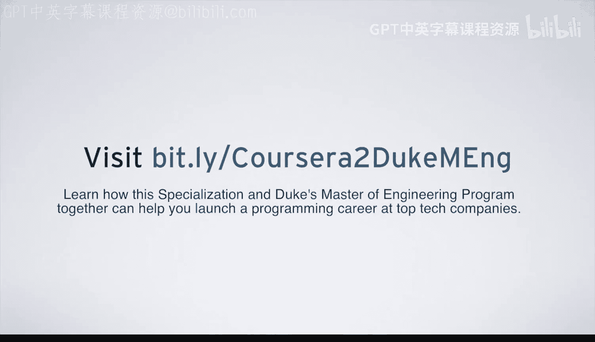

# 杜克大学《C语言入门（编程基础、C代码、指针⧸数组⧸递归、内存）｜Introductory C Programming》 p50 20_03_01_杜克大学软件工程学生的建议：永不放弃.zh_en -BV1Kp42117vh_p50-

Hi， I'm Nis Saag Dbi and I'm a master's student in the electricallectrical and computer engineering department at Duke University。

 but my advice to programmers is to keep a level head and not get discouraged Programming is a brand new skill and it's not very easy。

To a certain right way。 So I would encourage you to just keep going and stay motivated。

 My favorite programming project was building a scientific calculator。

 So what I really liked about this project was the fact that it really took for granted what a calculator does and how quickly some of the operations are are done when you're just using a basic calculator when I was actually programming it myself I realized that you know an operation where we just multiply really large numbers while that might be instantaneous when I'm typing into a calculator it's actually a lot more it's a lot slower than you'd expect when you're programming it out So what I really enjoyed was just being able to figure out how exactly to speed up that computation and that took a lot of algorithm work and just problem solving in general So my advice for people who want to work in software engineering is just to stay focused and keep programming a lot of companies really like when。

You take your own initiative to build your own projects because that shows that。You know。

 you put in the effort to build things on your own and you really understood something completely in order to get it to work。

 My advice for students who are taking this course is。

Definitely follow the strategies and the tips that they offer When I took this course。

 I definitely was resistant in。acccepting the methodology that this course kind of recommended。

 but I would just say that the sooner that you accept that that's one of the better ways to go about it。

 the better off you will be， and it'll definitely make you a better programmer in the long run。

