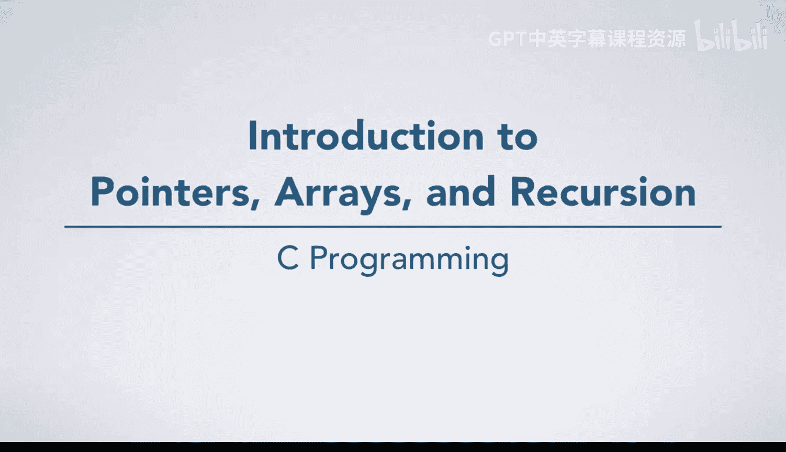
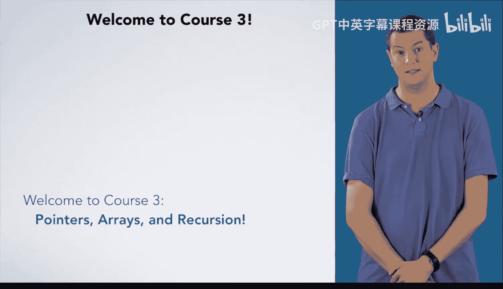

# C语言入门：3：指针、数组与递归简介 🎯

在本课程中，我们将学习C语言中三个核心且强大的概念：**指针**、**数组**和**递归**。掌握这些知识将使你能够处理序列数据，从而解决更广泛、更复杂的问题。

## 课程概述 📋

在前两门课程中，你已经掌握了开发算法的基础、C语言编程以及编译运行程序所需的工具。现在，是时候深入探讨那些能让你处理数据序列的主题了。

## 指针：数据的“地址簿”📍

上一节我们介绍了本课程的整体目标，本节中我们来看看第一个核心概念——指针。

指针用于指定其他数据在内存中的位置。我们将从一些基本的机制和概念开始，然后再探讨它们的各种用途。

## 数组：数据的“序列”📊

理解了指针的基本概念后，本节我们将探讨指针的一个重要应用——数组。

数组用于表示数据序列。还记得第一门课程中的“最近点”算法吗？一旦你学会了数组，就可以将这个算法转化为代码。当然，你也能用数组解决各种各样的其他问题。

以下是数组的一些关键点：
*   数组是内存中连续存储的相同类型数据的集合。
*   数组名本身可以看作一个指向其首元素的指针。
*   通过下标（如 `arr[i]`）可以访问数组中的特定元素。

## 字符串与多维数组 🔤

在掌握了数组之后，你将有能力学习字符串和多维数组。

你之前使用过一些字符串字面量，但我们尚未深入探讨操作或计算字符串的细节。字符串本质上是字符数组，因此学习完数组后，你将准备好全面了解它们。

此外，你将学习多维数组。例如，二维数组允许你表示数据矩阵。如果你的问题需要，你还可以处理更高维度的数组。

## 递归：用自身定义自身 🔄

我们将通过讨论递归来结束本课程。

递归是思考问题的另一种方式，它将一个复杂问题实例的解决方案，用同一个问题但更简单实例的解决方案来表达。许多问题天然适合用递归解决，因此我们希望确保你掌握这项编程技能。

以下是递归的核心思想：
*   一个递归函数会**调用自身**。
*   必须有一个或多个**基准情况**（base case）来终止递归。
*   递归调用必须向基准情况**推进**。

## 总结 🏁

本节课中，我们一起学习了C语言中三个进阶主题：**指针**、**数组**和**递归**。指针是操作内存地址的工具，数组是组织序列数据的结构，而递归则是一种强大的问题解决范式。掌握这些概念将极大地扩展你利用C语言解决问题的能力。现在，让我们正式开始深入探索吧。