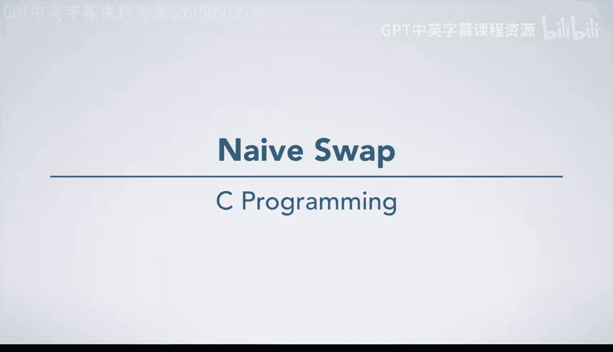
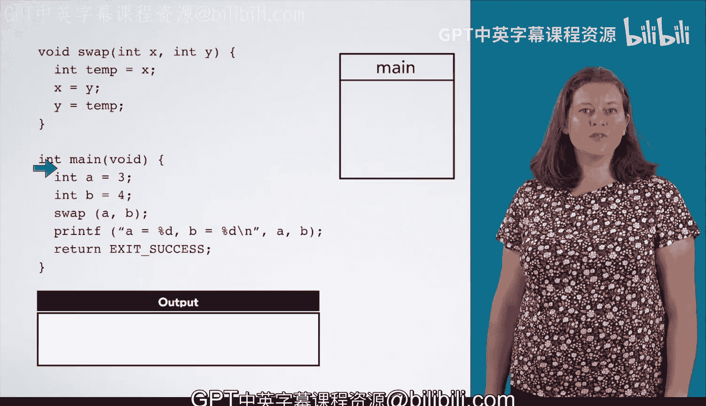
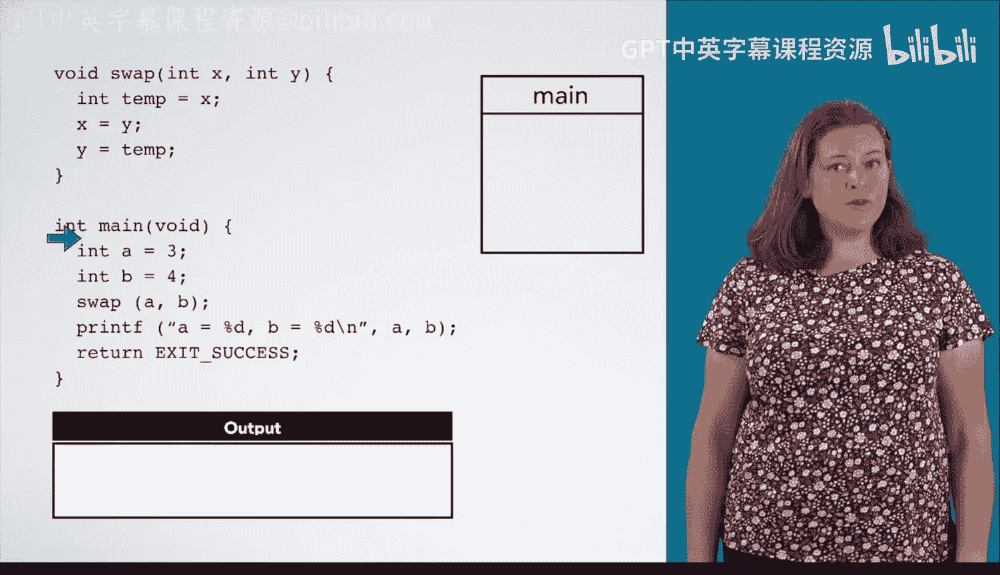
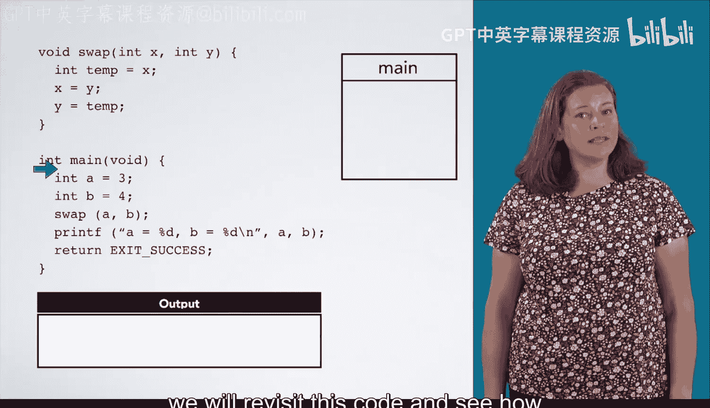
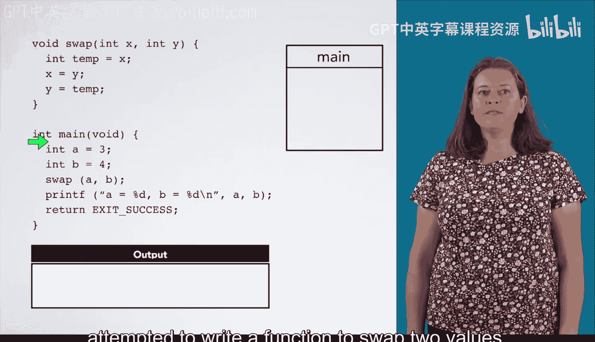
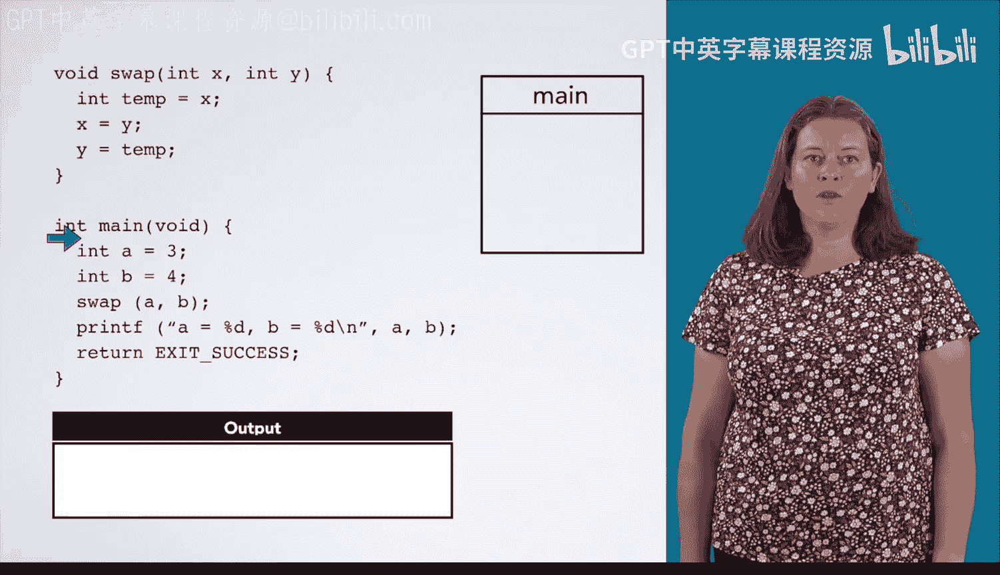
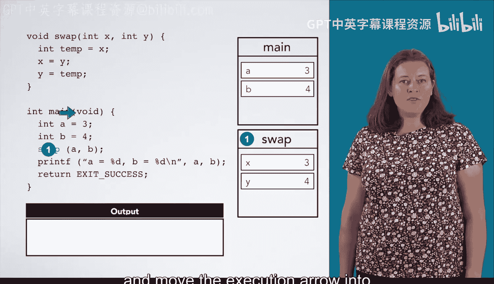
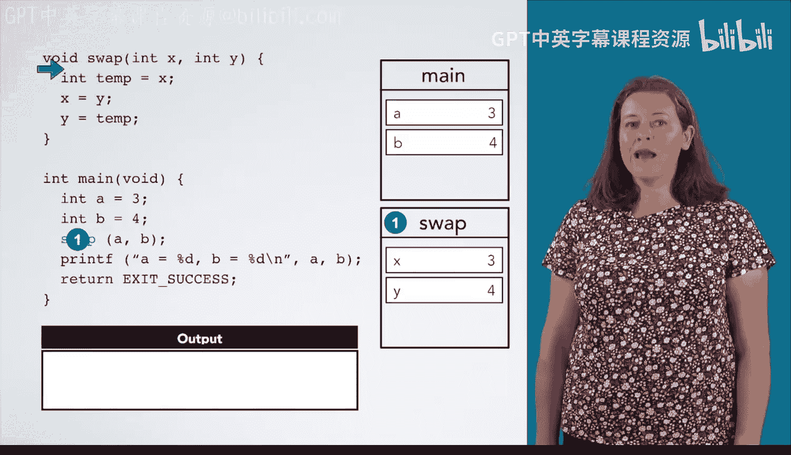
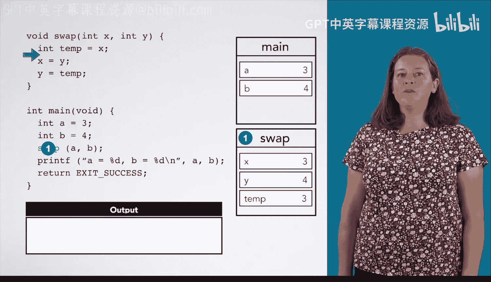
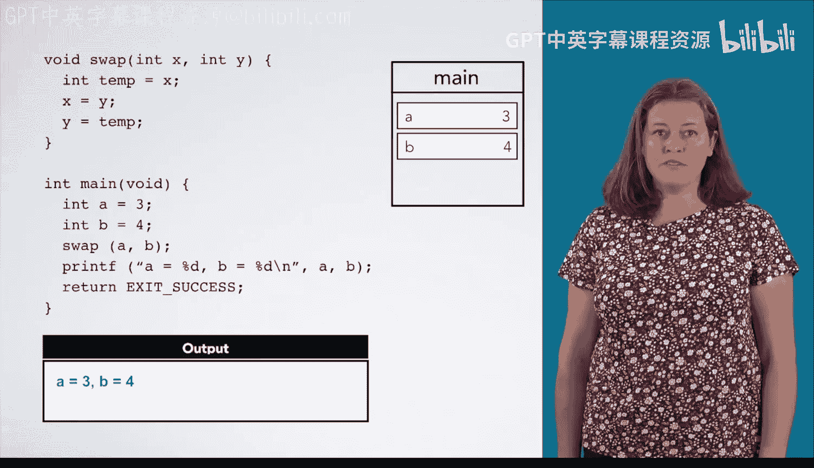

# C语言入门：02：指针的威力——从“朴素交换”说起 🔄

在本节课中，我们将通过一个具体的例子来理解为什么需要指针。我们将分析一个试图交换两个变量值但失败的函数，并以此引出指针如何解决此类问题。

为了让你直观地看到指针的威力，我们将展示一段没有指针就无法正常工作的代码。在我们介绍了指针的机制之后，我们将重新审视这段代码，看看如何利用指针使其正确运行。

## 一个失败的交换尝试

在这个例子中，一位思路有误的C程序员尝试编写一个交换两个变量值的函数，你可以在示例顶部看到这个函数。这个函数实际上做了什么？你可以自己分析，因为这里并没有涉及新知识。但我们还是来明确地走一遍流程。一如既往，我们从 `main` 函数的开始执行。

以下是 `main` 函数中的初始步骤：

1.  我们声明变量 `a` 并将其初始化为 `3`。
2.  接着，我们声明变量 `b` 并将其初始化为 `4`。
3.  然后，我们调用 `swap` 函数，并将 `a` 和 `b` 作为参数传入。

## 深入 `swap` 函数

当我们调用 `swap` 函数时，会为其创建一个新的栈帧。我们将 `a` 的值 `3` 传递给形参 `x`，将 `b` 的值 `4` 传递给形参 `y`。我们记下当 `swap` 返回时需要回到 `main` 中的哪一行代码，然后将执行箭头移到 `swap` 函数的第一行代码之前。这些都是自课程一开始你就学过的函数调用规则。

接下来，我们看看 `swap` 函数内部的操作：

1.  我们声明变量 `temp` 并将其初始化为 `x` 的值，即 `3`。
2.  然后执行赋值 `x = y`，将 `x` 的值设置为 `4`。
3.  最后执行赋值 `y = temp`，将 `y` 的值设置为 `3`。

现在，我们到达了 `swap` 函数的末尾，准备返回。我们将返回到之前在栈帧中记下的 `main` 函数中的调用位置，并销毁 `swap` 函数的栈帧。同样，这里没有新内容，这只是你在第一门课程中学过的函数返回规则。

## 回到 `main` 函数

然后，我们打印出 `a` 是 `3`，`b` 是 `4`，随后程序退出。

请注意，`a` 和 `b` 分别以 `3` 和 `4` 开始，并以相同的值结束。`swap` 函数实际上并没有对它们产生任何影响。根据C语言的规则，这个结果是合理的。`swap` 函数只能操作其自身栈帧中的副本，它无法影响 `main` 函数栈帧中的值。

## 指针能带来什么不同？

那么，指针将让我们能够做什么不同的事情呢？指针变量将为我们提供其他数据的位置（地址），即使这些数据位于不同的栈帧中。然后，我们可以通过指针来影响那些数据。这只是指针的用途之一，一旦我们掌握了基础知识，还会看到其他应用。

## 本节总结

本节课中，我们一起分析了一个没有使用指针的“朴素交换”函数为何会失败。关键在于，C语言中函数参数传递的是值的副本，因此函数内部对形参的修改不会影响调用处的实参。这引出了对指针的需求：指针允许我们间接地访问和修改其他内存位置的数据，从而解决此类问题。在接下来的课程中，我们将正式学习指针的语法和用法。