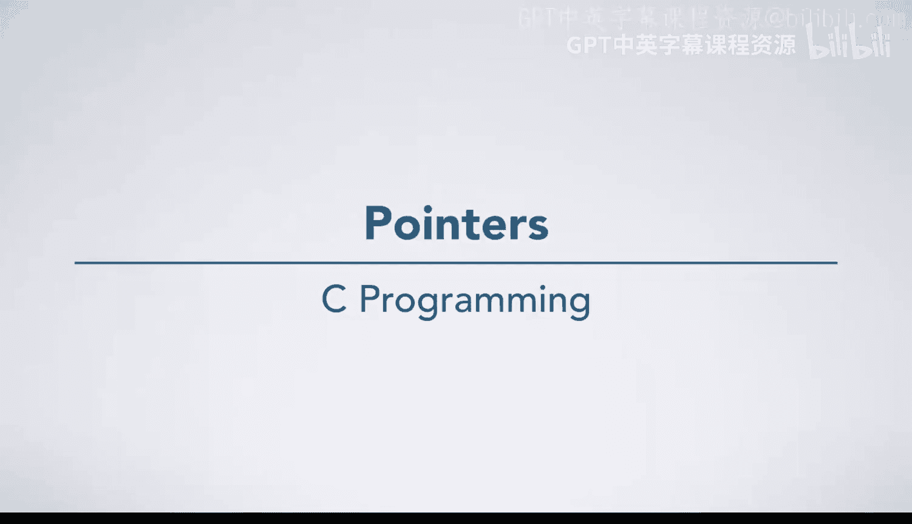
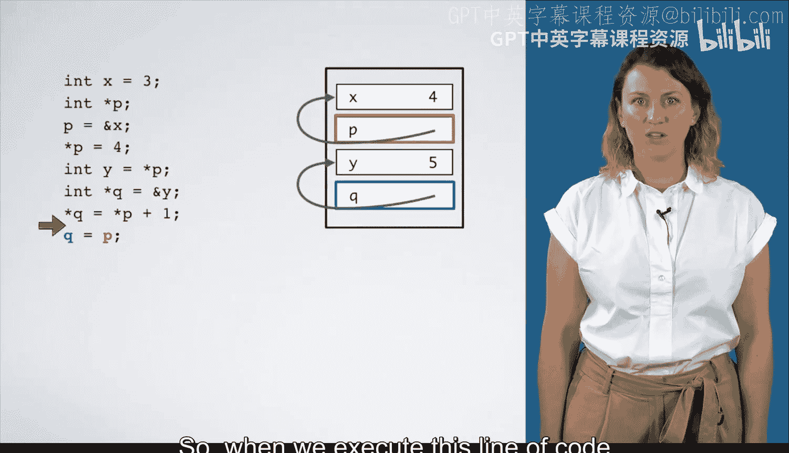
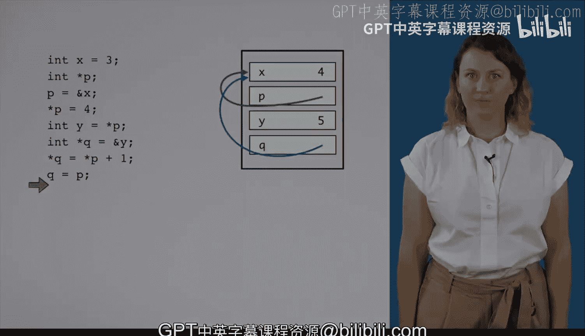

# C语言入门：03_01_03：指针详解与图解 🧭



在本节课中，我们将通过逐行分析一段使用指针的C语言代码，学习如何绘制图解来清晰地理解指针在程序执行过程中的变化。我们将重点关注变量的声明、指针的赋值以及通过指针修改值的过程。

---

上一节我们介绍了指针的基本概念，本节中我们来看看如何通过图解来跟踪指针的实际操作。

第一行代码声明了一个整型变量 `x` 并初始化为 `3`。
```c
int x = 3;
```

下一行代码声明了一个整型指针变量 `p`，但尚未初始化。
```c
int *p;
```
此时，我们有一个名为 `p` 的“盒子”，但尚不知道里面存放的值是什么。

接下来的一行代码将 `p` 初始化为变量 `x` 的地址。
```c
p = &x;
```
理解此类赋值语句时，应先看左侧，再看右侧。左侧表明值将被存入变量 `p`。右侧表明要存入的值是 `x` 的地址。执行此行后，变量 `p` 将包含一个指向 `x` 的箭头。

然后，我们通过指针 `p` 来修改它所指向的值。
```c
*p = 4;
```
左侧的 `*p` 表示 `p` 所指向的值，即变量 `x`。右侧的值是 `4`。执行此行后，`x` 的值将被改为 `4`。

以下是代码执行的步骤总结：
1.  声明并初始化 `x`。
2.  声明指针 `p`。
3.  将 `x` 的地址赋给 `p`。
4.  通过 `p` 将 `x` 的值改为 `4`。

---

接下来，我们继续分析后续的代码，看看指针如何与其他变量交互。

下一行代码声明了一个新的整型变量 `y`，并将其初始化为 `p` 所指向的值（此时为 `4`）。
```c
int y = *p;
```
执行此行后，将创建一个名为 `y` 的新“盒子”，其值为 `4`。

然后，声明另一个整型指针 `q`，并将其初始化为变量 `y` 的地址。
```c
int *q = &y;
```
这意味着将创建一个名为 `q` 的新“盒子”，其中包含一个指向 `y` 的箭头。

下面这行代码稍复杂一些。
```c
*q = *p + 1;
```
左侧的 `*q` 表示 `q` 所指向的位置，即变量 `y`。右侧的值是 `*p + 1`，即 `p` 所指向的值（`4`）加 `1`（结果为 `5`）。执行此行后，`y` 的值将被改为 `5`。

以下是此部分的步骤总结：
1.  将 `p` 指向的值赋给新变量 `y`。
2.  声明指针 `q` 并指向 `y`。
3.  通过 `q` 将 `y` 的值改为 `p` 指向的值加 `1`。

---

最后，我们来看指针之间的直接赋值操作。

最后一行代码将 `p` 的值赋给了 `q`。
```c
q = p;
```
`q` 是接收方，它将获得 `p` 所具有的值，即那个指向 `x` 的箭头。执行此行后，`q` 的值将被替换，现在 `q` 也指向 `p` 所指向的变量（即 `x`）。

---

本节课中我们一起学习了如何通过图解来逐步分析指针代码。我们掌握了：
1.  指针变量的声明与初始化。
2.  使用取地址运算符 `&` 获取变量地址。
3.  使用解引用运算符 `*` 访问或修改指针指向的值。
4.  指针之间的赋值，会使它们指向同一个内存位置。





通过这种逐行图解的方法，可以清晰地可视化指针的行为，这是理解和调试指针相关代码的强大工具。