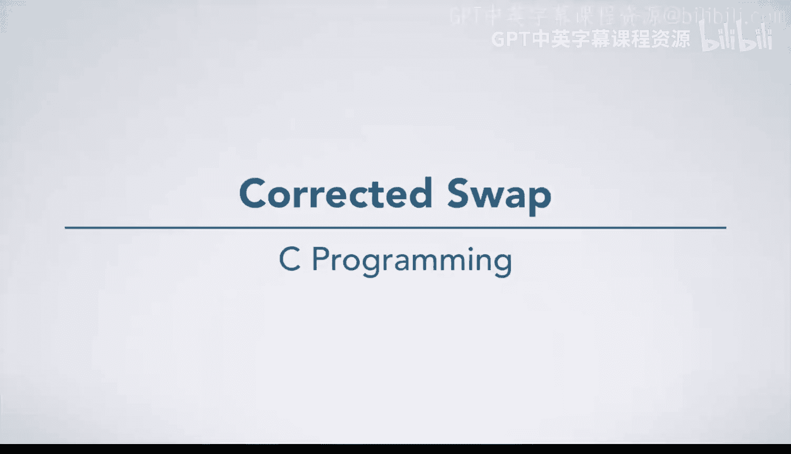
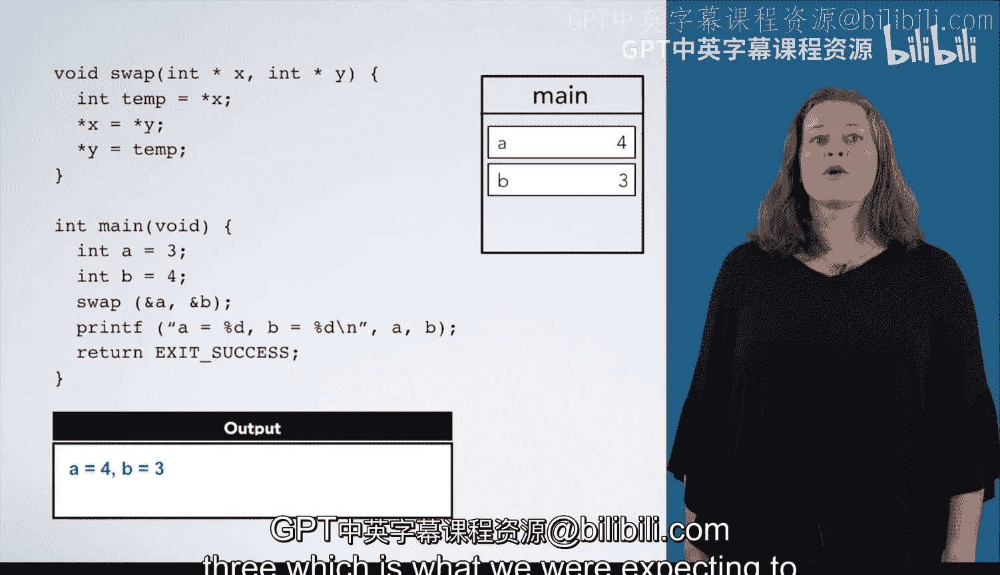

# C语言入门：04：修正的交换函数



## 概述

在本节中，我们将学习如何使用指针编写一个真正有效的交换函数。我们将对比之前无效的版本，详细分析指针在函数参数传递中的作用，并通过逐步执行来理解其工作原理。

## 指针版交换函数解析

上一节我们介绍了没有使用指针的交换函数，它无法真正交换两个变量的值。本节中我们来看看使用指针的正确版本。

以下是修正后的交换函数代码：

```c
void swap(int *x, int *y) {
    int temp = *x;
    *x = *y;
    *y = temp;
}
```

### 函数参数声明

首先观察函数参数声明的两种等效写法：

```c
// 写法1：星号与类型相邻
void swap(int* x, int* y)

// 写法2：星号与变量名相邻
void swap(int *x, int *y)
```

两种写法都正确，在C代码中都会见到。`x`和`y`是指向整数的指针，这意味着在函数内部访问它们指向的值时，需要进行解引用操作。

### 函数调用方式

在`main`函数中调用此函数时，需要传递变量的地址而非值：

```c
int main() {
    int a = 3, b = 4;
    swap(&a, &b);  // 传递地址
    printf("a = %d, b = %d\n", a, b);
    return 0;
}
```

## 逐步执行分析

让我们逐步跟踪程序的执行过程，理解指针如何实现真正的交换。

### 初始状态

在`main`函数开始时：
- 变量`a`的值为**3**
- 变量`b`的值为**4**

### 函数调用

调用`swap(&a, &b)`时：
- 参数`x`获得`a`的地址，指向变量`a`
- 参数`y`获得`b`的地址，指向变量`b`

### 进入swap函数

标记调用位置为`location1`，进入`swap`函数内部：

1. **创建临时变量**
   ```c
   int temp = *x;
   ```
   - 解引用`x`获得`a`的值**3**
   - 将**3**存入临时变量`temp`

2. **交换第一步**
   ```c
   *x = *y;
   ```
   - 解引用`y`获得`b`的值**4**
   - 将**4**存入`x`指向的位置（即变量`a`）
   - 此时`a`的值变为**4**

3. **交换第二步**
   ```c
   *y = temp;
   ```
   - 将`temp`中的值**3**存入`y`指向的位置（即变量`b`）
   - 此时`b`的值变为**3**

### 返回主函数

退出`swap`函数后：
- 变量`a`的值为**4**
- 变量`b`的值为**3**

执行`printf`语句将输出：
```
a = 4, b = 3
```

## 核心概念总结

以下是使用指针实现交换功能的关键要点：

1. **指针参数**：函数参数声明为`int *x`表示接收整数变量的地址
2. **地址传递**：调用时使用`&`运算符获取变量的地址
3. **解引用操作**：在函数内部使用`*`运算符访问指针指向的值
4. **间接修改**：通过指针可以修改函数外部的变量值

## 总结



本节课中我们一起学习了如何使用指针编写有效的交换函数。通过对比之前的无效版本，我们理解了为什么需要传递变量的地址而非值。指针作为C语言的核心概念，允许函数间接访问和修改调用者的数据，这是实现许多高级功能的基础。掌握指针参数的使用是成为熟练C程序员的重要一步。