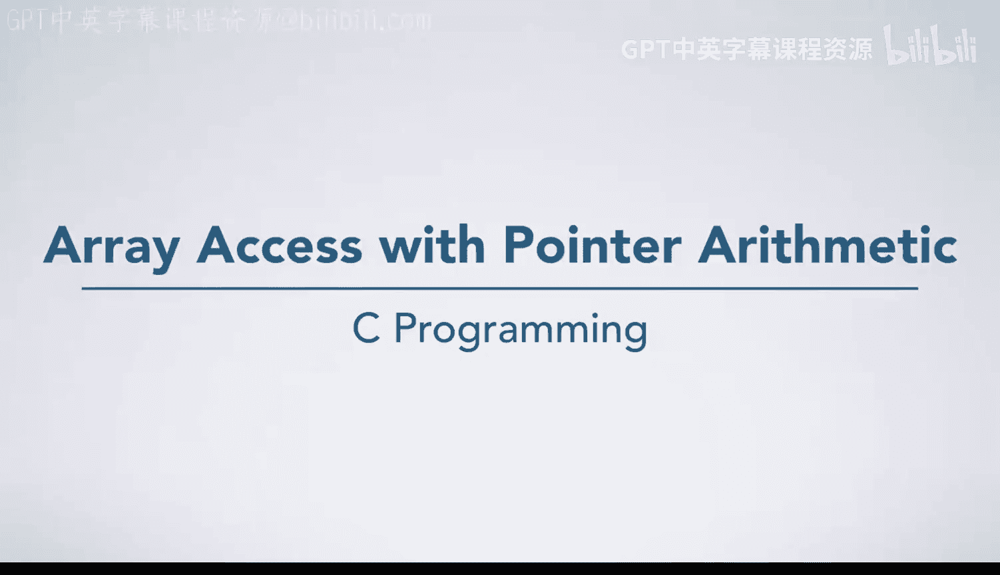

# 杜克大学《C语言入门（编程基础、C代码、指针⧸数组⧸递归、内存）｜Introductory C Programming》 p58 06_02_03_指针算术的数组访问.zh_en -BV1Kp42117vh_p58-

In this video， we're going to look at an example of a function that sums the elements of an array and uses pointer manipulation to access those elements。

 As always， we begin in main。 The first thing we're going to do is declare and initialize an array of four elements。

 We put them in main's frame with four boxes。 One that holds 4，1 that holds 6。

1 that holds 8 and one that holds 3。 Now we call the function some array passing in data。

 which is a pointer to that array and 4 as the number of elements。 In some array。

 We declare a variable answer， which equals 0， and an in star pointer。

 which points at the same place as the array parameter passed in。 Notice we have three arrows。

 all pointing at the beginning of this array。 Now， we're going to begin a four loop。

 We go inside that and have I equals0。 We're going to say answer plus equals star pointer。

 star pointer is the box pointed to by pointer， which is this int here，4。

 So we're going to do 0 plus 4 is 4。 and change answer to be4。😊，Now。

 we're going to increment pointer doing a little bit of pointer arithmetic。

 which is going to make pointer point at the next box in the array 1" later。

 We go around our for loop again。 I is now  one， and we go inside。

 Star pointer is now the box with 6 in it。 So answer is 4 plus 6， which is 10。

We increment pointer again， pointing it at the next box for an int， and we go through our loop again。

 Star pointer is 8，10 plus 8 is 18， and we increment pointer。 We enter the loop again。

 answerw is 18 plus 3， which is 21。We increment pointer to be something。

 It's past the bounds of data， And we might wonder if this is a problem。 Well。

 this is only a problem if we de referenceence pointer because we wouldn't actually know which box it's pointing at。

It could be pointing at some。It could be pointing at the return address for main。

 it could be pointing at the return address for some array， it could be pointing at anything。

 including something that is not actually a box we've drawn here。

Maybe just some other space where the compiler needed to put things in memory。

 it's okay to have an arrow pointing here past the bounds of the array。

 but we should not say star pointer while we do that。In this case， we've just finished our for loop。

 so it's not going to matter。Because we're going to return our answer 21 back to main and destroy some array frame so that variable and pointer are going to go away without us ever having D referenced it。

We print our answer， which is 21， and we return。