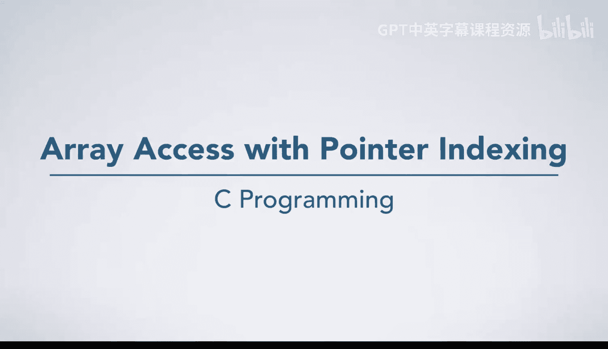
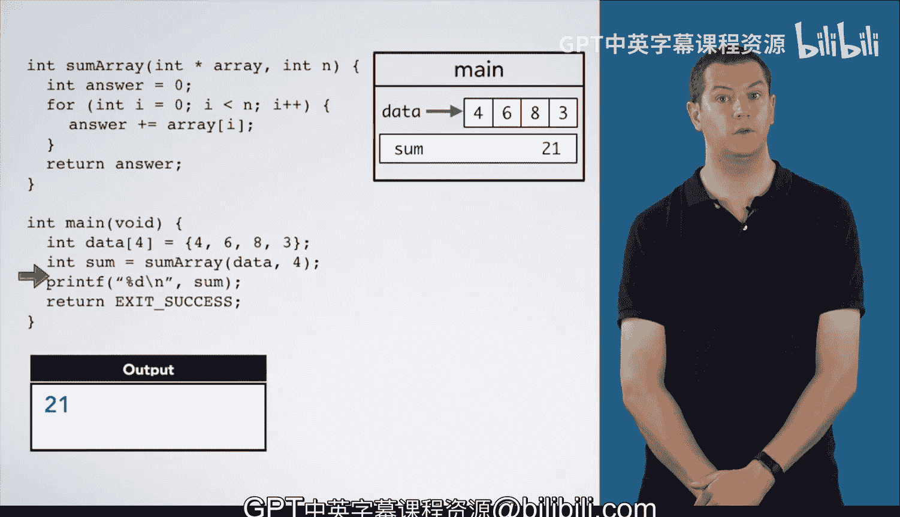

# 杜克大学《C语言入门（编程基础、C代码、指针⧸数组⧸递归、内存）｜Introductory C Programming》 p59 07_02_04_指针索引的数组访问.zh_en -BV1Kp42117vh_p59-

In this video， we're going to look at another example of a function that sums the elements of an array。

In the previous video， we used pointer arithmetic to access the array elements。 However。

 in this video， we're going to use indexing instead of an explicit pointer。

 We begin in much the same way， declaring and initializing the array data。

And calling the summary function， we pass in data， which points at the first element of the array。

And4 as the number of elements。We declare and initialize answer to 0， and we begin a4 loop。 I is 0。

 and we are going to take answer plus equals array at I。 That is array square bracket 0。

 which would be the first element of array。 So we add 4 to answer just like we did in the previous video。

 We go around the loop another time incrementing I。 So it is now one。

 Then we're going to do answer plus equals array at I， which is the box with 6。

 So answer is 4 plus 6， which is 10。😊，We go around the loop again incrementing I to 2 array square bracket I is array at 2。

 which is the box with 8。 so we add 8 to answer for 18。We go around the loop one more time。

 Ar square bracket I is the box with three， So we add three to answer。 incrementing I again。

 We see we are finished with our loop。Then we return our answer 21 back to mainine and destroy sum frame so the parameters and variables in it are going to go away。

We print our answer， which is 21 and we return。

