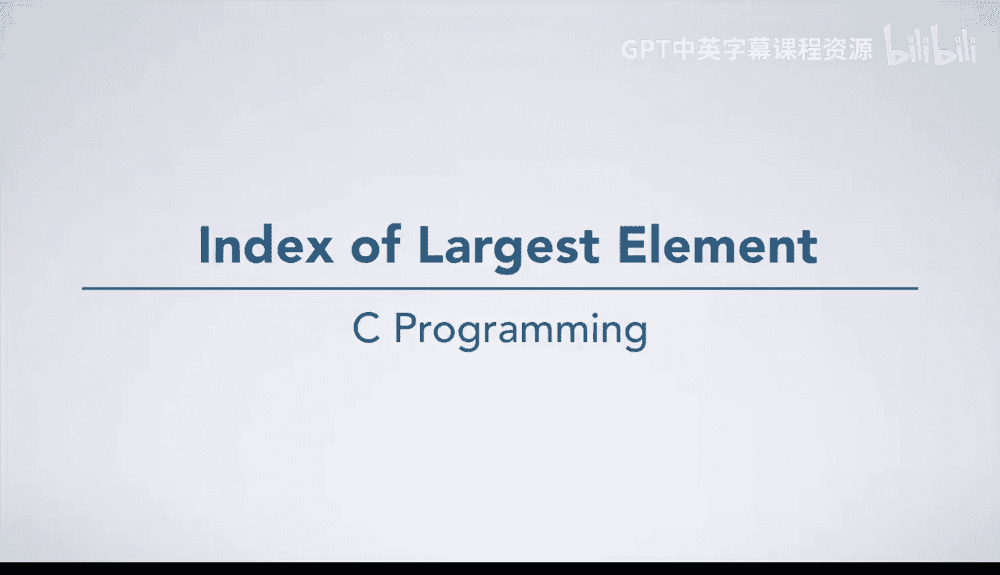

# 杜克大学《C语言入门（编程基础、C代码、指针⧸数组⧸递归、内存）｜Introductory C Programming》 p60 08_02_03_最大元素索引.zh_en -BV1Kp42117vh_p60-

Now， we are going to work through the problem of finding the index of the largest element in an array。

 As always， we will start by working an instance of the problem ourselves。 Looking at this array。

 we see that 99 is the largest element， and it is at index 2。

This is a problem where we may get stuck trying to figure out what we did because we just saw the answer。

What if instead， we had a million element array。We can't even draw that in this video so we can only see the first few elements here。

How would we find the answer here？Well， we might start by looking at the first element。

 which is 16 and then looking at the next element， which is 12，16 is bigger than 12。

 So let's move on to the next element， which is 43 and compare it to 16。43 is larger than 16。

 so we want to compare it to the later values until we find something even bigger。

We can continue this process， comparing each element to the largest element that we have seen so far。

 and when we find something larger， updating our information about what is largest。

When we reach the end of the array， we'll have found the largest element。

 no matter how big the array is。We don't want to write down all those steps for such a huge array。

 so let's go back and apply the step by step approach to our smaller problem instance。

We will want to keep track of the largest so far and where we currently are in the array。

And work through comparing element by element and updating our largest so far as we go through the array。

So now let's go to step 2 and write down exactly what we just did。

 We started by guessing that the index 0 might be the largest element。

 Then we started our element by element comparison at index 1。

 We compared 24 to 17 and found that 24 was larger。

So we updated our guests for the largest element to 24， found at index 1。Then we compared 99 to 24。

99 was bigger than 24。 So we again updated the largest element we had found so far。Next。

 we compared 3 to 99，3 is smaller than 99， so there was no need to update the largest element。

 There were no more elements in the array。 So we gave two as our final answer。Next。

 we need to generalize these steps。 Why is this 0， We are always going to start at index 0。

 no matter what array we are using。 However， we should think about the possibility that we might have an empty array。

This is our current guess for the largest index。 We will call it largest index。Next。

 we might think about why this number is 24 and why this number is 99， and this one is 3。

The answer to these questions is that these were elements one， two， and three of the array。

We can generalize this algorithm by replacing those specific numbers with their locations in the array。

Next， we should think about why we are comparing the numbers in the array to the numbers 17。

 24 and 99 respectively。These numbers also come from data in the array at elements 0，1 and 2。

So we can make the algorithm a bit more general like this。But in doing so。

 we have introduced another set of specific numbers that we need to think about。

 Why are these indices 0，1 and 2。Our first guess might be that we are counting。

 but are we really counting， We have to be a little bit careful here to see why。

 let's go back to our larger， more complicated example。In this example。

 we first compared element 1 to element 0。Then we compared element 2 to element 0。Here。

 we found that element 2 was larger， so we updated largest index。

 and then we compared element 3 to element 2。 The index of the second item in our comparison is not counting since we used 0。

 then 0 again， then 2。Next we compare element 4 to element 2 and then5 to 2。

 at which point we once again update our largest index。We now compare element 6，7 and8 to element5。

 and then once again find a new larger item at element 8。At this point。

 I've figured out what the pattern is。 Think about it for a moment and see if you know what we are doing。

The pattern is that we are always comparing the current element with the array largest index。

 so we can update our algorithm to reflect this understanding。

These steps are looking pretty repetitive。 The only thing that does not repeat exactly is that sometimes we update the largest index。

 and sometimes we do not。 We need to figure out under what conditions we update largest index。

 We are doing this when the current element is larger than the largest element we have seen so far。

With that in mind， we can make these steps completely repetitive。

So that we can then express this repetition in terms of counting。

We won't always give an answer of two， so we should think for a moment as to where this value came from。

And realized that it was the value of largest index， in our example。

Now our algorithm says to give largest index as the answer in the general case。

This algorithm is pretty general， but we might think about one corner case。

 What if there are no elements in the array， We would need to handle that case and give back an answer that indicates no valid answer。

 We will choose -1 as our answer， since it is not a valid index in an array。Next。

 we would want to test this algorithm。 We'll leave that up to you。

Try it out on a few inputs and convince yourself that it is correct before we proceed to step 5。

Here we've declared our function， find largest index。

 and written our algorithm as comments inside the code。The first line describes two steps。

 but they should be quite familiar now。 an if statement with a return statement inside of it。Next。

 we declare and initialize largest index。Then we have a four loop to count with。

And an if statement to compare array elements to each other。 If the condition is true。

 we update largest index to be I。And at the very end， we return largest index， and we're done。

