# 杜克大学《C语言入门（编程基础、C代码、指针⧸数组⧸递归、内存）｜Introductory C Programming》 p63 11_03_04_字符串比较.zh_en -BV1Kp42117vh_p63-

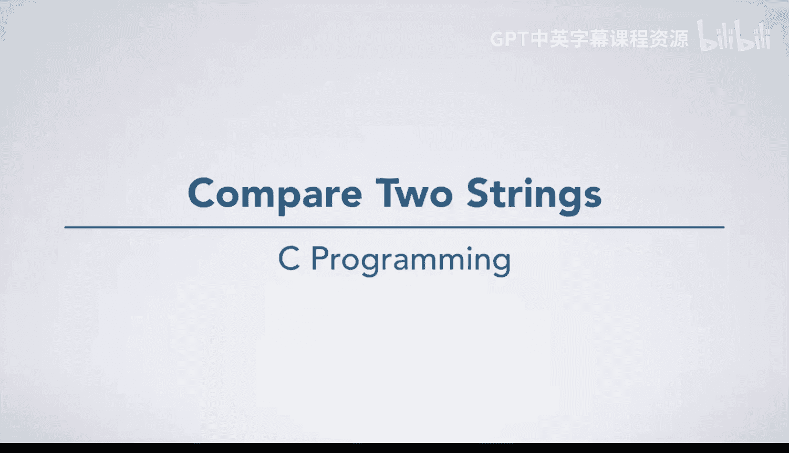

We would like to write a function which can compare two strings to see if they have the same contents。

 That is， if they are the same sequence of characters。 as with all programming problems。

 we can follow the seven steps to solve this problem。

 We'll start with step 1 and do an instance of the problem ourselves Here。 We have two strings。

 Notice how we have represented them quite explicitly。

 including the null Termininator character back slash 0 at the end of each。😊。

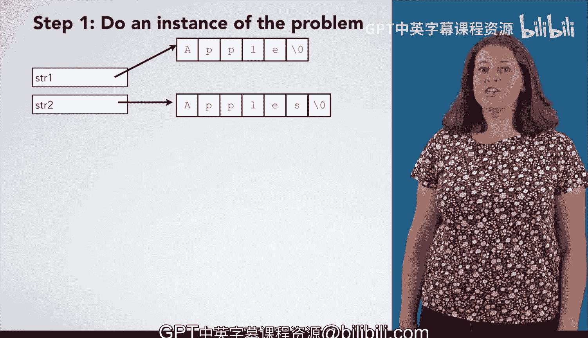

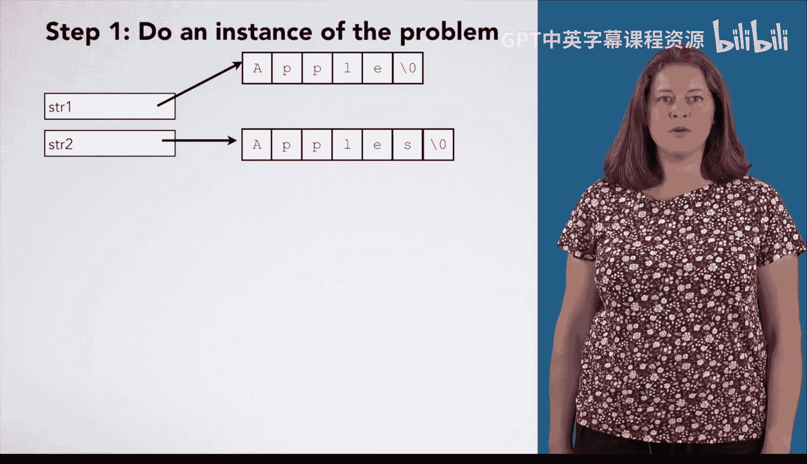

We're going to start looking at the first letter of the first string and the first letter of the second string。

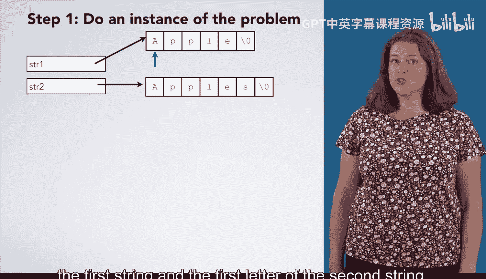

These are both capital A， so we want to look at the next letter。These are both P。

As are both letters in the next string。Then we have L's in both strings and E's in both strings。

 However， now we have a null terminator in the one string and an s in the other。

 These strings are not the same。 So we would give an answer of no。

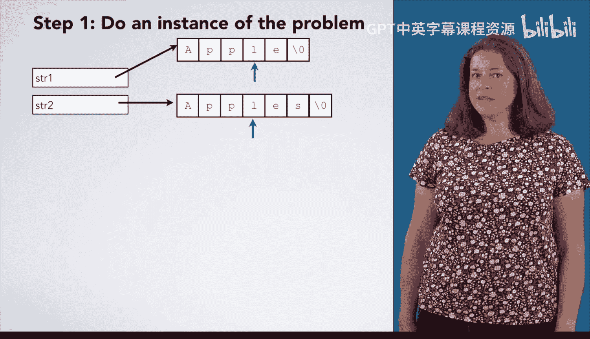

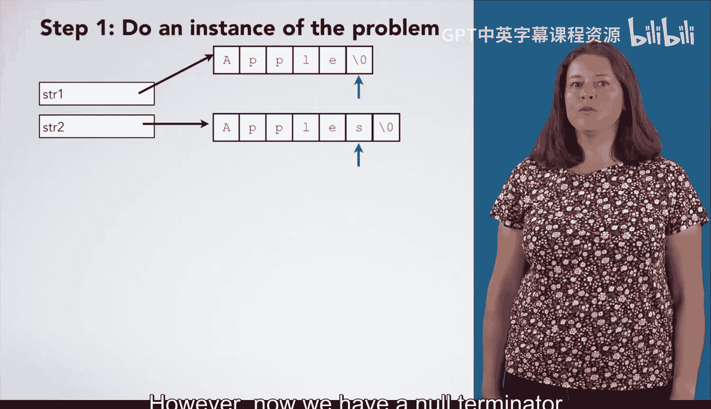

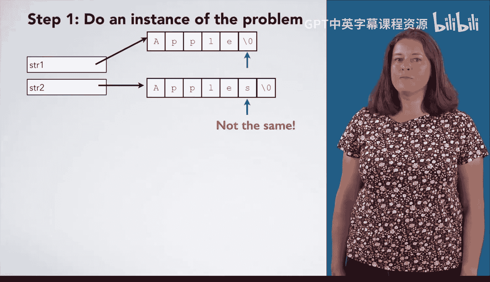

Okay， so what exactly did we do。First， we made this arrow to keep track of where we are in string 1。

 It points at the first letter of string 1。

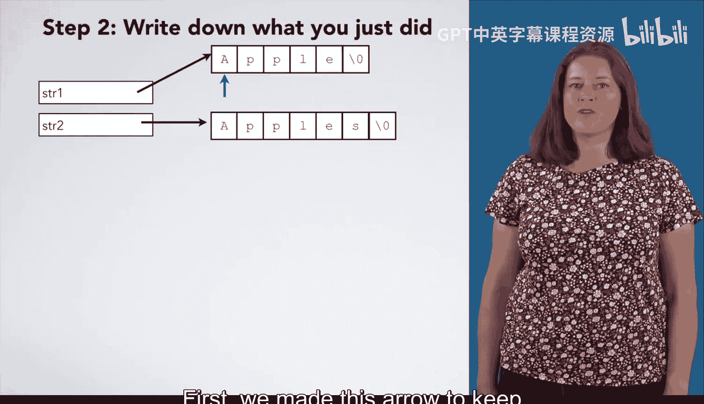

It is generally a good idea to give things names。 So let us call it P1。

We also made an arrow to keep track of where we are in string 2， which we might want to call P2。Next。

 I checked if the letter that P1 points at matched the letter that P2 points at。

 Both of these were capital A。 So I advanced P1 to the next letter after it。

 and I advanced P 2 to the next letter after it。Then I checked if the letter that P1 points at matched the letter that P2 points at。

 Both were P。 And so I advanced P1 to the next letter and advanced P2 to the next letter。And again。

 I compared the letters that P1 and P2 pointed at， and I found them to be the same。

 So I advanced P1 and P2。Does this seem a bit repetitive， If so， that is great。

 since finding repetition is one of the important parts of generalizing。

 which we will do in just a minute。First， we should finish step two。Again。

 we compare the letters P1 and P2 point at and find them the same， so we advanced P1 and advanced P2。

P1 and P2 both points at E， so we advance P1 and advance P2。However。

 now the letters that P1 and P2 point at are different。 One is an null terminator。

 and the other is S。 So at this point， we decide that our answer is no。

 These strings are not the same。Here are all the steps that we just did。

 So now we should generalize them to work on any two strings。

 These first two steps are initialization that we will always do。

 no matter what two strings we want to compare， we always want to set up P1 and P2 to point at their first letters。

As we noted earlier， these next steps are quite repetitive。

 We keep checking if the two letters are the same and advancing P1 and P2。

When do we stop repeating these steps？When the letters that P1 and P2 point at are different。

With that observation in mind， we have rewritten our steps to be a bit more general Here。

 We have expressed these steps as repetition that we do as long as P1 and P2 point at the same letter。

These steps are pretty general。 We expressed the similar steps as repetition。

 and we aren't using any values particular to the problem。 However。

 we are missing something very important。 Can you spot any warning signs that something is wrong with our algorithm。

This algorithm always gives an answer of no， Never yes。

 That comes from the fact that we only worked one example with a no answer and have not thought about how to get a yes answer yet。

We should be aware of the fact that we never explicitly checked for the end of the string。

How could we fix these problems？We can go back to step 1 and work through another instance of the problem that gives us a yes answer。

 such as this one。 Both strings are apple。 We aren't going to work through it in detail。

 but we will note that we would realize they are the same when we reach the end and have not found any mismatching characters。

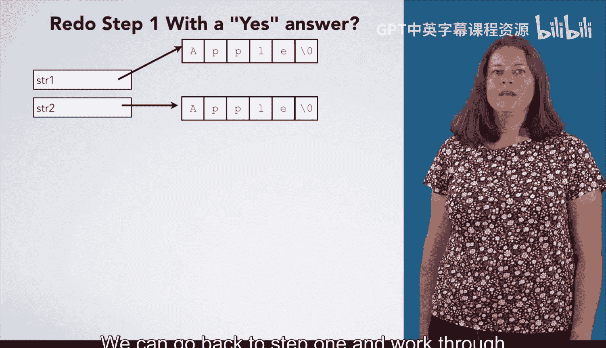

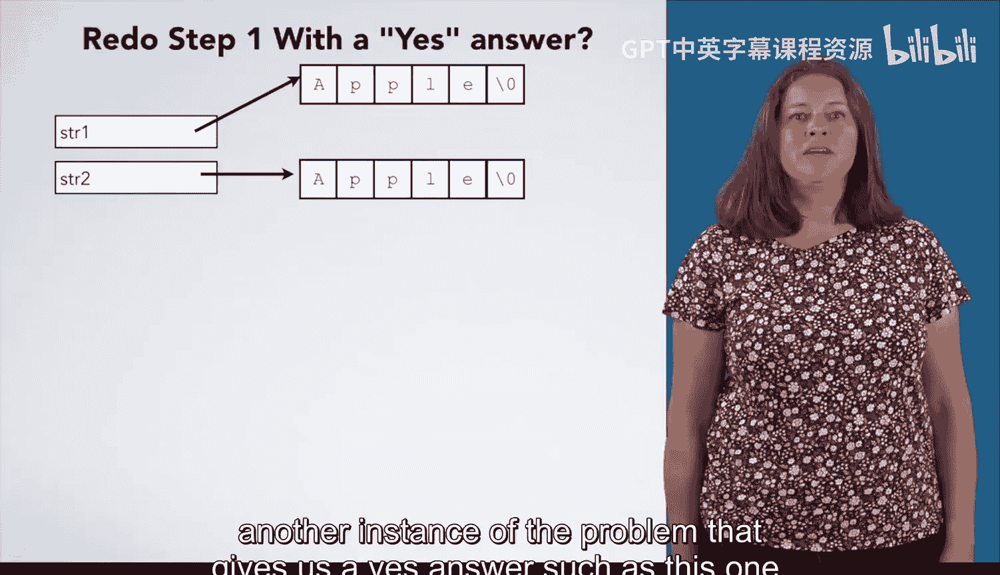

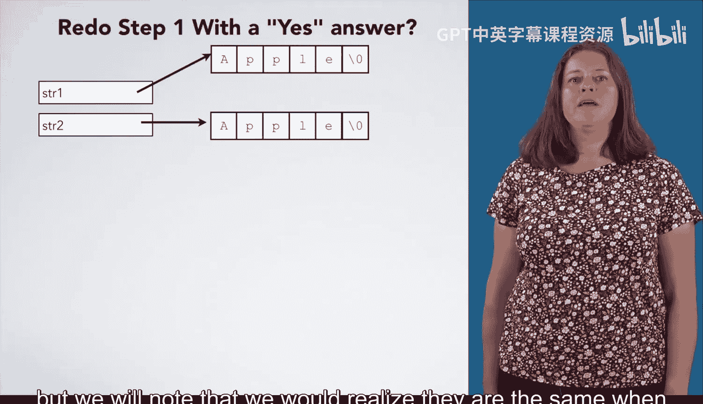

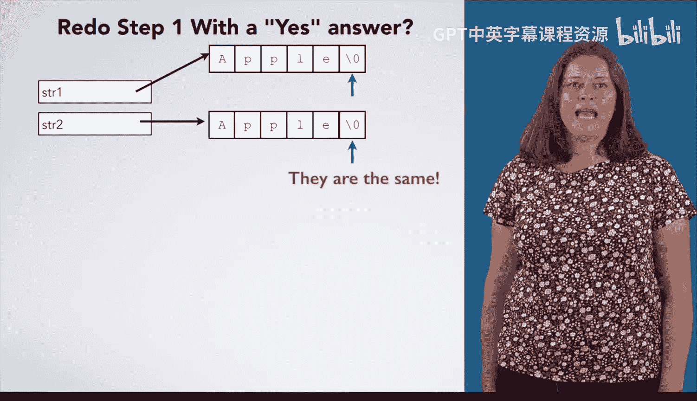

How do we know when we have reached the end of the string。

We know we have reached the end of the string when we encounter the null Terinator character backslash0。

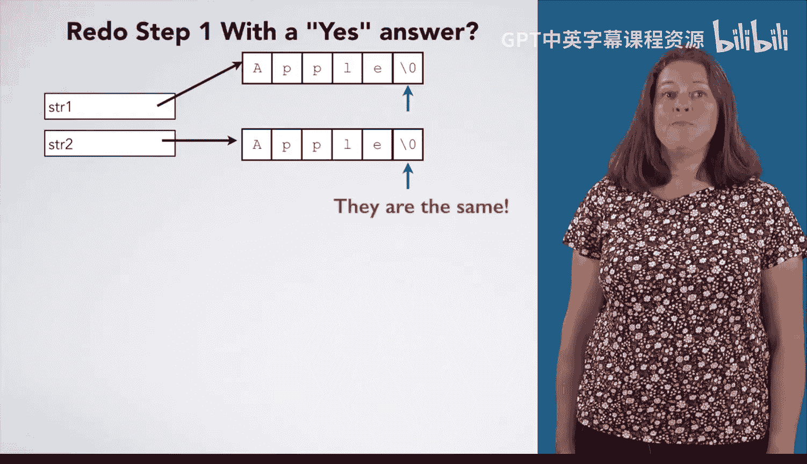

We can adjust our algorithm based on this observation。 If P1 points at back slash 0。

 then we have reached the end of string 0。Do we also need to check if P 2 points at backs slash 0。

 It would not hurt anything， but we just checked if P1 and P2 pointed the same letter。

 So if P1 points at backs slash 0， then P 2 must also point a backs slash 0 here。

 Notice that our algorithm now explicitly checks for the end of the string。

 which was the other warning sign we worried about。Next， you would want to test this out。

 We're going to all that step in this video， but we encourage you to try it out and convince yourself that it is right。

😊，Now， let's translate this algorithm into code。As usual。

 we start with the declaration of the function。 This function is called string equal。

 and it takes two const car stars。Why do we have constantst in the parameter types。

 Because we want to promise that this function does not modify the strings past in。

 This function returns an int， which will be 0 for no and one for yes。

 The first step says that we made an arrow pointing at the first letter of string 1。

This line turns into a variable declaration。 P1 is a new variable which is initialized to string1 so that it points at the same place that string  one points。

The type of P1 is also const car star， since P1 is a pointer to a character。

 but we will not modify the character that it points at。Likewise。

 the next step is the declaration and initialization of P2 to string2。Next。

 we want to repeat some steps as long as a condition is true。

 Repeing something as long as a condition true translates into a while loop。

For the condition inside the while loop， we need to test if the letter P1 points at is the same as the letter that P2 points at。

We want star P1 equals equals star P2。Next， we want to check if P1 points at the null Terinator。

 So we have an if statement whose then clause will give a yes answer， which would be return1。

After this statement， we advance P1 to the next letter。

How can we make a pointer point at the next element of a sequence， We can just write P1 plus plus。

 or P1 equals P1 plus 1。 Likewise， we can increment P2 to make it point at the next letter in the second string。

After the loop， we would give an answer of no， which would just be return 0。Great。

 now we have written code to compare two strings and see if they are equal。

 We should then test this code and see if it works correctly。😊。

