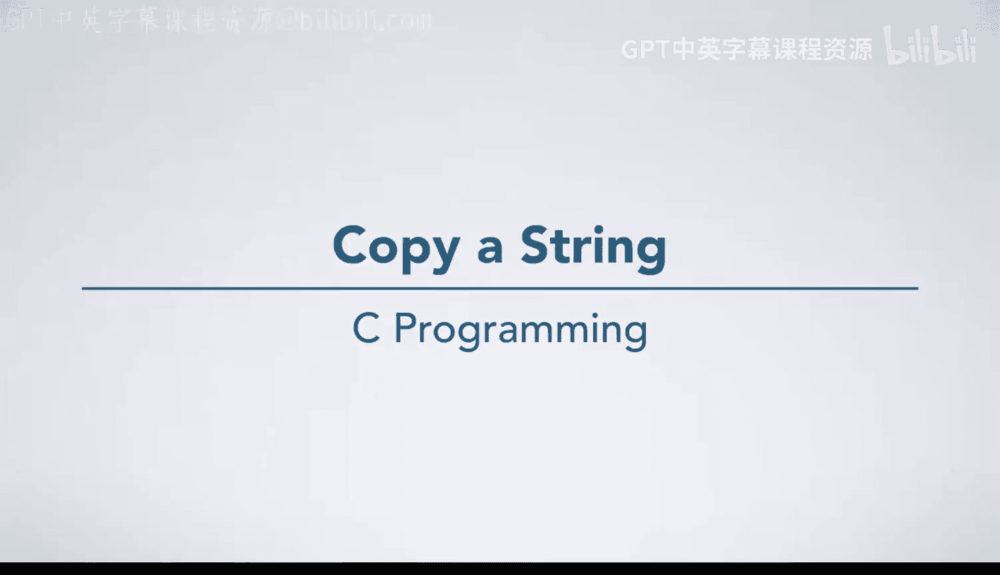
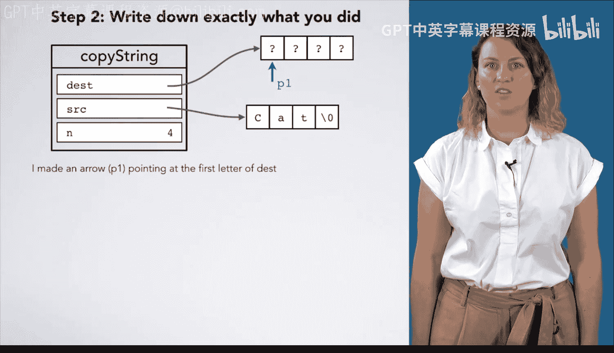

# 杜克大学《C语言入门（编程基础、C代码、指针⧸数组⧸递归、内存）｜Introductory C Programming》 p64 12_03_06_字符串复制.zh_en -BV1Kp42117vh_p64-

In this video， we're going to write a function that copies a string from one place。

 the source to another place， the destination， because we don't want to risk riding past the bounds of the destination。

 We're also going to specify to our function how much space it has and stop writing if we go past that amount of space in working an example for ourselves。

 We're going to take the string cat and copy it to this four element array。

 which is currently uninitialized。 We don't actually know what's there。

 And our function doesn't care。 So to do this， I'm going to start copying letter by letter， C。

 A T null terminator into the destination。 Now， I'm going to perform step 2 and write down exactly what I just did。

I made an arrow， which I'll call P1， so I can refer to it more concretely and set it pointing at the first letter of dust。

 Then I made another arrow， which I'll call P2 and set it pointing at the first letter of source。

I wrote a C into the box that P1 pointed at， then I advanced P1 to point at the next letter。

 and I advanced P2 Similarlyly， I wrote an A into the box that P1 pointed at。

 Then I again advanced P1 and advanced P2。 I wrote a T into the box that P1 pointed at。

 Then I advanced P1 and advanced P2。 Finally， I wrote a null terminator into the box that P1 pointed at。

 and then I was done。Now I'm ready to generalize these steps。These first two steps always happen。

 We'll just keep them the same， but I'll rewrite them in the imperative mood。Now。

 all of these next steps look repetitive， And you'll note that I've only boxed C。

 A and T and not the null terminator because we want to keep the pattern of writing。

 advancing P1 and advancing P2。 But for the last step， we don't advance。 These steps are repetitive。

 and we're doing almost the same thing。Except we're writing a different letter each time。

Why did we write capital C the first time， lowercase A the second time and lowercase T the third。

If we go back and think about our example， we'll see that in each case。

 this was what P2 pointed at so we can just change each of these statements to I wrote the letter in the box P2 pointed at into the box P1 pointed at。

Now， all three of these groups of steps are the same。 We have exactly the same three steps。

 which we've repeated three times。These steps are now repetitive， but how do we know when to stop。

 Are we always going to do this three times， Probably not。 If we go back to our example。

 we will see that we stop when we reach the end of the string we're copying。

 That is when P2 points at a box with a null terminator in it。

So we specify as long as the letter in the box P2 points at is not the null termminator。

 then we will do these three steps。After we finished this。

 we wrote a null terminator into the box that P1 pointed at。

Since we are always going to want to do this， we can write this simply as a direction。

We have finished generalizing our algorithm， now we should test it。

We're going to walk through our algorithm with a different test case。 So is once again cat。

 but n is only two。 So dust is an array with space for two letters。

 Walk through these steps willll make an arrow for P1。 Make an arrow for P2。

 As long as the letter in the box P2 points out is not the null terminator。 It's C。 So it's not。

 we go inside the repetition。Write the letter in the box P2 points at into the box P1 points at advance P1。

 advance P2。 then go back and continue repeating these steps。Again， it's not the null terminator。

 so we write advance， advance， go back and continue repeating these steps。P2 is， again。

 not pointing at the null terminator。 So we're going to write the letter in the box P2 points at。

 which is a T into the box P1 points at。 Unfortunately。

 P1 has gone past the end of the destination array and is now writing into a box it should not。

 We have no idea what piece of memory this is or what it belongs to。

 And we're going to do bad things to our program。 It may misbehave in strange ways。

 a segmentation fault or who knows what。 This means we need to go back and fix our algorithm。

Reworking steps 1，2 and 3 to fix this problem。 We're not going to walk through them in this video。

 but you'll see that we should only do these steps as long as the letter in the box P2 points at is not the null Terinator。

 And P1 is not equal to stop， which is going to be a new arrow that we make。

 pointing just past the end of the destination array that is end letters after dust。 Then at the end。

 we're going to check that P1 is not equal to stop before we write the null Terinator into the box P1 points at。

 In other words， we're going to draw an arrow past the end of the array and stop doing anything if we get there。

 In the next video， we'll translate these improved steps into code。

