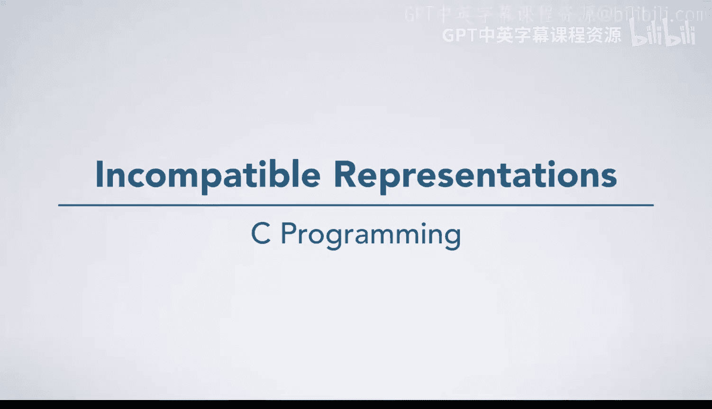
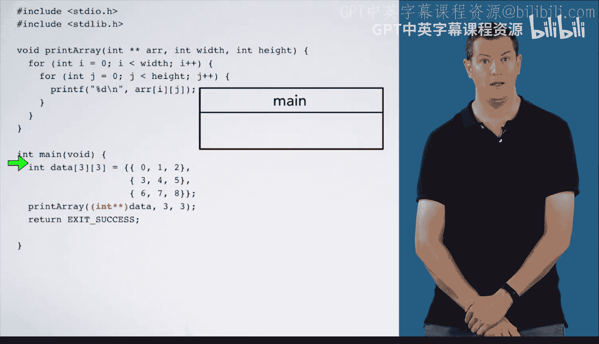

# 杜克大学《C语言入门（编程基础、C代码、指针⧸数组⧸递归、内存）｜Introductory C Programming》 p65 13_03_07_不兼容的表示形式.zh_en -BV1Kp42117vh_p65-

You've been learning about multidimensional arrays and the differences between what it means to declare them with multiple sets of square brackets versus as arrays of pointers。

 Sometimes new C programmers have trouble understanding the differences as well as the importance of those differences here。

 we're going to see some broken code that underscores the incompatibility of these representations and what goes wrong when we try to naively fix it by lying to the compiler without thinking about what we are doing。

 If we try to compile this code， we get this error message。 Let's take a second to pull this apart。

 It tells us that we are passing argument one of print array which we do here from an incompatible pointer type。

 In particular， it expects an int star star because that is how array is declared but we actually pass it an int star 3。

 that is a multidimensional array whose second dimension is 3。

 Remember that the compiler doesn't need to include。😊。

The first dimension in the type due to the way that multidimensional arrays are laid out。

A naive C programmer might try to fix this code by adding a cast anytime you want to cast something。

 think very carefully about what you're doing。With this change， the code compiles。

 so everything is good， right， it turns out that lying to the compiler about how data is laid out is often a bad idea。

 so we aren't actually going to like the results when we try to run this code。

 Let's see what happens。 We start in mainine and create data。

Then we call print array passing in data 3 and3， we enter the first for loop and enter the second for loop and are now ready to print array at IJ。

So we need to evaluate that expression。First， we can evaluate array。

 which is an arrow pointing at the first element of data。So what is a array at I， we know I is0。

 so this would be a array at  zero， which would be this box here。

But we need an arrow because we told the compiler that array points an int star。 However。

 we just have a number。Furthermore， we may be on a platform where size of an int star is larger than size of an int。

 For example， on the system you work on， pointers are 8 by and integers are4 bys。In that case。

 we actually need to read these two boxes and interpret them as an arrow。

 What happens when we try to do that？ Well， remember， everything is a number。

 So the program is just going to read a numeric value and interpret it as a pointer。

To see more precisely what might happen， we need to look under the hood On the left。

 we've listed memory addresses and the values stored in them。Each row corresponds to4 bytes。

 The thin blue line divides main's frame， which is on top from printer array's frame。

 which is on the bottom。These values at the top are data。

 which is laid out with each element sequentially in memory。

The return address is stored in the frame。As well， even though it does not figure into our example。

Aray is stored in the frame。 noticeice how its numeric value is the address of the first element of data。

 Also， as a pointer， it takes up8 bytes on this platform。Then we have width。And height。And I。And J。

But let's go back to array。 since we are trying to evaluate array at 0。

 we've told the compiler that array points at an int pointer。 So array at 0 is these8 bytes here。

That is the value of a array at 0 is this pointer you see here。

 where in the program does this pointer point， We didn't get it by taking the address of something。

 We just put some numbers together and turned them into a pointer。

Remember this general picture of the layout of memory。

 the particular address ranges shown here are platform and program specific。

 but were obtained for this test program on the 64 bit architecture。If you look at this picture。

 the pointer we just evaluated for array at 0 lands right here in this empty region between the stack and the heap。

 so it points in an invalid region of memory。 So if we go back to our picture with the code。

 array at 0 points off into invalid memory。So what happens when we try to evaluate array at IJ Well we are going to try to dereference this pointer。

 which points off into an invalid portion of the address space。

 What happens when you try to dereference a pointer to an invalid region of memory。

 everyone's favorite way for a program to crash segmentation fault。

 It turns out that lying to the compiler was a really bad idea， Our program compiled。

 but then crashed when we tried to run it。